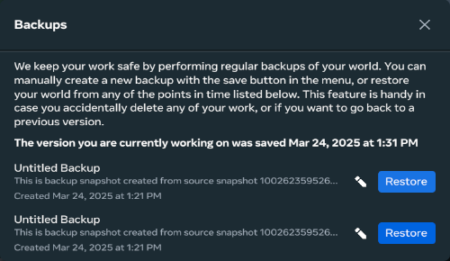

# [Restoring a world from backup](#restoring-a-world-from-backup)

Meta Horizon Worlds periodically creates backups of your worlds while you are editing them, allowing you to revert your world to an earlier state. You can manage world backups in the Developer Dashboard or in the desktop editor.

## [Restoring a world from backup in the desktop editor](#restoring-a-world-from-backup-in-the-desktop-editor)

In the desktop editor, you can view the list of backups, edit names and descriptions of backups, and restore previous backups of your worlds.

To manage your backups in the desktop editor:

1. Open Meta Horizon Worlds in Desktop Mode from the Meta Quest Link app on your PC.
2. Click the **My worlds** tab in the left navigation bar.
3. Choose the world you would like to restore from backup, select the three dots next to it, and choose **Backups**. A list of backups for that world appears. By default, each backup is labeled with the date and time it was created. You can edit the name and description of each backup by clicking the pencil icon next to it. 
4. Click the **Restore** button next to the backup you would like to restore. A confirmation window appears.
5. Click **Restore** to confirm the restore. The world is restored to the state it was in at the time of the backup.

## [Restoring a world from backup in the Developer Dashboard](#restoring-a-world-from-backup-in-the-developer-dashboard)

From the Developer Dashboard, you can view the list of backups, edit names and descriptions of backups, and restore previous backups of your worlds.

To manage your backups in the Developer Dashboard:

1. Open your browser and nagivate to the [Developer Dashboard](https://developers.meta.com/horizon/manage/).
2. Choose your world you would like to restore from backup.
3. From the left-side navigation, choose **Distribute** > **Backups**.
4. Click the **Restore** button next to the backup you would like to restore. A confirmation window appears.
5. Click **Restore** to confirm the restore. The world is restored to the state it was in at the time of the backup.

