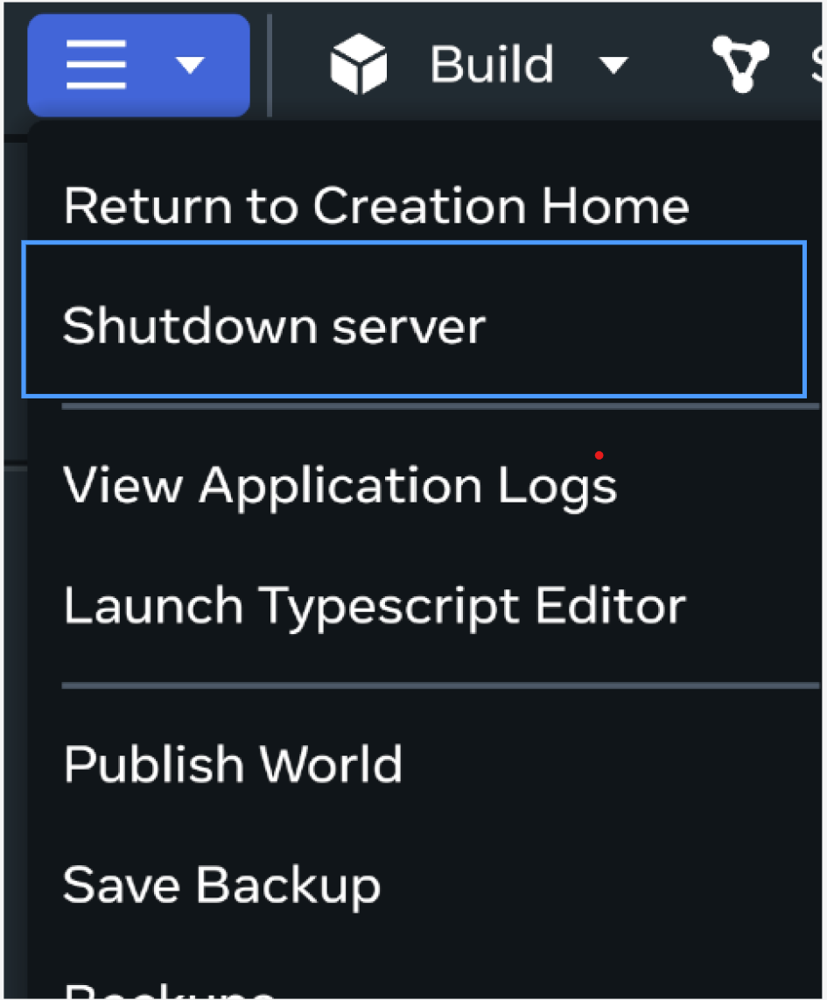
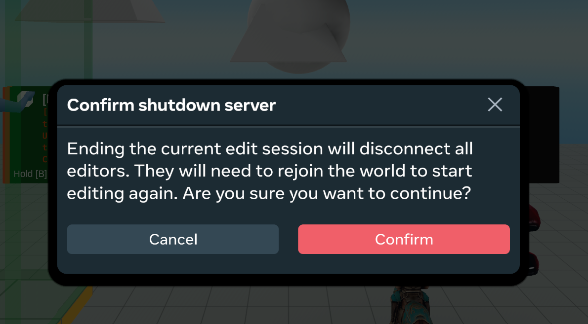

# [Shutdown Server Option](#shutdown-server-option)

The **Shutdown server** option allows creators to reset the server in a world. This is particularly useful for world creators who need to quickly refresh the world state during world creation. By shutting down the server, a new server instance is created upon rejoining, ensuring a fresh and consistent world. This feature helps avoid stale or glitchy worlds that can occur, improving the reliability and efficiency of world creation.

*Note: This feature only shuts down the actively running server client for the current world during edit mode. It does not affect the server client for published worlds.*

### [How to use the feature?](#how-to-use-the-feature)

Open desktop editor, and select **Shutdown Server** from the main menu. You will be asked to confirm this action. After confirming, anyone who is currently editing the world will be disconnected from the server and they will need to rejoin the world to continue editing.

