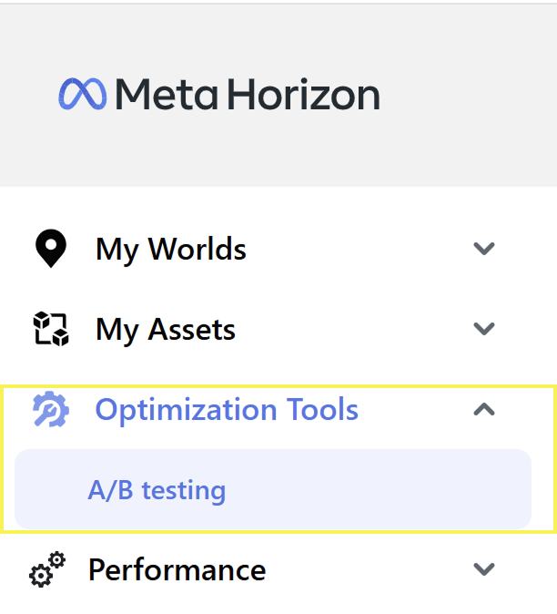
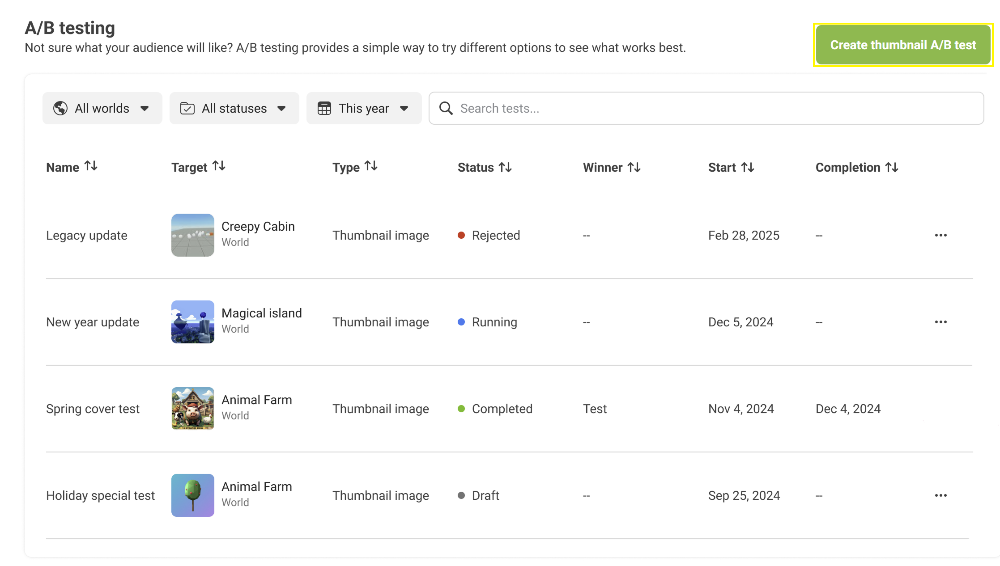
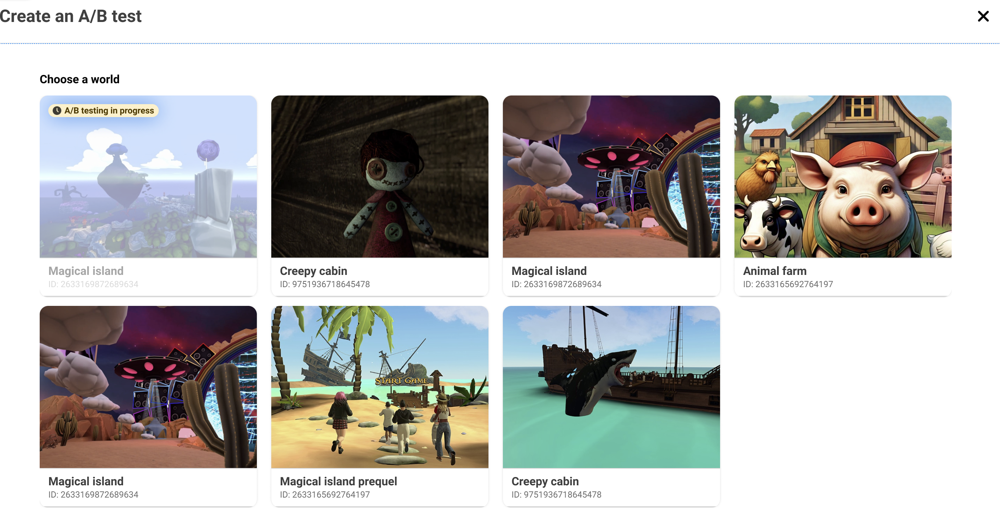
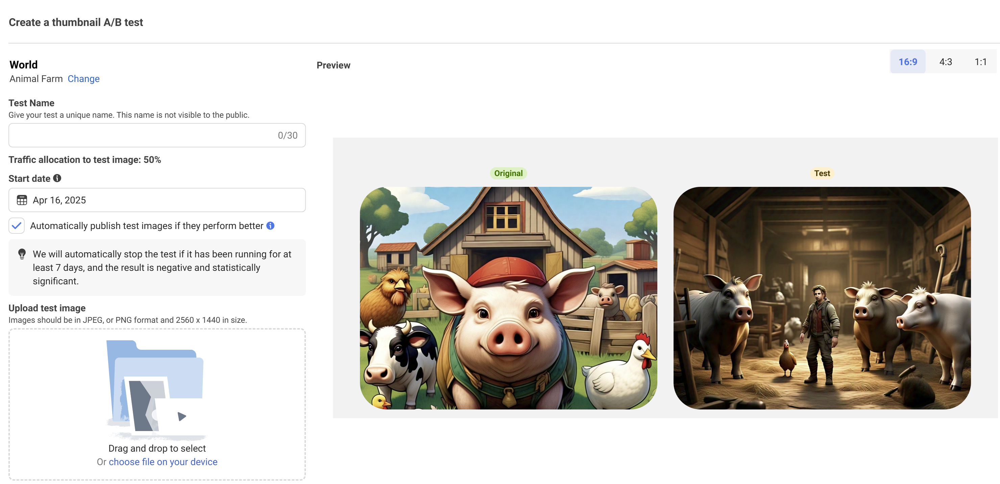
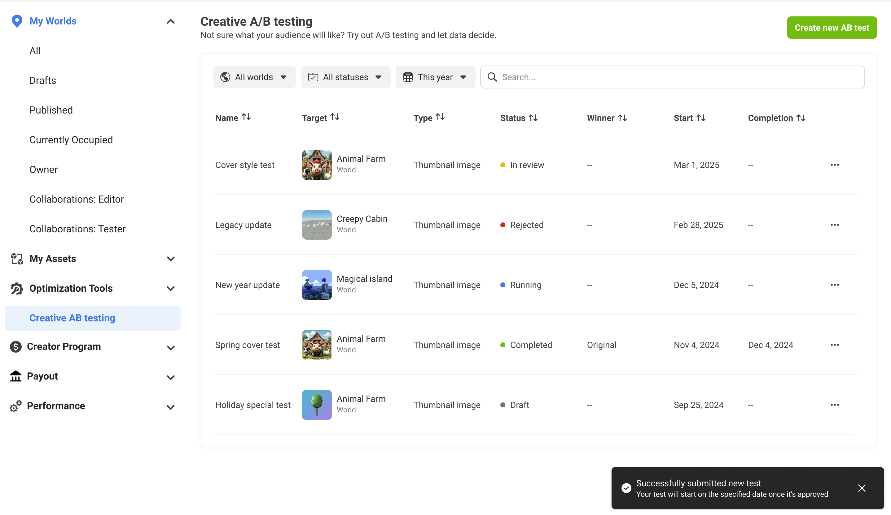
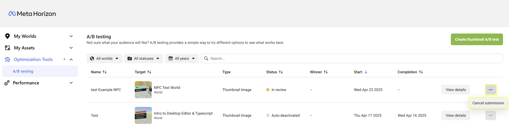
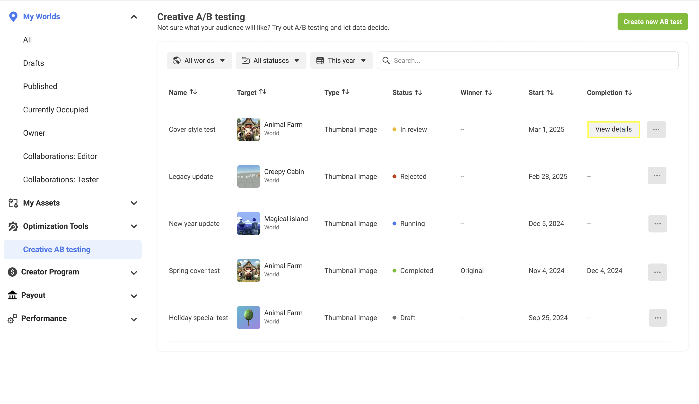
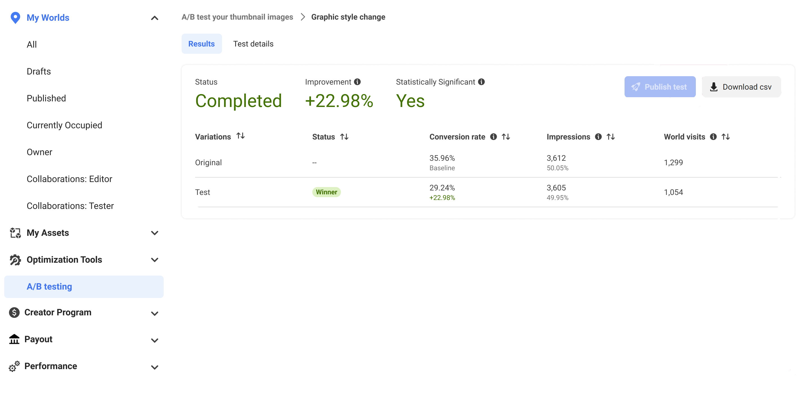

# [Thumbnail A/B testing tool](#thumbnail-ab-testing-tool)

## [Overview](#overview)

A/B tests allow developers to publish two versions of their app on the product page. Creators can:

- Create and edit tests.
- Submit a test to be published on a scheduled date.
- Check the results.

Consumers are randomly grouped into the A or B group and see one of the two product pages. Developers are given results which compare the conversion rate between the two versions and promote the version that is more optimal.

## [Access A/B testing](#access-ab-testing)

You can create A/B tests for your horizon world products through the Developer Dashboard by navigating to **Optimization Tools** > **A/B Testing**. A list of your worlds will be displayed.

### [Creating an A/B test](#creating-an-ab-test)

You can create a new A/B test by clicking **Create thumbnail A/B test**.

A list of all your eligible worlds to test is displayed. Select a world you would like to test.

Once your world is selected, input a unique name for your test in the **Test Name** text box. You can publish and schedule your test date by selecting from the calendar in the **Start date**. Drag and drop or choose an image file from your device from the **Upload test image** section. You can preview your images in **16:9**, **4:3**, and **1:1** by selecting the aspect ratio dimensions.

If you check the box to **Automatically publish test images if they perform better**,then this will automatically replace your thumbnail image at the end of the experiment with the image that performs better from the A/B test.

Click **Submit for review** to submit your test. Your world status will be updated to “In review” and you will receive a notification on the bottom right of your screen informing you that your test has been successfully submitted.

### [Cancelling a test](#cancelling-a-test)

You can cancel a test from the A/B testing page by clicking on the three dot menu beside the test you want to cancel, then click **Cancel submission**.

### [Viewing test results](#viewing-test-results)

You can view your test results from the Creative AB testing page by clicking on **View details**.

You can see the following data for your test:

| Category                      | Description                                                                                                                                                                                                                                                                                                                                                                                             |
| ----------------------------- | ------------------------------------------------------------------------------------------------------------------------------------------------------------------------------------------------------------------------------------------------------------------------------------------------------------------------------------------------------------------------------------------------------- |
| **Variations**                | The number of different thumbnail images used in the test.                                                                                                                                                                                                                                                                                                                                              |
| **Status**                    | Status is the current state of the test. The test can change states between **In review**, **Rejected**, **Running**, **Completed**, and **Cancelled**. Tests that are completed will show the image with more engagement with a status of **winner**.                                                                                                                                                  |
| **Improvement**               | Improvement is the percentage that the conversion rate is improved. This number is calculated by dividing the test conversion rate by the control conversion rate and subtracting by 1.                                                                                                                                                                                                                 |
| **Statistically Significant** | Statistical significance occurs when your experiment produces results that can be attributed to your test variables, rather than chance or external variables. It is achieved when your world generates enough traffic with a confidence level of 95% between your original and test asset. Statistical significance measurements are withheld for the first week of the experiment to assure accuracy. |
| **Conversion rate**           | The conversion rate is determined by the number of world visits divided by the impressions.                                                                                                                                                                                                                                                                                                             |
| **Impressions**               | The number of people for whom your world was displayed for more than 250ms on any surface.                                                                                                                                                                                                                                                                                                              |
| **World Visits**              | The number of people who visited your world by clicking on it from any type of surface.                                                                                                                                                                                                                                                                                                                 |

