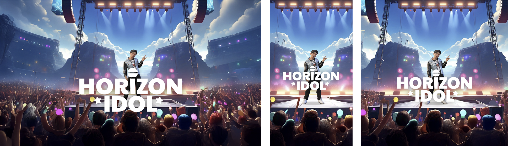
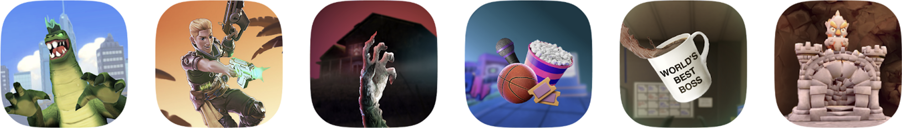
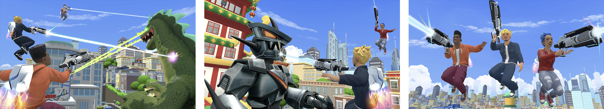

# [Worlds Asset Design Guidelines](#worlds-asset-design-guidelines)

World assets are the visual first impression of your world. High-quality, engaging visuals help attract users and communicate what makes your world unique. This document outlines best practices and requirements for creating assets that showcase your world effectively across discovery surfaces.

## [World asset specifications](#world-asset-specifications)

| **Asset Name**          | **Aspect Ratio** | **Resolution (width x height)** | **Image Format** |
| ----------------------- | ---------------- | ------------------------------- | ---------------- |
| Cover Landscape         | 16:9             | 2560 x 1440 px                  | 24-bit PNG       |
| Cover Portrait          | 9:16             | 810 x 1440 px                   | 24-bit PNG       |
| Cover Square            | 1:1              | 1440 x 1440 px                  | 24-bit PNG       |
| Icon                    | 1:1              | 512 x 512 px                    | 24-bit PNG       |
| Screenshots             | 16:9             | 2560 x 1440 px                  | 24-bit PNG       |
| Video Preview Landscape | 16:9             | 1080p                           | MP4              |
| Video Preview Portrait  | 9:16             | 1080p                           | MP4              |
| Video Preview Square    | 1:1              | 1080p                           | MP4              |

**Important**: Assets must adhere to the [safe area templates](Worlds%20Asset%20Design%20Guidelines.md#safe-areas) to ensure optimal display of your preview images across Horizon. Failure to comply may result in a poor visual experience.

While only the Cover Landscape, Cover Portrait, and Cover Square assets are required, we strongly recommend uploading the optional assets as well. Providing these extra assets ensures your worlds are optimally represented across Horizon, which in turn enhances the discoverability of your content.

## [Where world assets are visible](#where-world-assets-are-visible)

World assets show up on various discovery surfaces on mobile and VR, such as Search and Store. Quality assets have been validated to be shown as one of the strongest levers to increase interest and downstream engagement. World assets are the “book covers” in Meta Horizon, where accurate and exciting visuals can improve visits and time spent up to 40%. We have found that the closer the visuals are to the world experience, the more users will engage deeply. To learn more about worlds discovery surfaces, as well as tips and tricks on improving discoverability of your worlds, see [Intro to Worlds Discovery](Intro%20to%20Worlds%20discovery.md).

## [Asset design guidance](#asset-design-guidance)

- Keep key focal points within the [safe area](Worlds%20Asset%20Design%20Guidelines.md#safe-areas). This ensures important visual elements aren’t cut off on different surfaces or devices.
- Maintain visual consistency. All images should use the same core imagery to help users recognize your experience across various surfaces.
- Design for scalability. Images may appear at different sizes depending on the [discovery surface](Intro%20to%20Worlds%20discovery.md). Make sure key visuals remain clear and legible at any scale.
- Don’t place text in corners. Text in these areas is more likely to be cut off or overlooked. Using the templates provided will ensure important info falls within the safe zone.
- Skip taglines or extra descriptions. Let the visual speak for itself.

### [For assets with logos](#for-assets-with-logos)

- Place logos in the safe area. This ensures your logos aren’t cut off on different surfaces or devices.
- Ensure clear legibility. Users should be able to recognize the title of your experience at a glance. Use prominent, readable text styles and sizes.
- Use strong contrast. Avoid blending your logo into the background. Choose colors and fonts that stand out clearly to maintain readability.

### [Recommendations](#recommendations)

- Keep it simple. Clean, easy-to-read assets help users quickly understand and connect with your brand.
- Maintain consistency. Ensure all your images share core visual elements to create a cohesive identity.
- Emphasize key elements. Showcase the most exciting aspects of your experience—such as characters, scenes, or objects—to draw users in.
- Align with your core message. Before designing preview images, try summarizing your world in a few words to keep visuals aligned with your intent.
- Prioritize clarity. Preview images should clearly convey your world’s theme and experience. Avoid cluttered or overly abstract visuals.

## [Safe areas](#safe-areas)

Preview images appear on a variety of surfaces in a number of ways. To ensure that your key focus points are clearly visible on all surfaces and aren’t cut off or obscured, these must be within a safe area on the preview image. Non-essential artwork can be located outside the safe area, in the bleed area, but items in the bleed area could potentially be cut off or obscured on some surfaces. Additionally, all versions of the assets must be consistent with each other.

Templates that show the bleed areas on an asset can be downloaded as [.psd ](../_assets/misc/e54050564e35be993af7844558c852e545e56c5d73ade4cef80e9a10ff95024d.zip), [.png ](../_assets/misc/8760409d5e65e439bbdf0d54ec1af95b62dbd3e7e55c94975f17e57a5cf76db8.zip), or [.fig ](../_assets/misc/3919aefcfeec1e8571b60947f587fb709b012229a2001bc7e2c0387469c8db64.zip)templates.

Whether your asset is displayed on your Product Detail page (PDP) in VR or a category section on the mobile app, we strongly recommend that you take the time and effort to ensure that your assets look their best.

## [Asset types](#asset-types)

Refer to the following asset types and guidance when creating your world assets.

### [Cover assets (required)](#cover-assets-required)

Cover assets come in three varieties (landscape, portrait, square) and are the most frequently viewed marketing content for your experience. They may be displayed in web browsers, mobile and PC clients, in the headset, and other places at various sizes.

#### [Cover assets requirements:](#cover-assets-requirements)

- All assets must be similar and consistent
- Must have a 2560 x 1440 px resolution (landscape), 810 x 1440 px resolution (portrait), 1440 x 1440 px resolution (square)
- 24-bit PNG format

### [Icon (optional)](#icon-optional)

Icons are primarily used for situations requiring a small, yet clear and readable image. Your icon art needs to maintain legibility across various sizes, so you may have to modify visual elements so that they remain clear as the image is scaled down.

#### [Icon asset best practices:](#icon-asset-best-practices)

- Establish a clear focal point - center your design around one main element or symbol that represents your world’s core function or brand. Keep important visual information away from the edges of your content, as rounded corners may cause it to be cropped.
- Eliminate distracting elements - remove unnecessary details, background patterns, or secondary objects that compete for attention. Avoid adding titles, text, or logos.
- Stay true to the world’s style and theme - ensure the icon’s style, colors, and motifs are consistent with your world.

#### [Icon requirements:](#icon-requirements)

- It must match your world experience
- Corners of the icon must be squared, not slanted or rounded
- Must be a solid filled asset and must not have any transparencies
- 24-bit PNG format with dimensions of 512px x 512px

### [Screenshots (optional)](#screenshots-optional)

Screenshots are essential for helping users decide whether to visit your world by giving them a preview of what to expect. Each image you use should represent a unique scene highlighting the best part of the experience.

#### [Screenshot requirements:](#screenshot-requirements)

- Clear, sharp screenshots
- 5 images (no duplicates)
- All screenshots must reflect actual in-experience content; we recommend screenshots to be from the gameplay POV
- No banners, badges, titles, or marketing text
- Landscape image: 16:9 aspect ratio, 2560x1440 px resolution
- 24-bit PNG format

### [Video previews (optional)](#video-previews-optional)

Video previews come in landscape, portrait and square. Video previews let users preview gameplay and experiences in your world, providing them with a deeper, more immersive preview of your world. The videos should showcase a wide range of moments from your experience, giving users a holistic understanding of what to expect.

#### [Video preview best practices:](#video-preview-best-practices)

- Select key moments that demonstrate the core gameplay loop, unique features, and a variety of player interactions, that give users a feel for your game or app
- Avoid repetitive scenes; aim for a wide range of environments, mechanics, and player actions.
- All footage must be captured from actual in-experience gameplay.
- Do not include any logos, text, or branding overlays at any point in the video.
- Video may display without sound, so ensure the content still works well without sound.

#### [Video preview requirements:](#video-preview-requirements)

- Landscape video must be 10-30 seconds long and have a 16:9 aspect ratio
- Portrait video must be 10-30 seconds long and have a 9:16 aspect ratio
- Square video must be 10-30 seconds long and have a 1:1 aspect ratio
- MP4 format with 1080p or great resolution
- File size up to 150MB

## [Uploading metadata, images, and videos](#uploading-metadata-images-and-videos)

Use the following steps to upload images, videos, and metadata for your world:

1. Open your browser and navigate to the [Developer Dashboard](https://developers.meta.com/horizon-worlds/manage/).
2. Select the world that you want to upload images for.
3. From the left-side navigation, click **Distribution** > **World Metadata**
4. On the **World Metadata** page, you can add or update the **Name** and description for your world. When finished, click **Save changes**.
5. Upload your **Image assets**, including a primary square icon and up to 5 screenshots. When finished, click **Save changes**.
6. From **Video assets**, upload gameplay videos in one of three supported formats: **Landscape**, **Portrait**, and **Square**. When finished, click **Save changes**.

