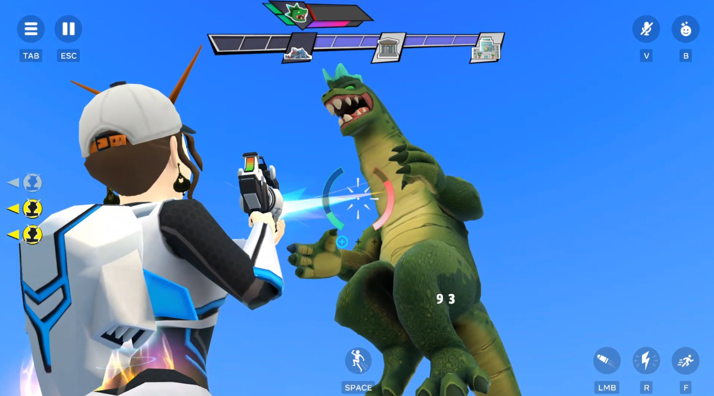
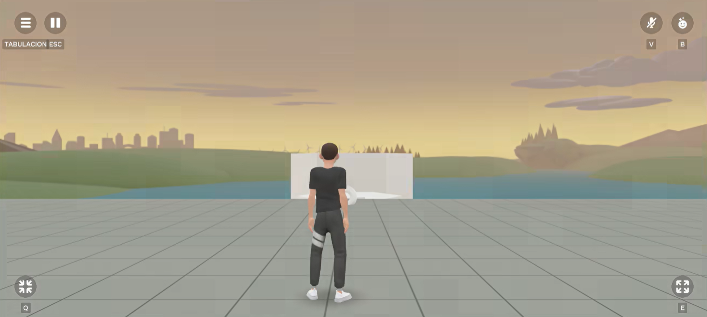
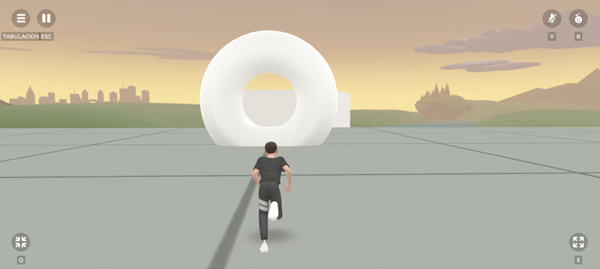

# [Avatar scaling API](#avatar-scaling-api)

This topic describes the `avatarScale` property in the [Player](../../Reference/core/Classes/Player.md) class, which is used to scale avatars. Use cases of this API include creating asymmetrical experiences where some players are larger than others, as well as dynamic changes of players during gameplay.

In the following image of [Kaiju City Showdown](https://horizon.meta.com/world/1279402616789539), the Kaiju player is larger than the rest of players using the API.



You can now unlock new content on the platform. The API enables creators to incorporate mechanics such as platform jumping and puzzle games that rely on scaling avatars up or down in order to progress in the game. Additionally, you can use avatar scaling as part of a progression system for prestige or reputation.

The following image shows the avatar at the beginning of the game.



The following image shows the avatar is scaled down to jump through the doughnut hole.



## [Prerequisites](#prerequisites)

- [TypeScript API version 2.0.0 or later](../Upgrade%20World%20to%20TypeScript%20API%20v2.0.0.md).
- The API is available in [horizon/core/player](../../Reference/core/Classes/Player.md).
- [Enable the API module](../Upgrade%20World%20to%20TypeScript%20API%20v2.0.0.md#upgrading-your-world).

## [Limitations](#limitations)

The recommended range for scaling avatars is between 0.05 and 50. Values outside of this range may cause unexpected behavior due to engine limitations.

## [Best practices](#best-practices)

The recommendation is to change the scale when the avatar teleports to another location or when the screen is in transition. Avoid changing the size too often.

## [Sample code](#sample-code)

The following sample shows you how to use the `avatarScale` property in the [Player](../../Reference/core/Classes/Player.md) class. When the user uses the [right grip action](../../Reference/core/Enumerations/PlayerInputAction.md), the player avatar scale will be increased. When the user uses the [left grip action](../../Reference/core/Enumerations/PlayerInputAction.md), the avatar scale will be decreased. Keep in the mind that the example only iterates between 3 different scales, which are 10%, 100%, and 500%. Additionally, the sample also uses custom input APIs, learn more in the [developer guide](../../Mobile%20and%20web/TypeScript%20APIs%20for%20mobile/Custom%20Input%20API.md) and the [API reference guide](../../Reference/core/Classes/PlayerControls.md).

```typescript
import * as hz from 'horizon/core';

class SetAvatarScale extends hz.Component<typeof SetAvatarScale> {
  static propsDefinition = {};

  growInput?: hz.PlayerInput;
  shrinkInput?: hz.PlayerInput;

  avatarScales: number[] = [0.1, 1, 5];
  avatarScaleIndex: number = 1;

  start() {
    this.connectCodeBlockEvent(
      this.entity,
      hz.CodeBlockEvents.OnPlayerEnterWorld,
      (player) => {
      this.entity.owner.set(player);
    });

    if (this.entity.owner.get() == this.world.getServerPlayer()) return;

    this.growInput = hz.PlayerControls.connectLocalInput(
      hz.PlayerInputAction.RightGrip,
      hz.ButtonIcon.Expand, this);

    this.growInput.registerCallback((_, pressed) => {
      if (pressed) this.changeAvatarScale(1);
    });

    this.shrinkInput = hz.PlayerControls.connectLocalInput(
      hz.PlayerInputAction.LeftGrip,
      hz.ButtonIcon.Contract, this);

    this.shrinkInput.registerCallback((_, pressed) => {
      if (pressed) this.changeAvatarScale(-1);
    });
  }

  changeAvatarScale(increment: number) {
    let player = this.entity.owner.get();
    this.avatarScaleIndex = Math.min(
      Math.max(0, this.avatarScaleIndex + increment),
      this.avatarScales.length - 1);
    player.avatarScale.set(this.avatarScales[this.avatarScaleIndex]);
  }
}

hz.Component.register(SetAvatarScale);
```

## [What’s next?](#whats-next)

Try more tutorials and follow examples in these topics:

- [Scripting](../Scripting%20using%20TypeScript.md)
- [Tutorial worlds](https://developers.meta.com/horizon-worlds/learn/documentation/tutorial-worlds/build-your-first-game/module-1-build-your-first-game)

