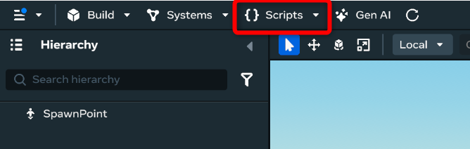
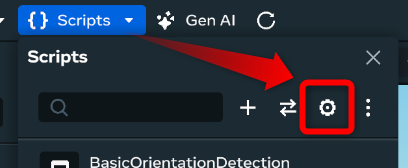
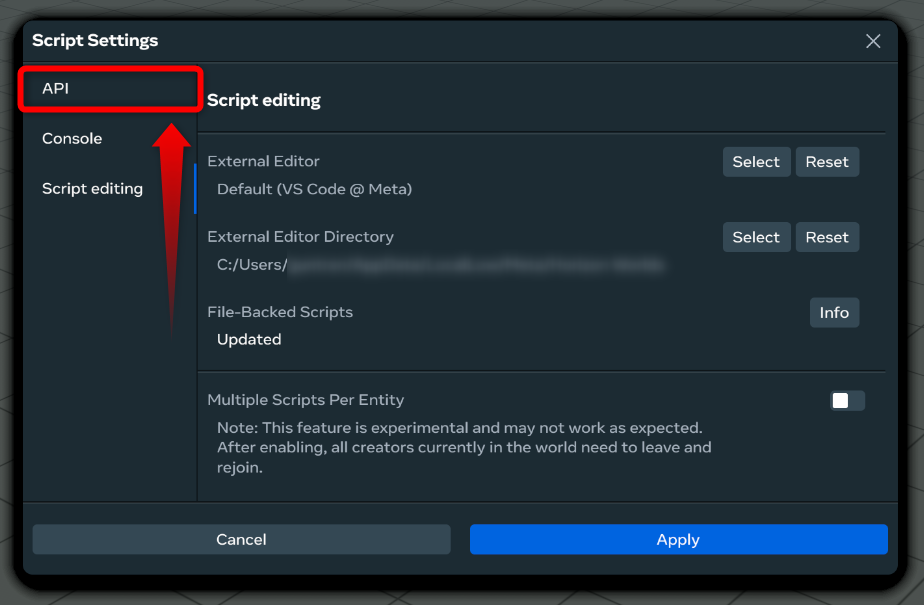
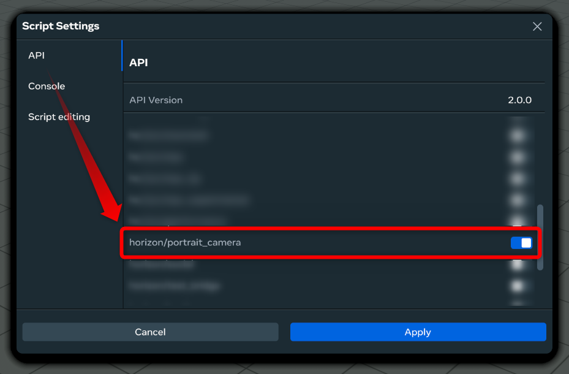
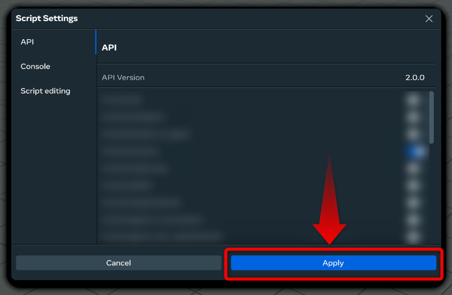

# [Portrait Camera API](#portrait-camera-api)

The Portrait Camera API is an experimental module that extends the standard Camera API with world-orientation detection capabilities. This allows you to create different camera behaviors and visual experiences based on whether you publish your world in portrait or landscape orientation.

## [Overview](#overview)

The Portrait Camera API provides the `PortraitCamera` class, which extends the core `Camera` class with additional properties for detecting the current world orientation. This lets you create adaptive experiences and easily test between the different orientations.

**Note:** This is an experimental module that will be merged into the core Camera API when fully released.

## [Prerequisites](#prerequisites)

To use the Portrait Camera API, you need:

- **Editor version**: Desktop Editor version 229 or later.
- **Script configuration**: Scripts must be set to [local execution mode](../Local%20scripting/Getting%20Started%20with%20Local%20Scripting.md#set-a-script-to-run-locally) and owned by the target player.
- **Compiling scripts**: You must have at least one script which successfully compiles in order to see the scripting API options.

## [Enabling the API](#enabling-the-api)

1. Open the **Scripts panel** in the desktop editor. 
2. Click the gear icon to open Script Settings. 
3. Click on **API** on the left side of the settings. 
4. Enable **horizon/portrait\_camera**. 
5. Click **Apply** to save the changes. 

## [API reference](#api-reference)

The [`PortraitCamera`](../../Reference/portrait_camera/Classes/PortraitCamera.md) class extends the standard [`Camera`](../../Reference/camera/Classes/Camera.md) class with orientation detection capabilities.

### [Properties](#properties)

| Properties               | Type | Description                                                                                                                                                |
| ------------------------ | ---- | ---------------------------------------------------------------------------------------------------------------------------------------------------------- |
| **`currentOrientation`** | enum | A readable property that returns the current world orientation as an enum of either **`CameraOrientation.Portrait`** or **`CameraOrientation.Landscape`**. |

### [Methods](#methods)

The [`PortraitCamera`](../../Reference/portrait_camera/Classes/PortraitCamera.md) class inherits all methods from the standard [`Camera`](../../Reference/camera/Classes/Camera.md) class and can be used as a drop-in replacement with additional orientation capabilities.

### [Usage example: basic orientation detection](#usage-example-basic-orientation-detection)

```typescript
import * as hz from 'horizon/core';
import {PortraitCamera} from 'horizon/portrait_camera';

class OrientationChecker extends hz.Component<typeof OrientationChecker> {
  static propsDefinition = {};

  start() {
    this.connectCodeBlockEvent(
      this.entity,
      hz.CodeBlockEvents.OnPlayerEnterWorld,
      (player: hz.Player) => {
        this.entity.owner.set(player);
        console.log(`Set entity owner to: ${player.name}`);
      },
    );

    if (this.entity.owner.get().id != this.world.getServerPlayer().id) {
      this.setUpCamera();
    }
  }

  setUpCamera() {
    let cam = new PortraitCamera();
    if (cam.currentOrientation.get().toString() == 'PORTRAIT') {
      // Configure portrait-specific camera behavior
      console.log('Portrait Options');
      this.configurePortraitCamera();
    } else {
      // Configure landscape-specific camera behavior
      console.log('Landscape Options');
      this.configureLandscapeCamera();
    }
  }

  configurePortraitCamera() {
    // Portrait-specific camera settings
    // e.g., adjust field of view, position, or other camera properties
  }

  configureLandscapeCamera() {
    // Landscape-specific camera settings
    // e.g., different camera positioning for wider screens
  }
}

hz.Component.register(OrientationChecker);
```

### [Script execution requirements](#script-execution-requirements)

- **Local execution mode**: Always set scripts using the Portrait Camera API to [local execution mode](../Local%20scripting/Getting%20Started%20with%20Local%20Scripting.md#set-a-script-to-run-locally).
- **Player ownership**: Ensure the script entity is owned by the target player before making camera API calls.
- **Ownership transfer**: Transfer ownership when players enter the world, similar to other camera-related scripts.

### [Integration with spawn point gizmos](#integration-with-spawn-point-gizmos)

The Portrait Camera API works well alongside [spawn point gizmo Mobile Camera Options](../../Gizmos/Spawn%20point%20gizmo.md#mobile-camera-options):

## [Testing and preview](#testing-and-preview)

Use the [Preview Configuration](../../Desktop%20editor/Get%20started%20with%20Desktop%20Editor/Preview%20mode.md#setting-the-preview-device) options in the desktop editor.

## [Related documentation](#related-documentation)

- [Spawn Point Gizmo - Mobile Camera Options](../../Gizmos/Spawn%20point%20gizmo.md#mobile-camera-options)
- [Preview Mode - Setting the Preview Device](../../Desktop%20editor/Get%20started%20with%20Desktop%20Editor/Preview%20mode.md#setting-the-preview-device)
- [Camera API for Web and Mobile](../../Mobile%20and%20web/TypeScript%20APIs%20for%20mobile/Camera.md)
- [Local Scripting Documentation](../Local%20scripting/Getting%20Started%20with%20Local%20Scripting.md)
- [World Settings Modification - World Orientation](../../Desktop%20editor/Settings/World%20Settings%20Modification.md#advanced)

## [Limitations and notes](#limitations-and-notes)

- **Experimental status**: This API is experimental and may change before final release.
- **Platform support**: Currently designed for mobile devices; behavior on other platforms may vary.
- **Preview limitations**: Publishing worlds with Portrait orientation will currently display as landscape in the final published version until the feature is fully released.
- **Early access**: This provides early access to editor tooling for development and testing preparation.

