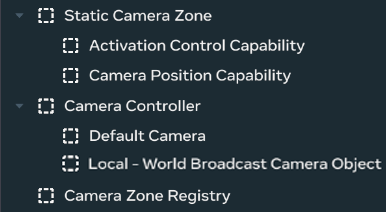
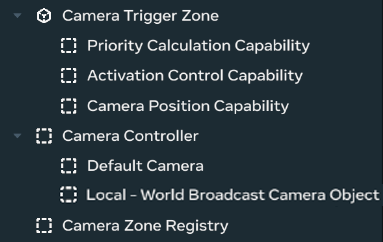

# [World Broadcast Camera Framework Guide](#world-broadcast-camera-framework-guide)

## [System Setup](#system-setup)

### [Step 1: Add the Registry Service](#step-1-add-the-registry-service)

Each world using World Broadcast requires exactly one `CameraZoneRegistryService` component.

1. Add the `Camera Zone Registry` object from “World Broadcast Camera System - Prefabs”
2. The component will auto-initialize as a singleton and requires no additional configuration

### [Step 2: Add the Camera Controller](#step-2-add-the-camera-controller)

Each world using World Broadcast requires exactly one `CameraController` component. This controller orchestrates the entire camera system.

1. Add the `Camera Controller` object from “World Broadcast Camera System - Prefabs”
2. Configure the required props:
   - `localBroadcastCamera`: Add the `Local - World Broadcast Camera Object` object from “World Broadcast Camera System - Prefabs”
   - `broadcastCameraUI`: Optional entity for UI overlay

## [Component Setup](#component-setup)

### [Setting Up a Static Camera Zone](#setting-up-a-static-camera-zone)

1. **Create the zone entity**:
   - Add the `Static Camera Zone` object from “World Broadcast Camera System - Prefabs”
2. **Create capability entities**: Find these as the “...Capability” objects in “World Broadcast Camera System - Prefabs”.

```
Position
 
Entity
:


└──
 
CameraPositionCapability
 component


Activation
 
Entity
:


└──
 
ActivationControlCapability
 component
```

1. **Wire the dependencies**:
   - Set `positionCapabilityEntity` to your position capability object
   - Set `activationCapabilityEntity` to your activation capability object
   - Configure `zoneId` to make each zone readable and easily referenced when using the Camera Controller API
2. **Configure positioning**:
   - Option A: Set `transformEntity` to a dedicated camera “transform” entity - you can use an `Empty Object` by creating one with `Build > Empty Object`
   - Option B: Enable `useSelfTransform` to use the zone entity’s position

### [Setting Up a Trigger Camera Zone](#setting-up-a-trigger-camera-zone)

1. **Create the zone entity**:
   - Add the `Camera Trigger Zone` object from “World Broadcast Camera System - Prefabs”
2. **Create capability entities**: Find these as the “...Capability” objects in “World Broadcast Camera System - Prefabs”. The Priority Calculator is also in this Asset Folder.

```
Position
 
Entity
:


└──
 
CameraPositionCapability
 component


Priority
 
Entity
:


└──
 
PriorityCalculationCapability
 component
    
└──
 
PriorityCalculatorComponent
 component 
(
It
 doesn
't have to be a child)

Activation Entity:
└── ActivationControlCapability component
```

1. **Wire the dependencies**:
   - Set `positionCapabilityEntity` to your position capability object
   - Set `priorityCapabilityEntity` to your priority capability object
   - Set `activationCapabilityEntity` to your activation capability object
2. **Configure behavior**:
   - Set `autoActivateOnPlayers` to enable automatic activation
   - Set `minPlayersForActivation` to define the activation threshold
   - Configure `zoneId` for external control

## [Configuration Examples](#configuration-examples)

### [Simple Static Camera Zone](#simple-static-camera-zone)

```
// Zone Entity Configuration


StaticCameraZone
:

  
-
 zoneId
:
 
"scenic_view_1"

  
-
 zoneType
:
 
"static"

  
-
 positionCapabilityEntity
:
 
[
Position
 
Entity
]

  
-
 activationCapabilityEntity
:
 
[
Activation
 
Entity
]


// Position Entity Configuration


CameraPositionCapability
:

  
-
 useSelfTransform
:
 
true


// Activation Entity Configuration


ActivationControlCapability
:

  
-
 isActive
:
 
true

  
-
 canBeControlledExternally
:
 
true
```

### [Player-Responsive Trigger Zone](#player-responsive-trigger-zone)

```
// Zone Entity Configuration


CameraTriggerZone
:

  
-
 zoneId
:
 
"playground_zone"

  
-
 zoneType
:
 
"trigger"

  
-
 autoActivateOnPlayers
:
 
true

  
-
 minPlayersForActivation
:
 
1

  
-
 positionCapabilityEntity
:
 
[
Position
 
Entity
]

  
-
 priorityCapabilityEntity
:
 
[
Priority
 
Entity
]

  
-
 activationCapabilityEntity
:
 
[
Activation
 
Entity
]


// Priority Entity Configuration


PriorityCalculationCapability
:

  
-
 priorityCalculatorEntity
:
 
[
Calculator
 
Entity
]

  
-
 fallbackPriority
:
 
1

  
-
 minimumPriority
:
 
0


// Calculator Entity Configuration (Optional)


PriorityCalculatorComponent
:

  
-
 basePlayerPriority
:
 
1

  
-
 mundanePetPriority
:
 
10

  
-
 fantasticalPetPriority
:
 
100
```

### [Custom Positioned Camera](#custom-positioned-camera)

```
// Create a dedicated camera positioning entity


Camera
 
Position
 
Entity
:

  
-
 
Position
:
 
(
10
,
 
5
,
 
10
)

  
-
 
Rotation
:
 
(
0
,
 
45
,
 
0
)


// Zone Configuration


CameraPositionCapability
:

  
-
 transformEntity
:
 
[
Camera
 
Position
 
Entity
]

  
-
 useSelfTransform
:
 
false
```

## [Presets](#presets)

The presets will be in the folder path “World Broadcast System - Prefabs > Presets”.

### [Static Camera Preset](#static-camera-preset)

This preset includes:

- A fully connected Camera Controller
- The Camera Registry
- A single Static Camera Zone with capabilities connected as child entities

To add more camera zones, duplicate the Static Camera Zone entity. Ensure each zone has a unique id, or leave the `zoneId` field empty to generate a unique id automatically.



### [Camera Trigger Preset](#camera-trigger-preset)

This preset includes:

- A fully connected Camera Controller
- The Camera Registry
- A single Camera Trigger Zone with capabilities connected as child entities

To add more camera zones, duplicate the Camera Trigger Zone entity. Ensure each zone has a unique id, or leave the `zoneId` field empty to generate a unique id automatically.



## [Troubleshooting](#troubleshooting)

### [Common Issues](#common-issues)

**Issue**: “Registry service not initialized” error

- **Solution**: Ensure `CameraZoneRegistryService` component exists in your world

**Issue**: Camera zones not appearing in feed

- **Solution**: Check that zones are registering successfully in console logs
- **Debug**: Enable `debugMode: true` on zone components

**Issue**: Priority calculation not working

- **Solution**: Verify `PriorityCalculatorComponent` is properly connected
- **Check**: Ensure `priorityCalculatorEntity` prop is set correctly

**Issue**: Camera positioning errors

- **Solution**: Verify target entities have position/rotation components
- **Alternative**: Use `useSelfTransform: true` for simple positioning

**Issue**: Trigger zones not activating

- **Solution**: Check trigger volume configuration and collision layers
- **Verify**: Ensure `autoActivateOnPlayers` is enabled
- **Check**: Confirm `minPlayersForActivation` threshold is appropriate

**Issue**: External control not working

- **Solution**: Verify `zoneId` is set and unique across all zones
- **Check**: Ensure `canBeControlledExternally` is enabled on activation capability

### [Debugging Tips](#debugging-tips)

1. **Enable Debug Mode**: Set `debugMode: true` on components for detailed logging
2. **Check Console Logs**: Look for registration and validation messages
3. **Verify Entity Wiring**: Ensure all capability entities are properly connected
4. **Test Activation**: Manually activate/deactivate zones to test behavior
5. **Monitor Registry**: Check that zones appear in the registry service logs
6. **Validate Capabilities**: Ensure capability entities have the correct components attached

### [Performance Issues](#performance-issues)

**Issue**: Camera switching is slow or laggy

- **Solution**: Limit the number of active trigger zones
- **Check**: Verify caching is working (look for cache hit messages in logs)

**Issue**: High CPU usage

- **Solution**: Reduce frequency of priority calculations
- **Alternative**: Use static zones for fixed monitoring points instead of trigger zones

**Issue**: Memory leaks

- **Solution**: Ensure zones properly unregister when destroyed
- **Check**: Monitor registry size in debug logs

---

