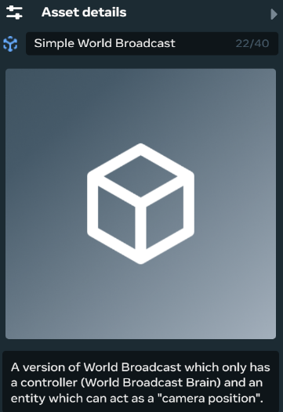
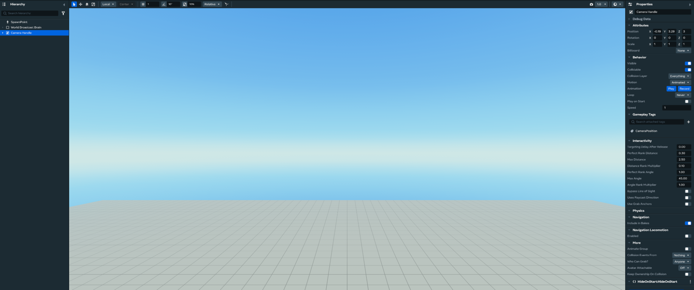
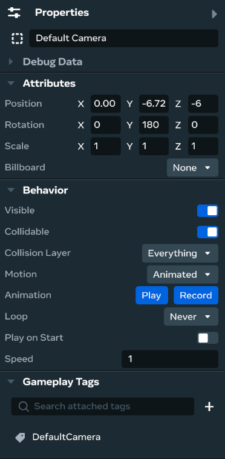

# [World Broadcast Simple Asset Group Guide](#world-broadcast-simple-asset-group-guide)

The `Simple World Broadcast` asset group provides an easy, “plug-and-play” set of entities for creators who want to quickly begin working with the World Broadcast system. It includes the minimum required tech to use all features and can be extended with custom logic.



## [System Setup](#system-setup)

### [Step 1: Add the “Simple World Broadcast” Asset Group](#step-1-add-the-simple-world-broadcast-asset-group)

The Simple World Broadcast Asset Group contains two root objects:

1. `World Broadcast Brain`
2. `Camera Handle`

The `World Broadcast Brain` component handles cycling through all camera handles in the world. An API is available to force the brain to focus on a particular camera handle.

```
  
public
 
ForceCameraFocusOnTarget
(
target
:
 
CameraTransform
):
 
void
 
{

    
if
 
(
target 
==
 
null
)
 
{

      console
.
error
(
'[*] WorldBroadcastBrain: Cannot force focus on null target'
);

      
return
;

    
}


    
if
 
(
this
.
props
.
debugMode
)

      console
.
log
(
`[WorldBroadcastBrain] Forcing focus on ${JSON.stringify(target)} `
);


    
this
.
forcedFocusTarget 
=
 target
;

    
this
.
currentState 
=
 
CameraDirectorState
.
ForcedFocus
;

    
this
.
UpdateCamera
(
target
);

  
}


  
public
 
EndForcedFocus
():
 
void
 
{

    
if
 
(
this
.
props
.
debugMode
)

      console
.
log
(
'[WorldBroadcastBrain] Ending forced focus'
);


    
this
.
currentState 
=
 
CameraDirectorState
.
CyclingThroughDefaultCameraPositions
;

    
this
.
forcedFocusTarget 
=
 
null
;

  
}
```

### [Step 2: Add More Camera Handles](#step-2-add-more-camera-handles)

The World Broadcast Brain picks up all `Camera Handle` components at `start`. To add more handles, duplicate the handle bundled with the Asset Group.



## [Extending The System](#extending-the-system)

The forced focus API can be used with custom logic to create gameplay-dependent camera switches. For example, link a trigger component to a camera handle to force the world broadcast brain to look at whatever enters the trigger zone. The `ForceCameraFocusOnTarget()` method can be called multiple times to change the forced focus target *without* ending forced focus first.

## [Troubleshooting](#troubleshooting)

### [“No default camera found”](#no-default-camera-found)

This error appears when no “Default Camera” entity exists as a child of the brain. The Asset Group includes this by default when imported, but the object hierarchy may have changed. If the “default camera” is no longer a child of the `World Broadcast Brain`, add an empty entity and copy these values from the inspector (excluding the transform):



### [“WorldBroadcastBrain: Cannot force focus on null target”, or “WorldBroadcastBrain: Cannot update camera to undefined transform”](#worldbroadcastbrain-cannot-force-focus-on-null-target-or-worldbroadcastbrain-cannot-update-camera-to-undefined-transform)

This error occurs when the `target` passed into the `ForceCameraFocusOnTarget()` method does not exist. When calling the API, pass a new object of type `CameraTransform`. Create this object at the point of the API call. The type definition is as follows:

```
type 
CameraTransform
 
=
 
{

  position
:
 hz
.
Vec3
;

  rotation
:
 hz
.
Quaternion
;


};
```

