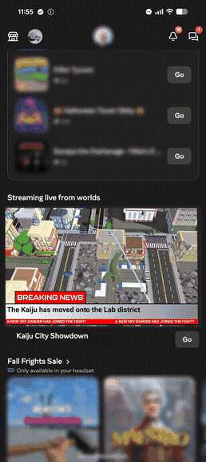
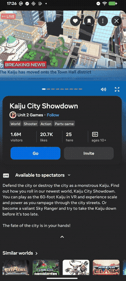
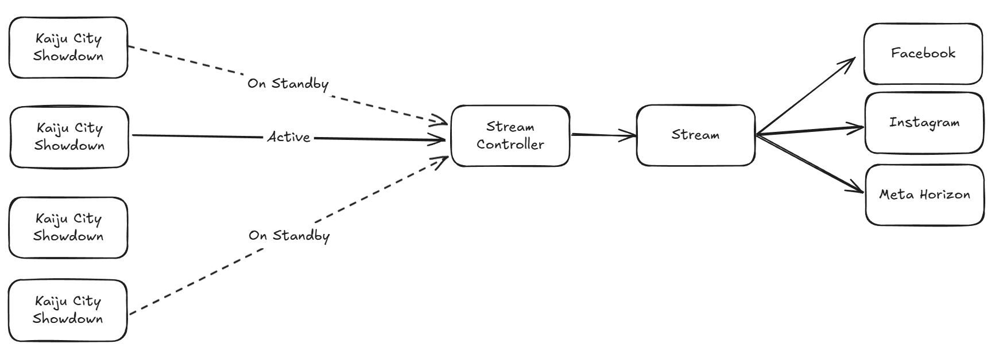
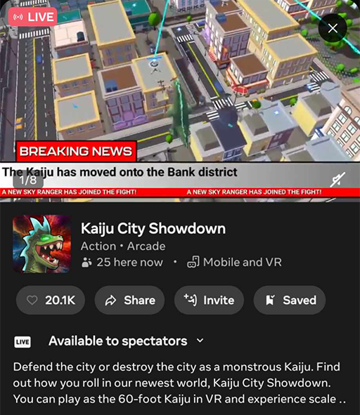
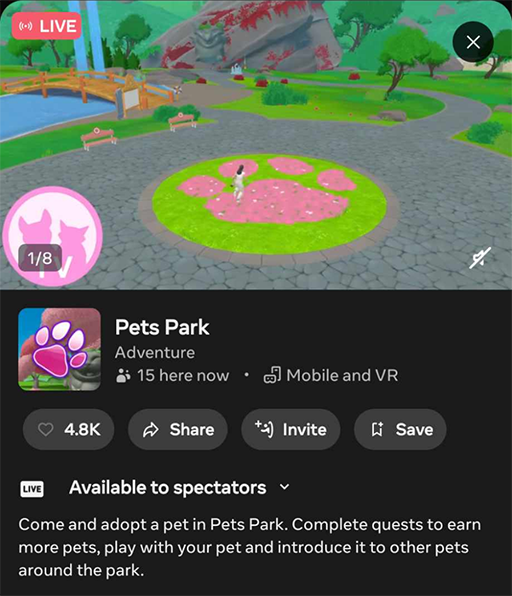

# [World Broadcast](#world-broadcast)

World Broadcast streams from live cameras inside Horizon to surfaces like the Meta Horizon app feed and Meta’s wider family of apps. Potential players can see inside the world, which entices them to hit the Go button.

> [!Note]
>
> World Broadcast does not work for worlds running in Portrait orientation at this time.



A high-quality integration shows the world’s action: what players are doing, how they’re playing together, and cool moments. It chooses where to point the camera to capture the best shots where the action happens.

It can add visuals to convey more information about what’s happening. For example, Kaiju City Showdown uses a news-style custom UI to showcase the game’s progression.

## [Integrate your world](#integrate-your-world)

The World Broadcast API is lightweight: wait for an event, then move the camera around.

The core technical flow is:

1. Subscribe to the `OnWorldBroadcastCameraJoined(cameraPlayer: Player)` event. This notifies you when a World Broadcast camera joins the world, allowing you to start camera scripting.
2. Transfer control of an entity to the `cameraPlayer` provided by the event: `myCameraDirectorEntity.owner.set(cameraPlayer)`
3. In a script on that entity, use the LocalCamera API to focus on points of interest in your scene.
4. Add custom UI to the entity to include extra on-screen elements that only the stream can see.

```
// In a default script on world start:


this
.
connectCodeBlockEvent
(

  
this
.
entity
,

  hz
.
CodeBlockEvents
.
OnWorldBroadcastCameraJoined
,

  cameraPlayer 
=>
 
{

    
this
.
myCameraDirectorEntity
.
owner
.
set
(
cameraPlayer
);

  
},


);
```

### [Alternate implementation methods](#alternate-implementation-methods)

- To accelerate development, we provide a simple asset group implementation with a largely plug-and-play experience: [World Broadcast Simple Asset Group Guide](World%20Broadcast%20Simple%20Asset%20Group%20Guide.md)
- We’ve also created a more advanced drop-in framework to help you get started. This provides static cameras and trigger zones that activate when players are present: [World Broadcast Camera Framework Guide](World%20Broadcast%20Camera%20Framework%20Guide.md)

# [High-level Overview](#high-level-overview)



The World Broadcast Stream Controller periodically scans all public instances of a given world, and discards those with players below a minimum count. It ranks the remaining instances (e.g., by population, player idleness) and selects some to prepare for streaming. One instance is then selected and presented to the public via a live-stream on the Meta Horizon app and potentially within the wider Family of Apps (exact locations vary). Periodically, a different instance is selected for presentation, e.g. if the current instance’s population drops or a more active instance becomes available.

When the Stream Controller prepares an instance for streaming, an additional cloud-based client joins the world. This triggers an `OnWorldBroadcastCameraJoined` code event on the server, which signals the world to start camera scripting. The streaming client doesn’t affect the player count and has no visible presence.

When the Stream Controller selects a prepared instance for the public live-stream, players in that instance receive a notification that they have an audience. They receive another notification after their instance is deselected. Players who join while the instance is already being shown receive the same notifications.

`OnWorldBroadcastCameraJoined` indicates that the instance is being *prepared*, not that it *is* being shown. No script event fires when the instance is selected to be shown. The instance should assume it is always being shown and start running camera scripting, but should not present this assumption to players.

World audio is captured automatically, including all effects and music. Player voices (VoIP) are not included.

# [Testing](#testing)

You can test your changes in two ways:

1. **In-editor** - This is the easiest workflow for checking changes as you work. Set up a trigger (e.g., a trigger zone) that activates your camera scripting when a player enters it. This allows you to see your cameras in the editor. Remember to disable this trigger before publishing! The frameworks we’ve provided have Debug Mode toggles to help with this.
2. **Developer Dashboard** - To test with real instances, navigate to **Distribute > World Broadcast** in the [Meta Horizon Developer Dashboard](https://horizon.meta.com/creator/). This provides a private “Draft” stream of instances you are in, allowing you to verify angles and UI. Note that you must publish your changes first, and instance preparation can take up to 5 minutes.

# [Examples](#examples)

Two Unit 2 Games worlds are currently integrated: Kaiju City Showdown and Pets Park. To view these streams, visit their details pages in the Meta Horizon app. The broadcasts appear in the gallery at the top.

## [Kaiju City Showdown](#kaiju-city-showdown)

[Kaiju City Showdown - Meta Horizon](https://horizon.meta.com/world/1279402616789539/) (open on mobile to see the stream in the Meta Horizon app).

Uses a custom-scripted setup with a prop news helicopter that circles the Kaiju with a camera attached underneath. Custom UI creates the appearance of a live news broadcast, with headlines that react to in-world events.



## [Pets Park](#pets-park)

[Pets Park - Meta Horizon](https://horizon.meta.com/world/9116337161745306/) (open on mobile to see the stream in the Meta Horizon app). Uses the example framework to place trigger zones in the world. These zones activate cameras when players are present.



# [Additional Recommendations](#additional-recommendations)

## [Keep the camera moving](#keep-the-camera-moving)

A single static camera is not engaging to watch. An engaging stream switches viewpoints periodically or uses cameras that move with the action, framing or following players.

## [Skip idle players](#skip-idle-players)

While the Stream Controller avoids instances with idle players, they will sometimes be present. If you detect an idle player (e.g., they haven’t moved or performed an action for a few seconds), refocus on active players. It also helps to move focus between players periodically.

## [Portrait](#portrait)

We’re experimenting with portrait streams in various forms, e.g., for Reels-type UX, initially by cropping the landscape stream. For the best results, keep action in the center of the camera.

