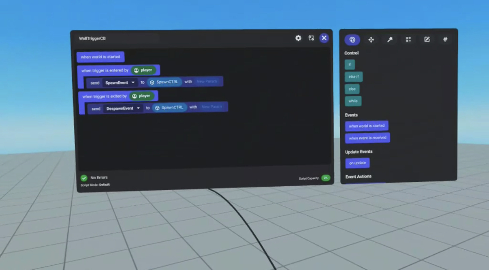
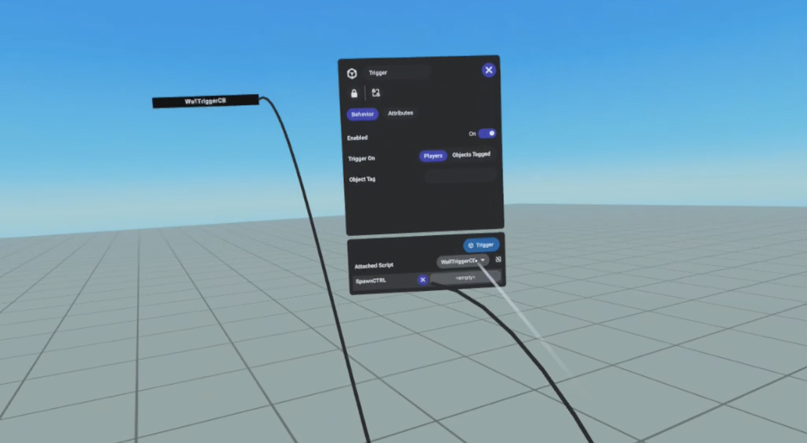
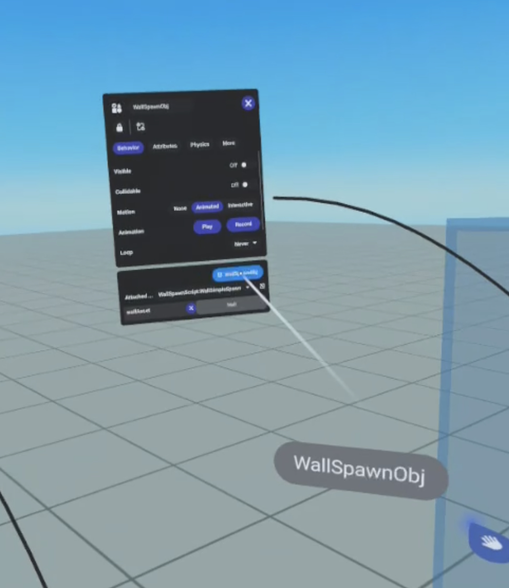
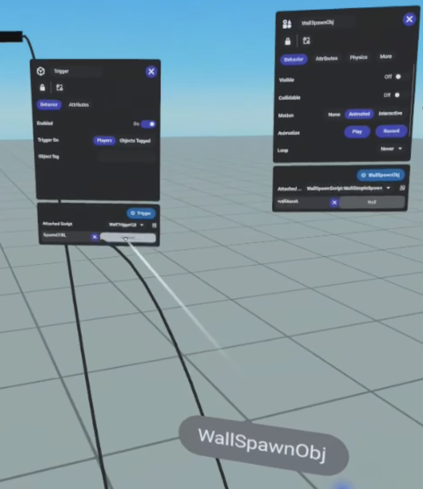
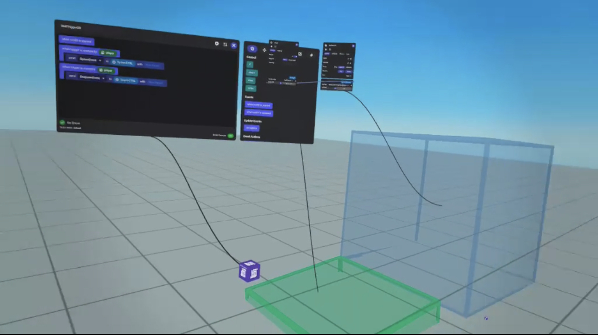

# [Introduction to Asset Spawning](#introduction-to-asset-spawning)

Asset spawning and despawning allows creators to instantiate and destroy objects at runtime. It does this through scripts powered by CodeBlocks and TypeScript. When objects are tied to Assets pulled from the creator’s Asset Library, it enables objects to be spawned so users can interact with them to perform in-world actions.

## [Considerations](#considerations)

Before deciding to add object spawning to a world, there are a few questions you’ll want to answer to determine if object spawning and despawning benefits or detracts from your world’s experience. Spawning and despawning has a performance cost at runtime, especially when objects are spawned in quick succession. Consider the following:

- How often will objects need to be created or removed for the experience?
- How many object variations does the world require?
- Do certain objects need to persist for the entire world experience?

**Note:** See the Optimization Tips near the end of this document for information on improving performance.

## [Implementing SpawnController](#implementing-spawncontroller)

The SpawnController object is a container for managing the spawning and despawning of assets. You create a SpawnController object to contain a specified asset, including position, rotation, and scale:

```typescript
// Controls the asset spawn
spawnController!: SpawnController;

this.spawnController = new SpawnController(
  myAsset,
  myPosition,
  myRotation,
  Vec3.one
  );
```

The SpawnController contains:

- The asset you’d like to spawn (myAsset)
- The position for the spawned object as a Vec3 (myPosition)
- The rotation for the spawned object as a Quaternion (myRotation)
- The scale of the spawned object as a Vec3 (Vec3.one)

A full example is listed below.

After the SpawnController has been defined for the asset, the following methods can be applied on the object:

| **Method** | **Description**                                                                                                                                                                                                                                                                                    |
| ---------- | -------------------------------------------------------------------------------------------------------------------------------------------------------------------------------------------------------------------------------------------------------------------------------------------------- |
| load()     | Loads the asset specified in the SpawnController object into runtime memory.                                                                                                                                                                                                                       |
| spawn()    | Spawns the asset from runtime memory into the location specified when you created the SpawnController object. If the load() method has not been called yet, it is automatically called before spawn(). The combined call to load() and spawn() is much longer than just calling spawn() by itself. |
| unload()   | Unloads the SpawnController entity from the world. A reference to the spawn entity remains. The spawn entity can be reused by calling again the load() method.                                                                                                                                     |
| dispose()  | Destroys the SpawnController object.                                                                                                                                                                                                                                                               |

### [Performance notes](#performance-notes)

The load() method performs 0.5 ms/frame of spawning work, while spawn() performs 5 ms/frame of spawning work.

If load() finished before calling spawn(), then the spawn() call has almost nothing left to do. To finish the spawning, the spawn() method enables and makes visible the entity at the specified location in a single frame and waits for lighting of the entity to begin.

## [Asset Spawning and Despawning Example](#asset-spawning-and-despawning-example)

The following TypeScript example demonstrates how to spawn and despawn a wall when the player steps on a trigger. The code:

1. Creates the asset variable `wallAsset` in the script.
2. Declares two CodeBlockEvents: one to trigger spawning, and the other to trigger despawning.
3. Creates a `SpawnController` to control the spawning of the asset.
4. Uses the `SpawnController.spawn` function to spawn the asset once the trigger is activated.
5. Uses the `SpawnController.unload` function to delete the asset when the despawn trigger is received.

```typescript
// Official documentation on TypeScript can be found here:
// https://www.typescriptlang.org/docs/handbook/typescript-from-scratch.html

import { Component, PropTypes, CodeBlockEvent, SpawnController, Vec3 } from 'horizon/core';

const spawnTriggerEvent = new CodeBlockEvent<[]>('spawnEvent', []); // Will spawn asset.
const despawnTriggerEvent = new CodeBlockEvent<[]>('despawnEvent', []); // Will despawn asset.

class SimpleSpawn extends Component<typeof SimpleSpawn> {
 // Define the inputs available in the property panel
 // in the UI as well as default values.

  static propsDefinition = {
    wallAsset: { type: PropTypes.Asset },
  };

  // Controls the asset spawn
  spawnController!: SpawnController;

  // Called on world start.
  start() {
    this.spawnController = new SpawnController(this.props.wallAsset!, this.entity.position.get(), this.entity.rotation.get(), Vec3.one);

    // Handle when the user steps on trigger.
    this.connectCodeBlockEvent(this.entity, spawnTriggerEvent, () => {
      this.spawnController.spawn();
    });

    // Handle when the user steps off  trigger.
    this.connectCodeBlockEvent(this.entity, despawnTriggerEvent, () => {
      this.spawnController.unload();
    });
  }
}

// Tells the UI that your component can be attached to an entity.
Component.register(SimpleSpawn);
```

## [Asset Spawning in VR](#asset-spawning-in-vr)

You can also use CodeBlocks with a Trigger gizmo to trigger the asset spawning script:



1. Create a trigger CodeBlock script to send the spawn and despawn events to an object. These scripts can be different for the spawn and despawn, but in this case we keep them together since they will be tied to the same trigger. 

2. Create a Trigger gizmo and attach the CodeBlock script to the trigger. 

3. Create an object and attach the TypeScript script to it. Depending on the application, it might be a good idea to make this object invisible.

4. Attach the asset you would like to spawn in the asset field that appears when you attach the script. This is done with the following steps:

   1. Navigate to your asset library from the build menu, then to the asset you want to spawn.
   2. Select the view info (“i”) icon on that asset.
   3. On the property panel, scroll down to see the asset reference pill (a blue oval containing the asset name).
   4. Select and drag this reference pill to the Asset Variable field “empty” on the object’s property panel. 

5. Finally, attach this script object to the Trigger gizmo.

Once you are done, you should have a CodeBlock script attached to a Trigger gizmo which in turn is attached to an object. The object should have the TypeScript script attached to it as well as the asset to be spawned and despawned.



