# [World Streaming](#world-streaming)

World streaming is a Meta Horizon Worlds feature that provides an efficient approach to building and running large worlds. It lets you divide a large world (a parent world) into a set of smaller worlds (sublevels). At runtime, you don’t have to load the world all at once. Instead, you can stream each subworld into the parent world programmatically.

This approach provides tooling that lets you preview sublevels and configure them correctly within a parent world. It allows a team of world creators to work independently, where each developer works on a different sublevel. Sublevels are integrated into the parent world as they’re completed.

From a runtime perspective, this approach gives better load times than streaming in parts of the world using asset spawning. Sublevels can load two to three times faster due to leveraging cached global illumination (GI) information, and removing the cost of dynamically computing lighting during load.

This document details the procedure for dividing large Meta Horizon Worlds into multiple sub-levels.

## [Benefits and limitations](#benefits-and-limitations)

The following section lists the benefits and limitations of the World Streaming feature.

### [Benefits](#benefits)

**Divide a world into smaller sublevels**

Sublevels are separate worlds, which can each contain meshes, gizmos, scripts. You can preview and organize sublevels during world creation, and at runtime. You can dynamically stream sublevels in and out.

**Faster load time**

You’ll experience a two to three times improvement in world load time, versus regular asset spawning for worlds containing only imported meshes. Cached global illumination is leveraged to precompute mesh lighting in the cloud. This speeds up loading at runtime.

**Note** : Meshes are lit based on the environment settings defined in the sublevel world.

**Typescript APIs for setting and retrieving the state of sublevels at runtime**

This allows you to create worlds in which sublevels load and unload according to the player’s actions.

**Improved collaboration for groups of creators**

Groups of creators can work independently on different sublevels, which may then be stitched together into a single large coherent experience.

### [Limitations](#limitations)

**Per-player world streaming is not supported**

World streaming is client independent. Loading a sublevel loads it for every player simultaneously.

**Multiple sublevels loaded at the same time will negatively impact performance**

You should be wary of performance considerations when spawning in multiple sublevels at the same time.

**Automated streaming based on player movement is not supported**

You must use Typescript APIs to manually stream sublevels.

## [World streaming vs asset spawning](#world-streaming-vs-asset-spawning)

World Streaming or [Asset Spawning](Introduction%20to%20Asset%20Spawning.md) are two approaches that you can use to spawn content into your world at runtime. Which approach you use depends on the following considerations.

**Use world streaming if**

- You want to spawn large chunks of static content.
- The content always spawns in the same location.
- You want to optimize the load time and improve the lighting quality for your content.

**Use asset spawning if**

- You want to spawn smaller chunks of content.
- The content is dynamic, or it spawns at different locations each time.

Meta encourages you to consider these factors when choosing which approach to implement. In many cases, it’s likely that you might want to use both strategies in the same world to spawn different kinds of content. For example, you might use world streaming to spawn static parts of the world as the player traverses it, and then use asset spawning to spawn dynamic content on top of the sublevel.

## [Example: Create a world with sublevels](#example-create-a-world-with-sublevels)

You can learn about the workflow involved in creating a world with sublevels by following the steps in this example scenario.

### [Create sublevel worlds.](#create-sublevel-worlds)

1. In the Horizon Desktop Editor, create two new worlds called Sublevel1 and Sublevel2. Under **Choose how you’ll create**, select **Custom model imports**. 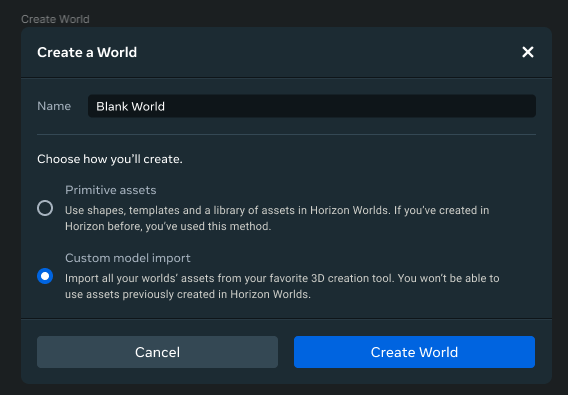
2. Place several pieces of recognizable geometry inside each world. For example, you could use green objects in Sublevel1, and red objects in Sublevel2. 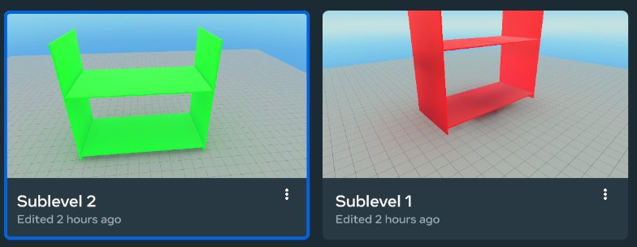
3. In each world, create a new sublevel entity. 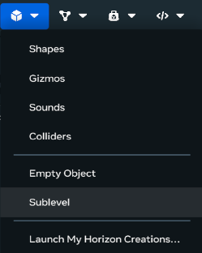
4. Set the type of the sublevels to **Exclude**, and rename it to “Testing Only”.\
   \
   This informs the world that any entities that are children to this sublevel should be ignored when loading it into the parent world. Note that they still exist when you load the sublevel world directly. This allows you to add content that you can use to test sublevels in isolation, without worrying about it being included in the integrated version. 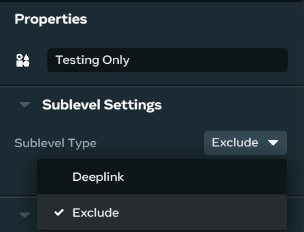
5. Drag the default spawn point under this new sublevel entity in the hierarchy so it won’t be included when you load this sublevel into the parent world.
6. Publish both worlds, and be sure to turn off the setting **Visible to the public**.

### [Create a parent world.](#create-a-parent-world)

- Create a new world called “Overworld”. Under **Choose how you’ll create**, select **Custom model imports**.


### [Add the sublevels.](#add-the-sublevels)

- Using the drop-down list, add the two sublevel worlds to the overworld.

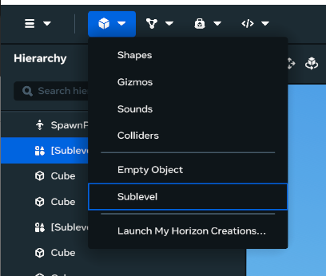

### [Link the sublevels.](#link-the-sublevels)

- Select a sublevel object from the hierarchy.
- In the property panel, ensure that the **Sublevel Type** is set to Deeplink.

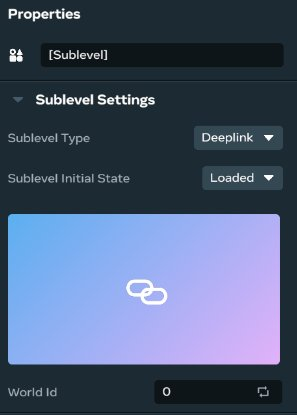

- Click on the thumbnail square.
- Select one of the sublevels from the world picker dialog box.

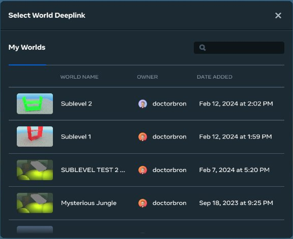

### [Position the sublevels.](#position-the-sublevels)

- Select a sublevel in the scene hierarchy.
- Using the transform handles, position the sublevel so you can easily see it turn on and off.

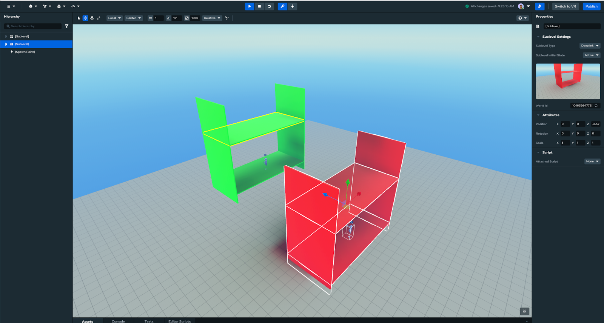

- Repeat the preceding two steps for the other sublevel.

### [Set the initial state on the sublevels.](#set-the-initial-state-on-the-sublevels)

- In the **Properties** dialog, under **Sublevel Initial State** , try setting each of the initial sublevel states.

  - Select **Active**, and the entities are loaded and become active.
  - Select **Loaded**, and the entities are loaded, but are neither active nor visible.
  - Select **Unloaded**, and no entities are loaded.

As you change the states, you’ll see the sublevel load and become active, and unload.

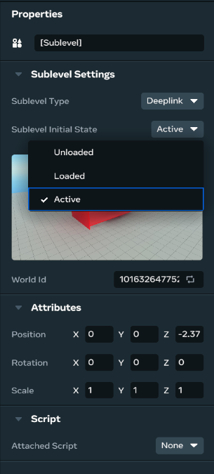

## [Programmatically spawn and despawn the sublevels](#programmatically-spawn-and-despawn-the-sublevels)

Follow this procedure to configure the Desktop Editor to run the sample script. You can run the script to see the SublevelEntity API in action. The sample code demonstrates how to:

- Get the current state of the sublevel (for example, loading).
- Get the target state of the sublevel (for example, loaded).
- Set the target state of the sublevel by using the following functions:

[activate()](https://horizon.meta.com/resources/scripting-api/world_streaming.sublevelentity.activate.md/?api_version=2.0.0) Make the sublevel visible to users and start running scripts.

[hide()](https://horizon.meta.com/resources/scripting-api/world_streaming.sublevelentity.hide.md/?api_version=2.0.0) Return an active sublevel back to the loaded state.

[load()](https://horizon.meta.com/resources/scripting-api/world_streaming.sublevelentity.load.md/?api_version=2.0.0) Begin the process of loading a sublevel into memory, but don’t activate it yet.

[pause()](https://horizon.meta.com/resources/scripting-api/world_streaming.sublevelentity.pause.md/?api_version=2.0.0) Temporarily pause the load of a sublevel. Loading a sublevel has an impact on performance, so you might want to temporarily pause a load at performance-critical times. Resume the load by calling load() again.

[unload()](https://horizon.meta.com/resources/scripting-api/world_streaming.sublevelentity.unload.md/?api_version=2.0.0) Completely remove a sublevel from memory.

You can find the SublevelEntity class API in the [v2.0.0 world\_streaming package](https://horizon.meta.com/resources/scripting-api/world_streaming.sublevelentity.md/?api_version=2.0.0). This API is not supported in v1.0.0 of the Meta Horizon Worlds API.

### [Preconditions](#preconditions)

Follow these steps to configure the Desktop Editor for running the example script.

1. In the Desktop Editor, click the Scripts panel dropdown. 
2. When the Scripts panel appears, select the **Settings** icon. 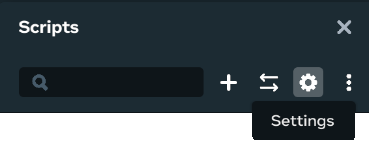
3. Enable the **horizon/world\_streaming** module. 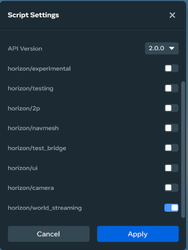

**Note** : You must have at least one script to enable a module.

### [Example script](#example-script)

The following code demonstrates how to spawn and despawn sublevels at runtime.

```typescript
import { Component, PropTypes, Entity, CodeBlockEvents } from 'horizon/core';
import { SublevelEntity } from 'horizon/world_streaming';


class TestSublevelAPI extends Component {
  static propsDefinition = {
    sublevel: {type: PropTypes.Entity},
    state: {type: 'number', default: 0}, // States 0 to 4 are:
                                         // Unloaded, Loaded, Active,
                                         // Pause, and Hide (Loaded).
  };


  start() {
    this.connectCodeBlockEvent(this.entity, CodeBlockEvents.OnPlayerEnterTrigger, async (player) => {
      var sublevel = this.props.sublevel?.as(SublevelEntity);
      var state = this.props.state;


      if (sublevel == null \|\| sublevel == undefined) {
        console.log("The sublevel entity was either null or invalid.")
        return;
      }

      console.log("Sublevel Trigger entered. Trying to set sublevel " + sublevel.toString() + " to " + state + ", current sublevel state is " + sublevel.currentState.get() + ", previous target sublevel state is " + sublevel.targetState.get());
      switch(state) {
        case 0: {
          sublevel.unload().then(() => {
            console.log("Sublevel " + sublevel?.toString() + " is now unloaded!");
          });
          break;
        }
        case 1: {
          sublevel.load().then(() => {
            console.log("Sublevel " + sublevel?.toString() + " is now loaded!");
          });
          break;
        }
        case 2: {
          sublevel.activate().then(() => {
            console.log("Sublevel " + sublevel?.toString() + " is now activated!");
          });
          break;
        }
        case 3: {
          sublevel.pause().then(() => {
            console.log("Sublevel " + sublevel?.toString() + " is now paused!");
          });
          break;
        }
        case 4: {
          sublevel.hide().then(() => {
            console.log("Sublevel " + sublevel?.toString() + " is now hidden!");
          });
          break;
        }
        default: {
          console.log("Invalid/Unexpected sublevel state # given: " + state);
          // unexpected state
          break;
        }
      }
    });
  }
}
Component.register(TestSublevelAPI);
```

