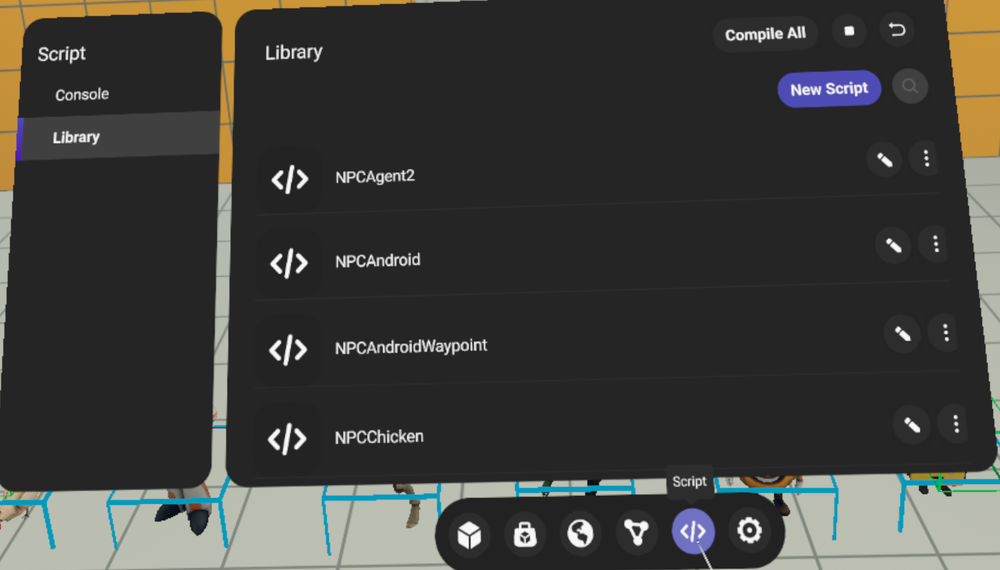
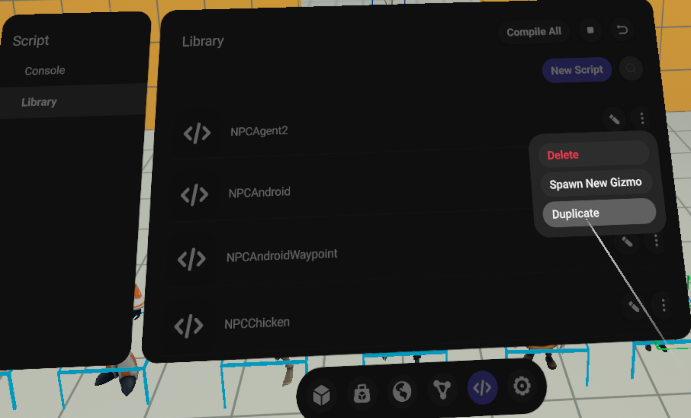
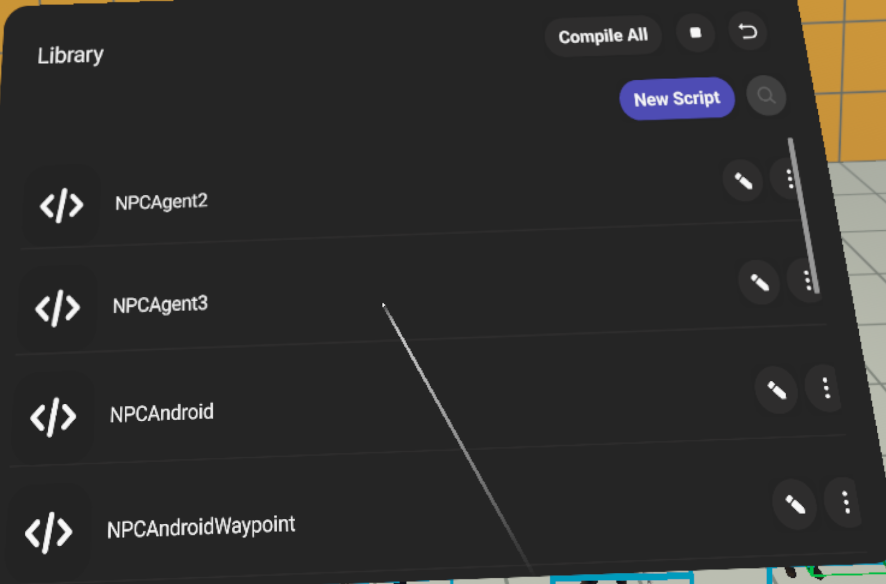

# File-Backed Scripts

File-backed scripts (FBS) is a script storage system that stores scripts on the server, rather than in the world. This allows for increased script size limits and improves script consistency. All new worlds created after 2/20/2025 use FBS.

## How does Meta Horizon Worlds store scripts?

All scripts (CodeBlocks and Typescript) are stored on the server. Worlds only store a reference to each script used in that world. When a script is saved, it is saved to the server and your world will reference that latest version.

Any number of entities can reference the same script. When you update that script, all entities referencing that script (both scripted entities and gizmos) will automatically get the most up-to-date version. Assets referencing that script need to be re-saved to get the most up-to-date version.

Script gizmos aren’t required with file-backed scripts and won’t be automatically created in most cases. You can still create new script gizmos from your list of scripts in both the Desktop Editor and in VR.

## Benefits

* Increased script size limits.
  + In the previous script storage method, each script was limited to 32 kb. File-backed scripts raised that limit for TypeScript scripts. Code blocks script size limits are unchanged.
  + There’s no limit on the total size of all scripts in a world and no limit on the total number of scripts you can have.
* Reduced travel times.
* Improved reliability and consistency of assets.
  + Assets with scripts should work more reliably between worlds.
  + Script state should stay in sync, even when edited by multiple collaborators across different editors (Desktop Editor or VR Editor).
* Spawning multiple copies of an asset no longer creates multiple copies of that asset’s scripts. Instead, all spawned assets reference a single instance of that asset’s scripts.
* Assets don’t require script gizmos. Assets automatically import the scripts they reference into the world when spawned or dragged in.
* FBS worlds are compatible with [asset templates](../Desktop%20editor/Assets/Asset%20Templates.md)**(not available to all creators)**.

## Important considerations

* Assets saved in FBS aren’t compatible with worlds using the legacy script storage method.
* Scripts that reference another script not already in the world won’t automatically load.
  + For example, if you have a “Car” script on an entity in your asset, and Car references a “Utils” script, the system won’t load Utils if it’s not already loaded in the world.
  + To handle this scenario, include the Utils gizmo in your asset or ensure the Utils script is referenced in your world.

**Note:** Clones of worlds that don’t use file-backed scripts will not use file-backed scripts unless opted-in.

## How script identification works

In worlds that support file-backed scripts, every script has a unique ID used by Meta Horizon Worlds to identify the script.

When a new script is created, if there is no existing script with that name in the world, a new ID is assigned to the script. If the world is cloned, scripts within the cloned world will have the same IDs as in the base world. Similarly, if an asset containing scripts is dragged into a world, those scripts maintain their IDs.

If your team uses cloned worlds and assets as branches that get merged into a main world, ordering of steps during the merge is important. Make sure to execute the following steps in order when merging from a branch world to your main world:

- Update scripts and assets in the branch world
- Drag in assets to the main world
- Pull in code changes to the main world

In step 3, any scripts that are included in assets will already be known to the main world and they will be assigned the existing ID. If steps 2 and 3 are switched, any new script will be assigned a new ID when the code is pulled. Then, when the asset is dragged in, there will be two copies of the script: one with the newly created ID, and one with the ID from the script in the asset. Scripts with duplicate names cause undefined behavior when used as dependencies on other scripts and can create confusion.

## Duplicating scripts in VR

If you need to duplicate your world’s scripts while in VR it’s important to note that the process differs from worlds still using the legacy script storage solution.

Once you’ve created scripts in your world, use the following process to duplicate them in VR:

- Enter your world in VR and press down on the right control stick to enter the world management view.
- Press the three line menu icon on the left controller, then select **Assets** from the menu.
- In the Assets menu, select the **Script** icon from the floating menu bar at the bottom.
  
- Once in the Script menu, select **Library** to view all the scripts currently added to your world.
- Hover over a script and select the three dots on the script entry field, then select **Duplicate**.
  
- A new script will be created and added to your script library.
  

**Note**: In file-backed scripts worlds the script gizmos are references to a script. Duplicating a script gizmo creates a new reference to the same script as the original gizmo. This means that any edits made to the duplicated gizmo will also apply to the original script.

#### Different scripts with the same name are not allowed

If you world contains a script and then attempts to load another script with a different ID but the same name (e.g. by spawning an asset at runtime) a warning will be logged to the console and the second script will not be executed.