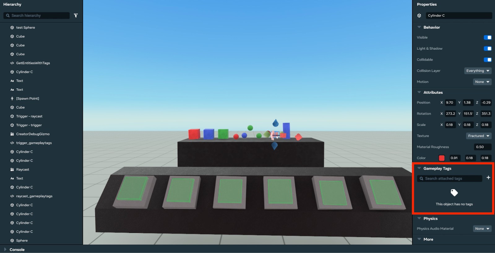
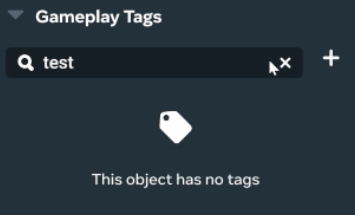
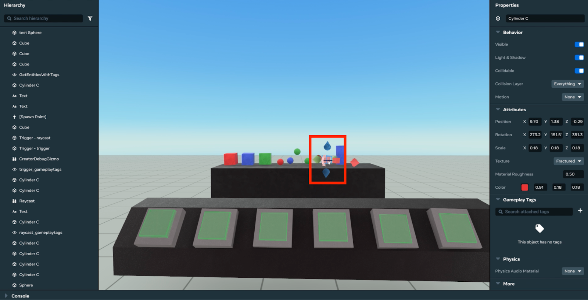
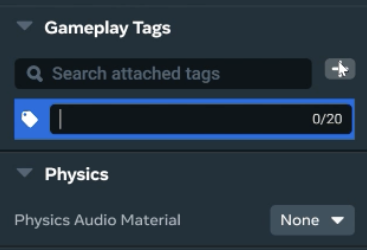
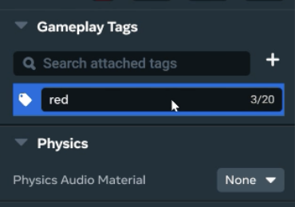
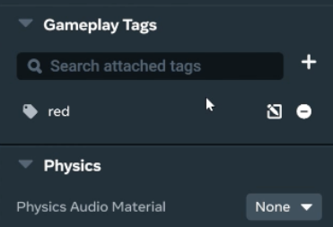
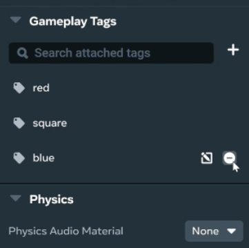
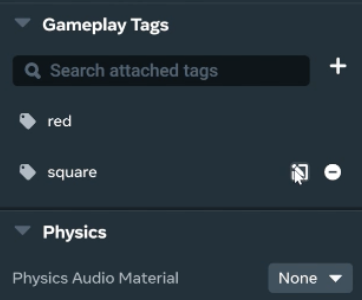
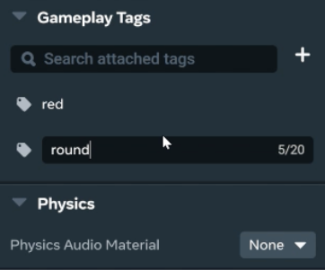
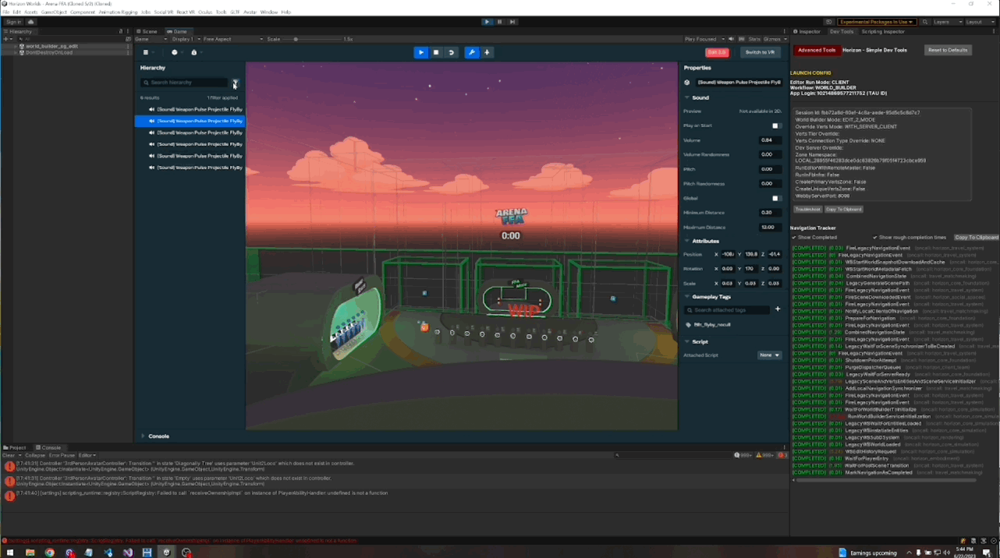

# [Introduction to Gameplay Tags](#introduction-to-gameplay-tags)

Gameplay Tags are user-defined labels given to gameplay objects. These labels allow you to define sets of objects e.g., player, respawn, and enemy to identify and manipulate using scripts. This new tag type expands on the current functionality of tags - removing existing pain points - and aligns more closely with industry standards. To learn more about possible use-cases for tags and understand how tags are used in game development, visit the [Unity](https://docs.unity3d.com/Manual/Tags.html) and [Unreal](https://docs.unrealengine.com/4.26/en-US/ProgrammingAndScripting/Tags/) documentation on tags. With this update, your entities will automatically migrate to the new field type: “gameplayTags” and be ready for use in scripts.

Gameplay Tags allow you to:

- Assign multiple tags to a single entity (up to 5 tags with a max of 20 characters per tag)
- Manipulate tags using TypeScript e.g. add, remove, set, and compare
- Search with Typescript using AND|OR to find entities with specific tags or sets of tags on a “World” level
- Assign tags to triggers and raycasts
- Filter entities by tags in Desktop Editor

For more information on the Gameplay Tags API and to see example code, see the [API reference doc](Modify%20and%20Retrieve%20Entity%20Tags.md).

## [Using Gameplay Tags in Desktop Editor and VR](#using-gameplay-tags-in-desktop-editor-and-vr)

Since this feature involves multiple moving parts, below are a few different scenarios for modifying and manipulating gameplay tags in Desktop Editor and Build Mode in Meta Horizon Worlds.

To quickly navigate to a specific editing workflow, use the following links:

- [Tag Editing in Desktop](Introduction%20to%20Gameplay%20Tags.md#tag-editing-in-desktop-editor)
- [Tag Editing in VR](Introduction%20to%20Gameplay%20Tags.md#tag-editing-in-vr)
- [Tag Filtering](Introduction%20to%20Gameplay%20Tags.md) (Desktop#tag-filtering-in-desktop-editor)

## [Tag Editing in Desktop Editor](#tag-editing-in-desktop-editor)

Using Desktop Editor, you can search for, add, remove, and modify gameplay tags.

**Search for a tag**

1. Navigate to the right-most menu and find the “Gameplay Tags” section 
2. Enter the keyword in the search bar and press enter 
3. Any entities with this tag should appear

**Add a tag**

1. Select the object 
2. Navigate to the right-most menu and find the “Gameplay Tags” section 
3. Select the “+” symbol next to the search bar 
4. Enter tag name into field and press enter 
5. The tag will now appear under the object’s tags 

**Remove a tag**

Repeat steps 1 and 2 from “Add a tag”

1. Navigate to the desired tag to remove and click on the “-” icon 
2. The tag will be removed from the object’s tags

**Modify a tag**

Repeat steps 1 and 2 from “Add a tag”

1. Navigate to the desired tag to modify and click on the pencil icon 
2. Enter the new tag name or modifications 
3. Click enter and the tag will update

## [Tag Editing in VR](#tag-editing-in-vr)

Adding, removing, and modifying tags in VR is a similar process to that of Desktop Editor. The following video shows where to find tags (under Attributes in a game object’s menu) and how to remove, add, and modify them.

<video controls><source src="(BROKEN_REF)" type="video/mp4"></video>

## [Tag Filtering in Desktop Editor](#tag-filtering-in-desktop-editor)

In the “Hierarchy” menu of Desktop Editor, you’re able to filter entities by their associated tags. To do so, click on the filter icon and select the appropriate tag and watch the list re-populate with only the entities using that tag.

## [Known Issues](#known-issues)

- Due to limitations on world builder that do not allow for collection types on Entity fields, tags are stored as a JSON serialized string. To counteract the performance implications of serialization, we’ve introduced a service that caches tags in a readily available set to perform any matching operation on an Entity’s tags.

