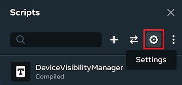
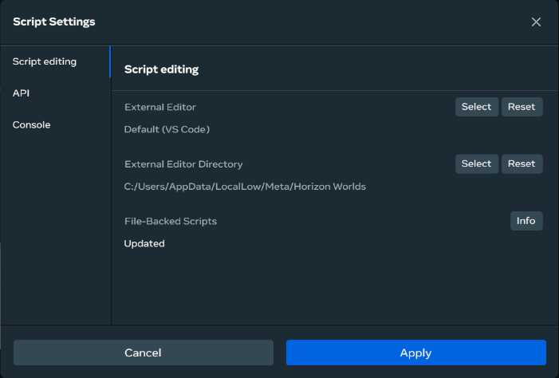

# [Adding an IDE to the desktop editor](#adding-an-ide-to-the-desktop-editor)

You will need an IDE to write your own scripts for Meta Horizon Worlds. By default, the desktop editor uses [Visual Studio Code](https://code.visualstudio.com/download), but if you want to use a different editor, you can configure it to use another IDE instead.

To configure the desktop editor, you need to make sure that you use version 4.7.4 of TypeScript. While you can use other versions of TypeScript, you may encounter issues when you use them with Meta Horizon Worlds APIs. If you don’t have TypeScript installed yet or you’re uncertain what version you’ve got, see [Managing Typescript](Managing%20Typescript.md).

Whichever IDE you choose to use, you will need to configure the desktop editor to use it. Steps to do so can be found below:

- [Using VS Code with the desktop editor](Adding%20an%20IDE%20to%20the%20desktop%20editor.md#configure-the-desktop-editor-to-use-vs-code)
- [Using another third-party IDE with the desktop editor](Adding%20an%20IDE%20to%20the%20desktop%20editor.md#using-another-third-party-ide-with-the-desktop-editor)

## [Using VS Code with the desktop editor](#using-vs-code-with-the-desktop-editor)

This section shows you how to set up Visual Studio Code (VS Code) for editing TypeScript scripts with the desktop editor.

**Configure the desktop editor to use VS Code**

1. If it’s not already installed on your computer, install the latest version of VS Code from the [VS Code website](https://code.visualstudio.com/).

2. Ensure that you have version 4.7.4 of TypeScript installed. For more information on doing this, see [Managing Typescript](Managing%20Typescript.md).

3. Note the file path to where VS Code is installed on your computer. You’ll need this in the following steps.

4. Open the Meta Horizon Worlds desktop editor and then open the **Scripts** panel.

   

5. Click the gear-shaped icon to open **Settings**.

   

6. Next to **External Editor**, click **Select**.

   

7. Paste the file path from Step 3 into the **File name** field and then click **Open**. You can also navigate to the EXE file for your IDE and then click **Open**.

8. Click **Apply** to set VS Code as the external editor.

## [Using another third-party IDE with the desktop editor](#using-another-third-party-ide-with-the-desktop-editor)

These section shows you how to set up the desktop editor to use an IDE other than VS Code as the default IDE.

1. Ensure that you have version 4.7.4 of TypeScript installed. For more information on doing this, see [Managing Typescript](Managing%20Typescript.md).

2. If it’s not already installed on your computer, install the latest version of your third-party IDE.

3. Note the file path to where the EXE file for your IDE is installed on your computer. You’ll need this in the following steps.

4. Open the Meta Horizon Worlds desktop editor and then open the **Scripts** panel.

   

5. Click the gear-shaped icon to open **Settings**.

6. Next to **External Editor**, click **Select**.

   

7. Paste the file path from Step 3 into the **File name** field and then click **Open**. You can also navigate to the EXE file for your IDE and then click **Open**.

8. Click **Apply** to set VS Code as the external editor.

