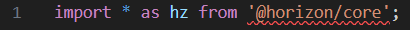
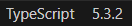
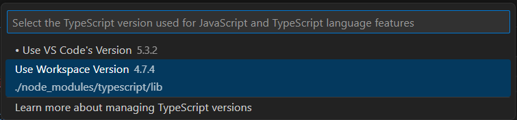

# [If VS Code can’t find a V2 module](#if-vs-code-cant-find-a-v2-module)

VS Code ships with a recent stable version of the TypeScript transpiler. By default, VS Code uses this version to provide IntelliSense in your workspace. The workspace version of TypeScript is independent of the version of TypeScript that you use to compile your TypeScript files.

In Meta Horizon Worlds development, you need to change the version of TypeScript if VS Code can’t locate a V2 Meta Horizon Worlds library module when you include it. For example:

## [How to use the workspace version of TypeScript](#how-to-use-the-workspace-version-of-typescript)

If VS Code can’t locate a V2 Meta Horizon Worlds library module, you need to configure VS Code to use the workspace version of TypeScript. You should use TypeScript v4.7.4 for all versions of the Meta Horizon Worlds TypeScript API.

1. Open one of the script files from your project in VS Code. Notice the word “TypeScript” in the bottom right part of the screen. Beside it is the version number.

1. Click on the version number. A fly-out menu appears at the top of the screen.

1. Select the option **Use Workspace Version**. This configures VS Code to use version 4.7.4.

You should now stop getting the “Can’t find module” error.

**Note**: For more information about TypeScript versions, see VS Code’s documentation on [Using newer TypeScript versions](https://code.visualstudio.com/docs/typescript/typescript-compiling#_using-newer-typescript-versions).

