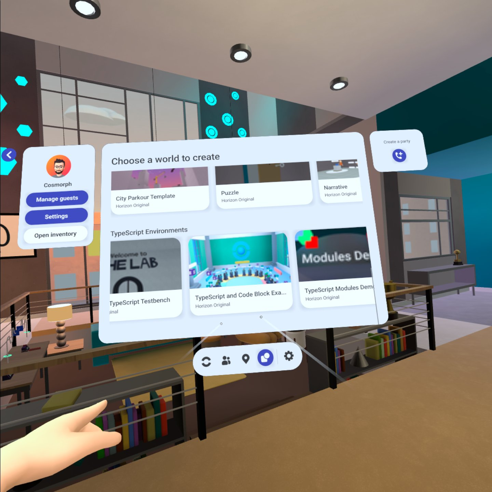
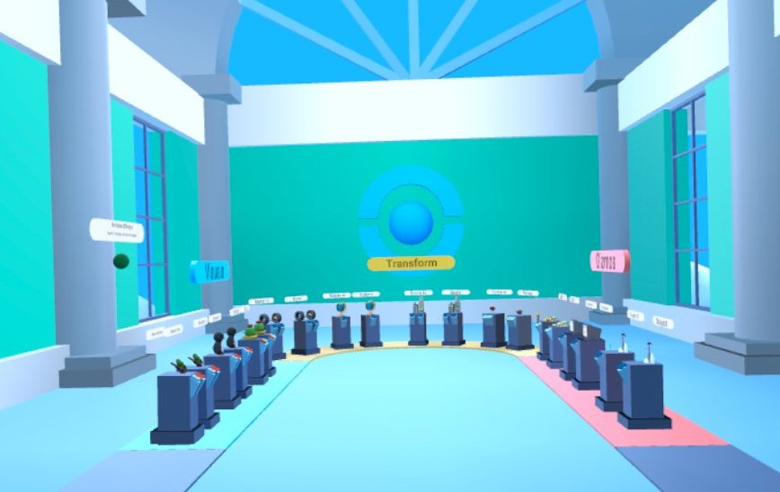
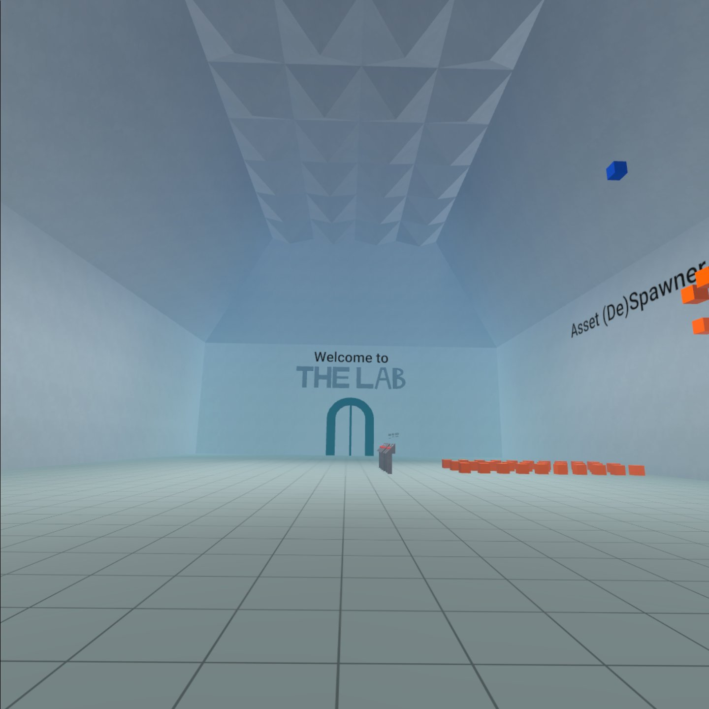
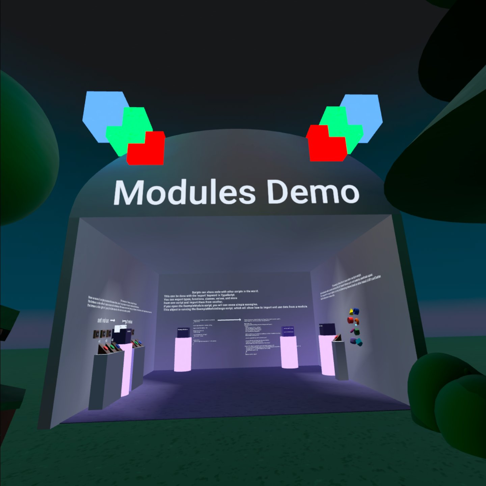

# In World Examples

## Horizon TypeScript Templates

There are 4 world templates available to help you create starter worlds. Templates allow you to choose a theme and begin learning with a single click.

**Note:** These templates use some calls and events that may not be considered best practices today e.g., HorizonEvent vs LocalEvent or NetworkEvent. Templates will be updated periodically to adhere to latest best practices and performance optimizations.

**Follow these steps:**

- Navigate to the Horizon “Create New World” page.
- Scroll down to section **TypeScript Environments**.
- Select the template world you want to create and click Create world. 
- You can open the Desktop Editor and view or update the TypeScript files to experiment with how it works. To see how the code creates the module’s behavior, navigate to the module’s definitions and interface.

### A: TypeScript and Code Block Example Scripts

This template world is an expansion of the Code Block Example Scripts template. Each example has both a TypeScript and Code Block implementation and a station to experience those next to each other. If you are familiar with using Code Blocks, the examples show common use cases for both CodeBlocks and TypeScript.

### B: TypeScript Events

Events enable objects in your world to interact with one another through an attached script. There are several types of events available in Horizon that cover communications across TypeScript and CodeBlock scripts. This template will help you learn about the event types introduced with TypeScript (**Local**, **CodeBlock**, and **Broadcast** events).

The template complements the Horizon events documentation [here](../Events/Local%20Events.md). This template covers:

* Horizon **Local**, **CodeBlock**, and **Broadcast** events
* Players present board and text gizmo updates
* Creating events and subscribing to events
* Interactions and events detection and world updates

### C: The Lab: TypeScript Testbench

This world has demos introducing:

* Asset spawning and despawning
* Object Pooling
* Bezier Curve math implemented with custom TypeScript Classes

### D: Modules

TypeScript modules are an exciting new addition to Horizon scripting. They let you write code that is not attached to objects. Modules can be used by other scripts in the world. They allow encapsulation and define a set of behavior in the same file, promoting readability.

* Simple “Hello World” implementation
* Simple math library that can be used by other scripts
* More complex data store example showcasing how to force a single global instance of a script

