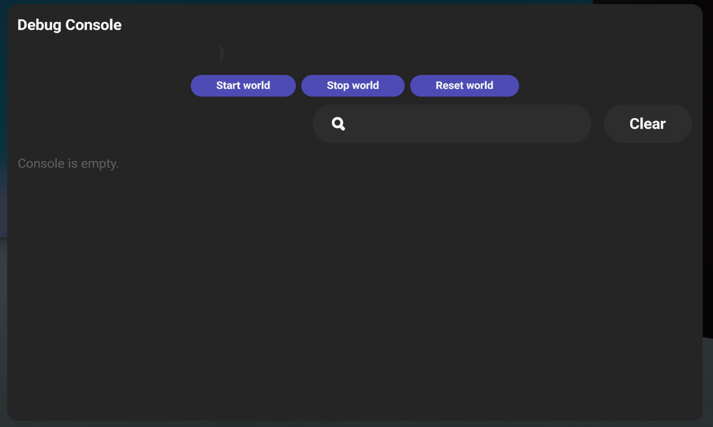
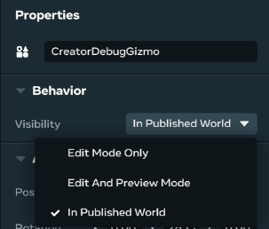

# The Debug Console

The Debug Console Gizmo provides access to debug console logs. It allows you to start, stop, and reset worlds while you are in edit mode or visit mode.

## Features

The Debug Console gizmo enables you to view the debug logs in a world while in preview or visit mode. This can be helpful when debugging in-world behavior because you can stop, start, and reset the world from this gizmo. Details include:

* Stopping the world stops all currently executing scripts.
* Starting continues these scripts.
* Resetting restarts all scripts and resets dynamic objects to their original state.
* In visit mode, the Debug Console is only visible to world collaborators.
  + This provides an effective way for developers to view world behavior while others enjoy the world.
  + Multiple Debug Consoles can be placed in a world, and all of them will receive the same logs.
  + Logs can be cleared by pressing the **Clear** button or searched by entering search terms in the search field.

## Controlling Visibility of the Debug Console

**Setting Visibility**

In the Properties panel for a Debug Console, you can set the visibility of the console in the Visibility dropdown. Options are:

* **Edit Mode Only**
* Not visible in preview mode or the published world
* **Edit and Preview Mode**
* Not visible in the published world
* **In Published World**
* Visible in edit mode, preview mode, and published mode

The Visibility setting applies to the world owner, editors, and testers. If you configure a Debug Console with the “In Published World” setting, all collaborators will be able to see it. As a result, at no time will a regular world visitor see the console.

**NOTE:** It’s possible to hide the console using the visibility code block, but the code block can’t force the Debug Console to appear if it would otherwise be hidden by the console’s Properties or the user’s role.

## Known Issues / Limitations

* The server is often started several seconds before any clients join, so logs from start() methods in scripts might not show up for these clients.