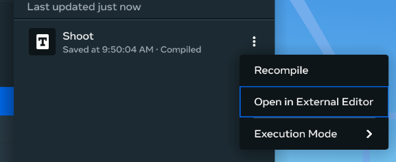
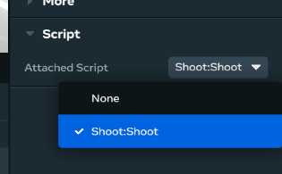
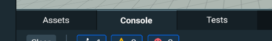
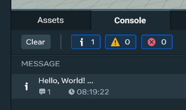

# [TypeScript Tutorial](#typescript-tutorial)

## [Build your first Hello World with TypeScript and the Desktop Editor](#build-your-first-hello-world-with-typescript-and-the-desktop-editor)

Follow these steps to access the Desktop Editor

1. Navigate to *Scripts -> CreateNewScript*.
2. We will use a starter script named Shoot.
3. Choose the *:* menu next to the new script. You can select “Open in External Editor” if using a preferred editor. 
4. The `start()` function is called whenever the object it is attached to is created. To print to the debug console for an object created, add a *console* print:
   ```typescript
   start() {
     console.log("Hello, World!");
   }
   ```
5. Save the file.
6. In the Desktop world editor, connect your new script to an object you have in the hierarchy. Scroll down to the bottom of the property panel on the right. Select “Attached Script” and choose the script file named “Shoot:Shoot”. This will associate the script with the object. 
7. Preview the world by clicking on the person icon next to the wrench. 
8. Press escape and click on Console window at the bottom of the editor. 
9. When the object you associated the script with is created, the console will print the  debug message you specified. 

### [Sharing Code Between Scripts](#sharing-code-between-scripts)

Scripts can share code with other scripts in your world. This can be done with the **`export`** keyword in TypeScript. You can export types, functions, classes, and even values from one script and import them to another. The module name is the name of the script. So if you have a script name `Script1`, you can import any exports from it by using this code: **`import``\*` as `S1` from `'Script1'`**`;` .

#### [Module1](#module1)

TypeScript example

```typescript
//Module1

export function add(a: number, b: number) { 
  return a + b;
}

export type MyScalar = number \| string;

export const ModValue = 42;

export class Person { 
  name: string;     

  constructor(name: string) {   
    this.name = name; 
  } 

  sayHello() {   
    console.log(`Hello my name is ${this.name}`);
  }
}
```

#### [Script1](#script1)

TypeScript example

```typescript
// Script1
import type {MyScalar} from 'Module1';
import {Person, ModValue, add} from 'Module1';

const p = new Person('Jon');
p.sayHello(); // logs 'Hello my name is Jon'

let v: MyScalar = ModValue;
console.log(v); // logs 42
v = 'string';
console.log(v); // logs 'string'

console.log(add(5, 8)); // logs 13
```

