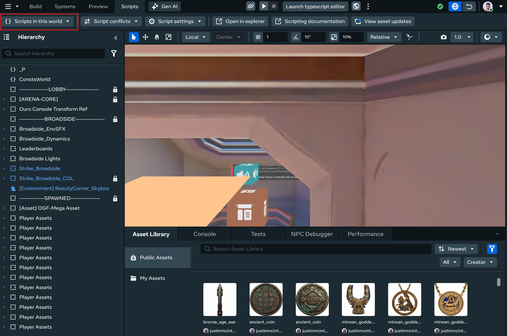
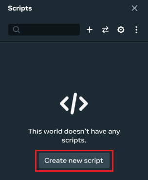
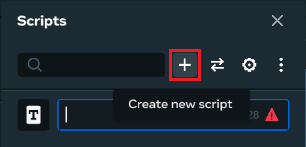
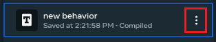
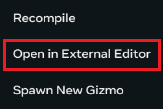
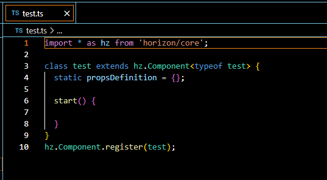
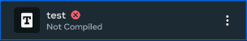
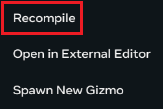
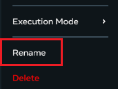
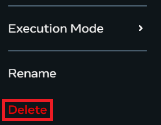

# Using TypeScript in Meta Horizon Worlds

The following topics explain some of the basics about using TypeScript in Meta Horizon Worlds. The following operations may also be performed by opening the **Properties** panel and clicking the **Attach script** button.

## Create a new script

- Open the desktop editor and click **Scripts**.

  
- Click **Create new script**.

  **Note**: This button is only visible if you have no scripts created for this world.

  

  If you already have scripts created, you can click the **Create new script** icon to create a new script.

  
- Enter a name for your new script.

  

  The new script will appear in the scripts list, first with the action **compiling** next to it, and then **compiled**.
- Hover over your script item, and click the menu button.

  
- Select **Open in External Editor**.

  
- Write your script in your external editor.

  

  When VS Code opens, your new script is ready for writing. It will automatically include a default class definition and multiple statements.

**Note**: The first statement in your script imports the required Meta Horizon worlds module. For example: `import { PropTypes } from 'horizon/core';`

## Edit an existing script

- Select the TypeScript file in your script library.
- Hover over the script file, and click the menu button.

  
- Select **Open in External Editor**.

  
- Make your changes and save the file in your external editor.

Once your changes have been made and saved in your external editor, the desktop editor will attempt to compile them. If there are errors in your script, the compiling will not be successful and the script will display a red warning symbol:



You can hover over the symbol to get a description of the error. To fix the error, open the script in the external editor again and make your changes.

## Recompile an existing script

**Note**: The desktop editor will automatically recompile a script once you’ve saved it in the external editor.

- Select the TypeScript file in your script library.
- Hover over the script file, and click the menu button.

  
- Select **Recompile**.

  

## Rename an existing script

- Select the TypeScript file in your script library.
- Hover over the script file, and click the menu button.

  
- Select **Rename**.

  
- Make any name changes in the text box.
  **Note**: Changing the name of a script will only change the reference to it. It will not recompile the script.

## Delete an existing script

- Select the TypeScript file in your script library.
- Hover over the script file, and click the menu button.

  
- Select **Delete**.

  
- Click **Confirm** to delete the script.

## An example of a simple script

The following example script sets an entity’s color to red when you attach the script to it.

```
import { PropTypes } from 'horizon/core';
import { Component, Entity, PropsDefinition } from 'horizon/core';

class MoveAttachedEntity extends Component<typeof MoveAttachedEntity> {
  static propsDefinition = {
    target: {type: PropTypes.Entity},
    position: {type: PropTypes.Vec3},
};

  start() {
    this.world onUpdate(({ deltaTime }) => {
        this.entity.position.set(this.props.position!);
    });
  }
}

Component.register(MoveAttachedEntity);
```