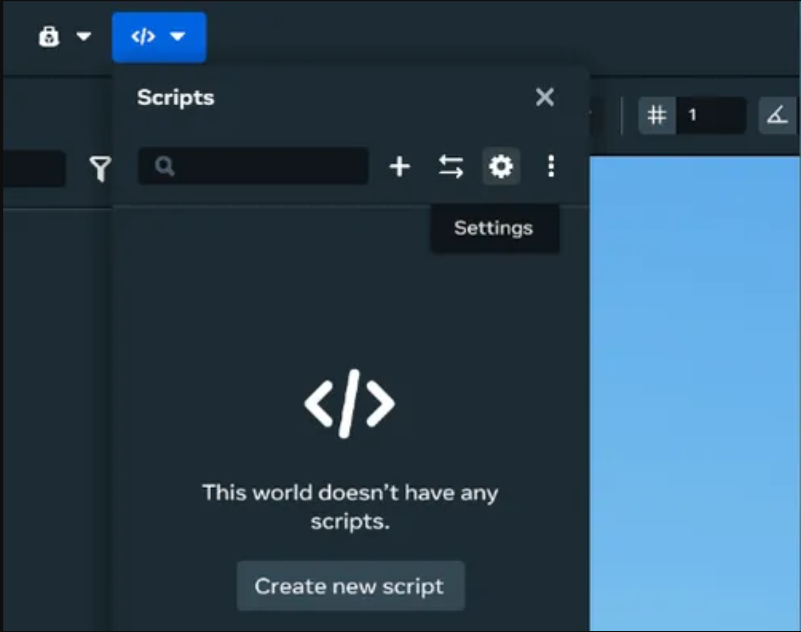
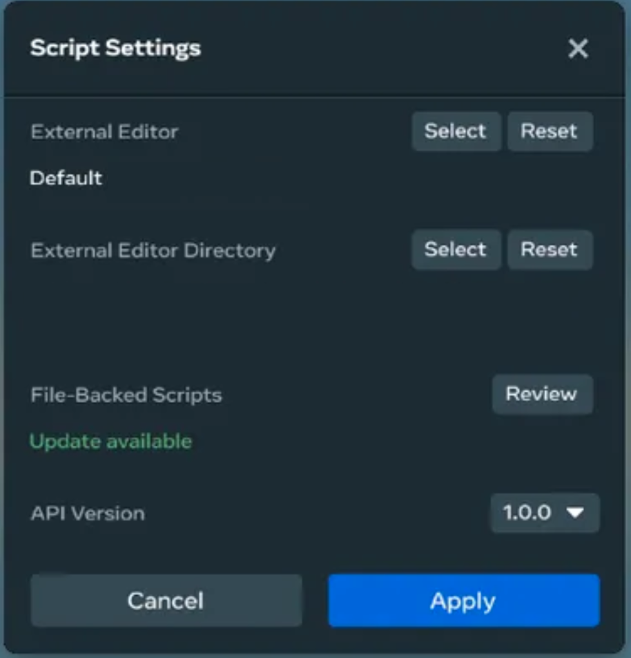
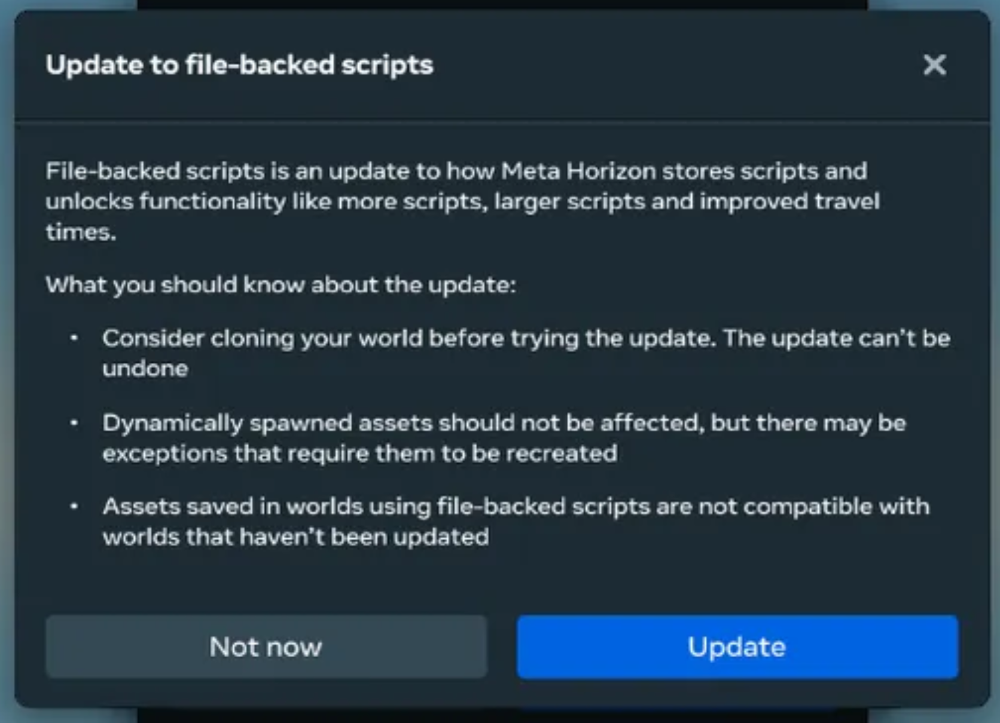
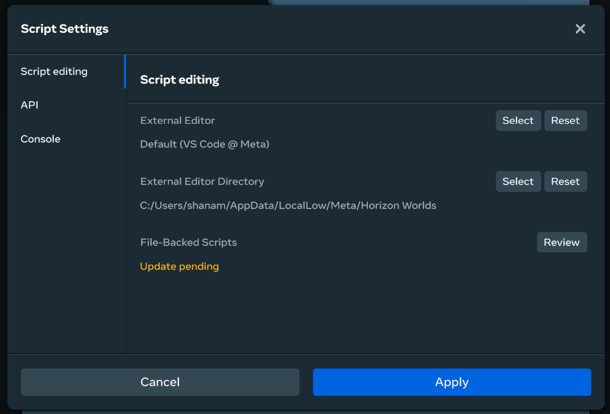

# [Legacy Script Storage](#legacy-script-storage)

Legacy script storage availability

As of 2/20/2025 all new created worlds will use the file backed script storage solution. The contents of this document applies only to worlds created before 2/20/2025 that have not opted-in to the file-backed scripts solution.

There are some important differences between the legacy script storage solution and file-backed scripts for worlds that leverage the legacy solution.

- There is a size limit per script of 32 kb.
- [Scripts in legacy worlds don’t have an ID and rely solely on script names.](https://developers.meta.com/horizon-worlds/learn/documentation/typescript/script-storage/filebacked-scripts#How-script-identification-works)
- There are some differences in [asset behavior](https://developers.meta.com/horizon-worlds/learn/documentation/typescript/script-storage/filebacked-scripts##benefits) between the legacy and FBS as script storage options.

## [Opt-in to file-backed scripts solution](#opt-in-to-file-backed-scripts-solution)

If your created world is on the legacy system, you can always opt-in to the file-backed scripts system at anytime.

**Note**: Clones of worlds that don’t use file-backed scripts will not use file-backed scripts unless opted-in.

To opt-in to file-backed scripts as your script storage solution use the following process:

1. Open the **Scripts** dropdown and click the **Settings** gear. 
2. Under **File-Backed Scripts**, click **Review**. 
3. After reading the information, click **Update**. 
4. Once you click **Apply**, your changes will be saved and your world and all the scripts in it will be migrated to FBS. 
5. A notification will appear when the migration is complete.

## [What to look out for after opting in a world](#what-to-look-out-for-after-opting-in-a-world)

After opting in a world, there are some scenarios where you may need to manually update your scripts and assets to make sure they behave as intended.

### [Existing assets won’t be automatically migrated to the new script storage method](#existing-assets-wont-be-automatically-migrated-to-the-new-script-storage-method)

If your world uses a mix of world scripts and asset scripts, you must manually recreate your assets to republish them with references to the newly stored scripts. If you skip this step, existing assets aren’t guaranteed to work as intended and won’t get the benefits of the new script storage method.

New assets created in opted-in worlds will use the new script storage method.

### [The new script storage method doesn’t allow for multiple versions of the same script in a world (conflicting script versions)](#the-new-script-storage-method-doesnt-allow-for-multiple-versions-of-the-same-script-in-a-world-conflicting-script-versions)

If your world contains assets that reference a different version of a script than the one in the world, those assets will instead reference the world’s script version when spawned. If your world contains spawned assets that reference different versions of the same script, each of the spawned assets will now use the same version of the script. They will use the script version in the world if it exists, or the script version attached to whichever asset is spawned first.

When either of these situations occur, you should see a message in the scripting console to let you know that your world had conflicting script versions and the references have been automatically changed to resolve any conflicts.

To prevent any unintended behavior, update your assets to reference the intended script version. You can do this by recreating the asset with the intended script version, pulling it into the world, and resaving the asset.

