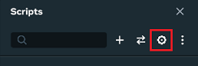
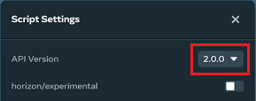
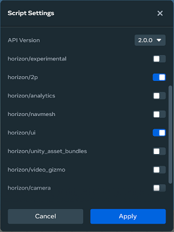

# Upgrade World to TypeScript API v2.0.0

If you have created a world using a previous version of the TypeScript API, we strongly recommend that you upgrade it to API v2.0.0 for the following reasons:

* All new API features are landing in v2.0.0 first. They are backported selectively and typically only upon request.
* All future development efforts are focused on API v2.0.0. Bug fixes are first applied to that API version.
* Previous versions of the API are no longer being updated.

This doc outlines some basic changes to address the majority of issues during upgrade.

For the official Meta documentation, please see [Meta Horizon TypeScript V2 changes](API%20references%20and%20examples/Horizon%20TypeScript%20V2%20Changes.md).

## Upgrading your world

You can use the following steps to upgrade your world to API v2.0.0 and to address most of your validation issues. The remaining steps are likely to be dependent on the nature of your implementation.

**To upgrade your scripts**

- Create a clone of your world. Append v2.0.0 to the name. For example: `My World v2.0.0`.
- Open `My World v2.0.0` in the desktop editor.
- Click the scripts icon.

  
- In the Scripts panel, click the **Settings** icon.

  
- In the **Script Settings** panel, note all API modules from prior versions that are currently enabled.

  **Note:** Any modules from prior versions that are currently enabled will remain enabled after switching to v2.0.0. This can cause problems with script execution. You should map them to their v2.0.0 equivalents, and then disable them before upgrading.
- Select **2.0.0** from the **API** version list.

  
- Enable the API modules that you use in your world.

  
- Click **Apply**.

## Fixing script validation errors

Each of your scripts used for a prior version of the Typescript API is likely to contain errors. You can perform the following to address most upgrade errors.

**Note**: We recommend that you fix these errors file by file rather than all at once. If possible, perform fixes in a file that is simple and testable first. When fixing the scripts, you may also find it helpful to create a copy of each line, comment it out, and then perform the update.

### Fix imports

All import statements must be updated to point to API v2.0.0 and their equivalents.

#### General:

| **Search string** | @early\_access\_api/ |
| --- | --- |
| **Prior version** | import { UIComponent, View, Text } from “@early\_access\_api/ui”; |
| **Replace string** | horizon/ |
| **New version** | import { UIComponent, View, Text } from “horizon/ui”; |

**/v1 to /core:**

In prior versions of the API, the main module was the /v1 module. In API v2.0.0, the main module has been renamed to /core.

Following examples assume you have performed the above changes.

| **Search string** | horizon/v1 |
| --- | --- |
| **Prior version** | import \* as hz from `horizon/v1`; |
| **Replace string** | `horizon/core` |
| **New version** | import \* as hz from `horizon/core`; |

### Fix Props and class declarations

The Props declarations outside of the class declaration are no longer necessary. The static propsDefinition are simplified.

**Prior version**

```
type UIComponentGetCandyProps = {
  triggerZone: hz.Entity
};

class UIComponentGetCandy extends UIComponent {
  static propsDefinition: hz.PropsDefinition = {
    triggerZone: { type: hz.PropTypes.Entity }
};
```

**API v2.0.0 version**

```
class UIComponentGetCandy extends UIComponent<typeof UIComponentGetCandy> {
  static propsDefinition = {
    triggerZone: { type: hz.PropTypes.Entity }
  };
```

#### Changes

* The type declaration outside of the class declaration can be deleted in all cases.
* The `<Props>` declaration that is part of the class is changed to `<typeof MyClassName>`.
* Type information in the static props declaration is no longer needed.

### Fix properties references

Some scripts have references to properties that are exposed in the **Properties** panel in the desktop editor. For example:

```
static propsDefinition = {
    triggerZone: { type: hz.PropTypes.Entity }
};
```

Elsewhere in your scripts, you may have references like:

```
myVar = myFunction(this.props.triggerZone)
```

These are likely to be broken. The general rule in API v2.0.0 is that property references cannot be passed directly into function calls and event listeners. Instead, they must be captured to a variable first and then passed in.

This can be fixed in the following manner:

```
  let mv: hz.Entity | undefined = this.props.triggerZone
  myVar = myFunction(mv)
```

### Upgrade events

In API v2.0.0, event names have changed.

**Note**: The `HorizonEvent` type is no longer available in API v2.0.0. Please use `LocalEvent` or `NetworkEvent`.

| **Previous event name** | **API v2.0.0 event name** |
| --- | --- |
| `sendNetworkEntityEvent` | `sendNetworkEvent` |
| `sendEntityEvent` | `sendLocalEvent` |
| `connectEntityEvent` | `connectLocalEvent` |
| `connectBroadcastEvent` | `connectLocalBroadcastEvent` |
| `sendBroadcastEvent` | `sendLocalBroadcastEvent` |

### Iterate and Test

The above changes should address the majority of your validation errors in upgrading your TypeScript to API v2.0.0.

Additional errors may need to be debugged and tested.

If possible, you should test the results of individual scripts as you address issues. As needed, you should write test code or debugger messages to verify proper execution of your code.