# [Adding and manipulating objects tutorial](#adding-and-manipulating-objects-tutorial)

In this tutorial, you’ll learn how to create a simple Meta Horizon Worlds game. The tutorial shows you how to create a world, add assets to it, write scripts to attach to entities to create behavior, and try going to the world on a mobile device and in virtual reality.

The key learning objectives are the following:

- Writing TypeScript code
- Setting entity ownership
- Handling object collisions
- Trying the world on mobile and in virtual reality

## [Prerequisites](#prerequisites)

This tutorial requires you to use the Meta Horizon Worlds desktop editor. See [Install and run the desktop editor](../Get%20started/Install%20the%20desktop%20editor.md) for instructions.

## [Section 1: Create a new world](#section-1-create-a-new-world)

In this section, [create a new world](../Desktop%20editor/Get%20started%20with%20Desktop%20Editor/Create%20a%20New%20World.md) for your game.

**Note**: When you’re building your world, Meta Horizon Worlds automatically saves your progress and it’s part of your online save flow.

## [Section 2. Create an avatar, a bat, and a ball](#section-2-create-an-avatar-a-bat-and-a-ball)

In this section, you’ll spawn an avatar into your world, and then you’ll add a baseball bat and a baseball to your world.

1. Select the **SpawnPoint** gizmo in the Hierarchy. This is the avatar.

   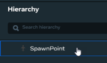

2. Focus the camera on the avatar by pressing the “F” key.

   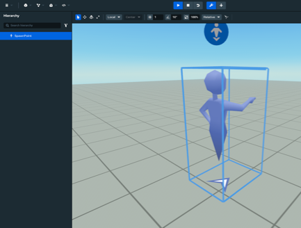

3. Spawn a new cylinder object into the scene, and name it “Bat”. Click **Build** > **Shapes** > **Cylinder**.

   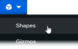

4. Spawn a new sphere object into the scene, and name it “Ball”. Click **Build** > **Shapes** > **Sphere**. Your Hierarchy should now look like this:

   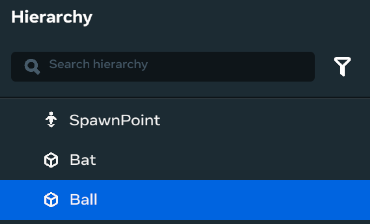

5. Resize the cylinder to resemble a bat, and place it in front of the spawn point.

   

6. Place the bat in front of the spawn point. To move the bat easily, activate the on-screen Position Manipulator Handles by pressing “W”, and then drag the bat to where you want it.

   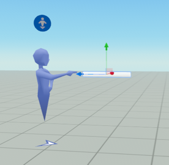

7. Resize the sphere to make it the approximate size of a baseball.

   

8. Reposition the ball high in the air, slightly in front of the spawn point.

   

   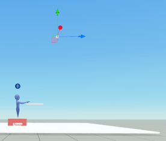

   You place the baseball up high because it will take time to fall down to the player, and the player needs this time to grab the bat.

9. Set the **Behavior** properties on the ball.

   1. Select the Ball object from the Hierarchy.

   2. Enable **Collidable**. This ensures that the ball can collide with other objects.

   3. Set **Motion** = “Interactive”. When you set this value, the **Interaction** property appears.

   4. Set **Interaction** = “Physics”.

   5. Enable **Gravity**, and set it to a custom gravity value to make the ball fall slower so it’s easier for the player to hit. For example, try using a value of “-0.20” instead of the default “-9.81” m/s2.

      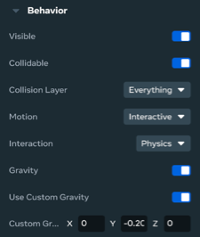

10. Set the **Behavior** properties on the bat.

    1. Select the Bat object from the Hierarchy.

    2. Enable **Collidable**. This ensures that the bat can collide with other objects.

    3. Set **Motion** = “Interactive”. When you set this value, the **Interaction** property appears.

    4. Ensure that **Interaction** = “Grabbable”.

       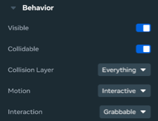

When you run the simulation, the player spawns into the world. You can move the avatar over to the bat, and you can grab it, but you can’t swing it yet. The ball falls down a couple of seconds later.

## [Section 3. Create the floor, and setup ball reinitialization](#section-3-create-the-floor-and-setup-ball-reinitialization)

In this section, you’ll create the floor, and then configure collisions with it.

If the player swings at the baseball and misses, the ball simply falls to the floor. But when this happens, the ball should automatically move back to its original starting position, and then fall all over again. You need to add the code to accomplish this.

1. Spawn a new cube object into the scene, and rename it “Floor”. Click **Build** > **Shapes** > **Cube**. Your Hierarchy should now look like this:

   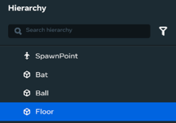

2. Change the dimensions of the Floor object so that it covers a relatively wide playing area.

   

   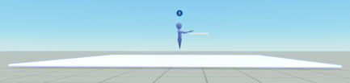

3. Add a **Gameplay Tag** to the Floor object, and name it “floor”.

   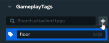

4. Select the Ball from the Hierarchy.

5. Set the following **More** properties on the Ball.

   1. Set **Collision Events From** = “Objects Tagged”.

      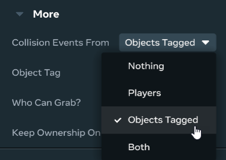

   2. Set **Object Tag** = “floor”.

      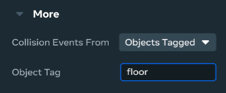

6. Create a script to control the Ball’s behavior. The code listens for collisions between the Ball and the Floor. When a collision occurs, the code resets the ball’s position back to its initial starting point, and it resets its velocity back to zero.

   1. Click **Scripts** to open the Scripts panel.

      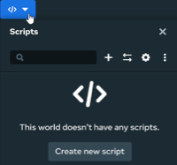

   2. Create a new script by clicking **Create new script**.

   3. Name the script “BallScript”, and then press **Enter**. The script is created.

      

   4. Open the script in VS Code. Click the menu icon to the right of the script name, and then select **Open in External Editor**.

      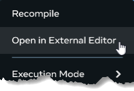

      VS Code launches, and opens a new TypeScript code file that contains a default class.

      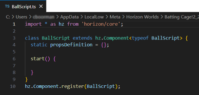

   5. Copy the following code snippet, and paste it on top of the default code in VS Code, and then save it.

      ```typescript
       import * as hz from 'horizon/core';


       class BallScript extends hz.Component<typeof BallScript> {


           static propsDefinition = {};


           originalPosition: hz.Vec3 = hz.Vec3.zero;


           start() {

               // Set the original position of the ball so you know where to respawn.

               this.originalPosition = this.entity.position.get();


               // Listen for ball collisions with any other entity.

               this.connectCodeBlockEvent(this.entity, hz.CodeBlockEvents.OnEntityCollision,

                 (collidedWith: hz.Entity, collisionAt: hz.Vec3, normal: hz.Vec3,

                   relativeVelocity: hz.Vec3, localColliderName: string, otherColliderName: string) => {


                       // Move the baseball back to its original starting position.

                       this.entity.position.set(this.originalPosition!);


                       // Reset the baseball’s speed to zero.

                       this.entity.as(hz.PhysicalEntity)?.zeroVelocity();

                 });

           }

       }


       hz.Component.register(BallScript);
      ```

7. Attach the BallScript to the Ball object.

   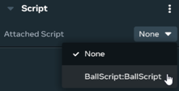

8. Preview your new world in the Meta Horizon Worlds desktop editor. Enter Preview mode by clicking Play on the menu bar.

   

9. Maneuver the avatar over to the bat using the arrow keys, and then grab it by pressing the “E” key.

   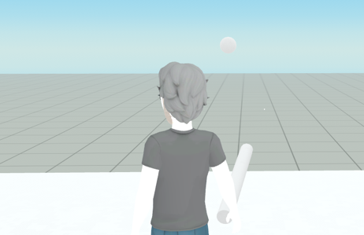

   You can’t really do much at this point except walk around holding the bat. As you do, the ball continually keeps dropping out of the sky and falling to the floor.

10. Exit Preview mode by pressing **Escape** twice.

## [Section 4. Setup baseball/bat collision detection](#section-4-setup-baseballbat-collision-detection)

In this section, you’ll configure collision detection.

1. Select the Ball object from the Hierarchy.

2. Add a **Gameplay Tag** to the Ball object, and name it “ball”.

   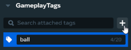

3. Select the Bat object from the Hierarchy.

4. Set the following **More** properties on the Bat object.

   1. Set **Collision Events From** = “Objects Tagged”.
   2. Set **Object Tag** = “ball”.

5. Create a script to control the bat’s behavior. The code listens for collisions between the bat and baseball. When such a collision occurs, the code displays a message pop-up that congratulates the player for successfully hitting the baseball.

   1. Click **Scripts** to open the Scripts panel.

   2. Create a new script by clicking **Create new script**.

   3. Name the script “BatScript”, and then press **Enter**. The new script appears in your scripts list.

      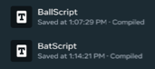

   4. Open the script in VS Code by clicking the menu icon next to the script name, and then selecting **Open in External Editor**.

   5. Copy the following code snippet, and paste it on top of the default code, and then save it.

      ```typescript
       import * as hz from 'horizon/core';


       class BatScript extends hz.Component<typeof BatScript> {


           static propsDefinition = {};


           batHolder: hz.Player | null = null;


           start() {

               // Set the player holding the bat when they grab the bat.

               this.connectCodeBlockEvent(this.entity, hz.CodeBlockEvents.OnGrabStart, (isRightHand: boolean, player: hz.Player) => {

                   this.batHolder = player;

               });


               // Reset the player holding the bat when they let go of it.

               this.connectCodeBlockEvent(this.entity, hz.CodeBlockEvents.OnGrabEnd, (player: hz.Player) => {

                   this.batHolder = null;

               });


               // Listen for bat/ball collisions.

               this.connectCodeBlockEvent(this.entity, hz.CodeBlockEvents.OnEntityCollision,

                 (collidedWith: hz.Entity, collisionAt: hz.Vec3, normal: hz.Vec3,

                   relativeVelocity: hz.Vec3, localColliderName: string, otherColliderName: string) => {

                       if (this.batHolder) {

                           this.world.ui.showPopupForPlayer(this.batHolder, "Good job hitting the ball!", 5);

                       }

               });

           }

       }


       hz.Component.register(BatScript);
      ```

   6. Select the Bat object from the Hierarchy, then navigate to **Properties** > **Scripts**, and then attach the BatScript to the Bat object.

      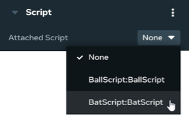

      When the player swings and hits the ball, they’ll see a cheerful message that congratulates them.

      **Note**: You can’t swing the bat in desktop mode. To be able to swing the bat, you must switch to VR.

   7. This step is optional for the Batting Cage tutorial.

      To enable restart of this world, set the ball to its original position by resetting it with a secondary action (the button press) whenever the user wants to do so. To implement this, you can create a scripting event for a [button press](../Mobile%20and%20web/Grabbable%20entities/Action%20Buttons.md#how-to-handle-button-presses) and attach it to a [grabbable entity](../Mobile%20and%20web/Grabbable%20entities/Introduction%20To%20Grabbable%20Entities%20On%20Mobile%20And%20Web.md).

## [Section 5. Configure local scripting](#section-5-configure-local-scripting)

In this section, you’ll configure the scripts to run locally.

When the player hits the ball, they take ownership of the entity that the script is attached to. In this case, it’s the Ball object. Transfer of ownership causes script processing to switch from the server to the player’s local device. This improves latency for the player. For more information, see [Ownership in Meta Horizon Worlds](../Scripting/Local%20scripting/Ownership%20in%20Meta%20Horizon%20Worlds.md).

1. Change the Execution Mode of both the Ball and Bat scripts to “Local”.

   1. Select the BallScript script from the Hierarchy.
   2. In the **Properties Panel**, set **Script Execution Mode** = “Local”.
   3. Select the BatScript script from the Hierarchy.
   4. In the **Properties Panel**, set **Script Execution Mode** = “Local”.

2. Update the BatScript script with the following revisions.

   1. Adds a property that takes in the Ball entity.

   2. Assigns the ball entity to the script property “ball”.

   3. Transfers ball ownership to the player whenever they grab the bat.

   4. Transfers ball ownership to the server when the player releases the bat.

   5. Adds a `receiveOwnership()` method that preserves the value of `batHolder` when the script changes ownership.

   6. Adds the `transferOwnership()` and `receiveOwnership()` methods that preserve the value of `originalPosition` when the entity changes ownership.

      This is what your BatScript should look like at this point:

      ```typescript
       import * as hz from 'horizon/core';


       type State = {};


       class BatScript extends hz.Component<typeof BatScript> {


           static propsDefinition = {

               ball: {type: hz.PropTypes.Entity}

           };


           batHolder: hz.Player | null = null;


           start() {


               // Set the player holding the bat when they grab the bat.

               this.connectCodeBlockEvent(this.entity, hz.CodeBlockEvents.OnGrabStart, (isRightHand: boolean, player: hz.Player) => {

                   this.batHolder = player;


                   // Set the ball's owner to the player so that interactions with

                   // the ball execute on the player's client with reduced latency. The bat's

                   // ownership is implicitly transferred to the player upon grab.

                   this.props.ball?.owner.set(player);

               });


               // Reset the player holding the bat when they let go of it.

               this.connectCodeBlockEvent(this.entity, hz.CodeBlockEvents.OnGrabEnd, (player: hz.Player) => {

                   this.batHolder = null;


                   // Reset the ball's ownership to the player.

                   this.props.ball?.owner.set(this.world.getServerPlayer());

               });


               // Listen for the bat colliding with the ball.

               // [...] omitted, same as in the previous step.


               // After grabbing the bat, ball ownership transfers. This means you

               // must ensure that batHolder stays set correctly.

               override receiveOwnership(state: State, fromPlayer: hz.Player, toPlayer: hz.Player): void {

                   this.batHolder = toPlayer;

               }


               override transferOwnership(fromPlayer: hz.Player, toPlayer: hz.Player): State {

                   return {};

               }

           }


       hz.Component.register(BatScript);
      ```

3. Update the BallScript script with the following revisions.

   ```typescript
    import * as hz from 'horizon/core';


    type State = {

        originalPosition: hz.Vec3

    }


    class BallScript extends hz.Component<typeof BallScript> {


        static propsDefinition = {};


        originalPosition: hz.Vec3 = hz.Vec3.zero;


        start() {


          // Set the original position of the ball so you know where to respawn.

          this.originalPosition = this.entity.position.get();


          // Listen for ball collisions with the ground.

          this.connectCodeBlockEvent(this.entity, hz.CodeBlockEvents.OnEntityCollision,

            (collidedWith: hz.Entity, collisionAt: hz.Vec3, normal: hz.Vec3,

              relativeVelocity: hz.Vec3, localColliderName: string, otherColliderName: string) => {


                // Move the ball back to its starting position.

                this.entity.position.set(this.originalPosition!);


                // Reset the ball's velocity.

                this.entity.as(hz.PhysicalEntity).zeroVelocity();

              }

          );

        }


        // Get the original position of the ball so that it respawns in the same place.

        override receiveOwnership(state: State, fromPlayer: hz.Player, toPlayer: hz.Player): void {

          this.originalPosition = state.originalPosition;

        }


        // Pass the ball's orginal position to the new owner.

        override transferOwnership(fromPlayer: hz.Player, toPlayer: hz.Player): State {

          return {originalPosition: this.originalPosition!};

        }

    }


    hz.Component.register(BallScript);
   ```

   When the player grabs the bat, they take ownership of the Bat entity. This causes the script component attached to the bat to execute locally on the player’s device (VR headset, web, and mobile). This provides a better visual experience for the player because there is no latency incurred in transmitting rendered scenes from the server to the player’s device.

## [Section 6. Play in your new world on mobile](#section-6-play-in-your-new-world-on-mobile)

1. Publish your world

   To [play in your world on mobile](../Mobile%20and%20web/Testing%20worlds%20on%20mobile%20and%20web.md#mobile), [publish](../Save%2C%20optimize%2C%20and%20publish/Publish%20your%20world.md) the world first. Provide the necessary information in the **Publish World** dialog, which can be opened by navigating to the dropdown menu on the menu bar or by clicking **Publish** on the top right.

   Enter the necessary information such as **Name**, **World Rating**, **Comfort Rating**, and **Tags**.

   - You can name your world something unique other than the default name.
   - If you do not wish your world to be visible to the public, ensure that the toggle for **Visible to Public** is turned off.
   - Ensure that mobile is selected as one of the supported devices.
   - Toggle on **Compatible with Web and Mobile**

   Click **Publish** to publish the world.

2. Configure the preview device as mobile

   To preview your world on mobile, select **Mobile** as your preview device by going to [Preview Configuration](../Desktop%20editor/Get%20started%20with%20Desktop%20Editor/Preview%20mode.md#how-to-set-the-preview-configuration). Click the ellipsis button on the menu bar. In **Preview actions**, send a preview build link to your Meta Horizon app.

3. Play it on mobile

   Open the Meta Horizon app on your mobile device, find the build link under **Notifications** to play in your world. For more related information, see [Testing worlds on mobile](../Mobile%20and%20web/Testing%20worlds%20on%20mobile%20and%20web.md#mobile).

## [Section 7. Play in your new world in VR](#section-7-play-in-your-new-world-in-vr)

In this section, you’ll see what it’s like to play your game in 3D in Meta Horizon Worlds on your Meta Quest VR headset.

1. Grab your Quest headset, strap it on, and turn it on.

2. Launch Meta Horizon Worlds on your headset.

3. Navigate to the **Create** page. You can get there by clicking the fourth icon from the left on the menu bar at the bottom of the page.

   

4. Locate the world that you just created, and then click it to launch it on your Quest VR headset.

5. Step up and grab the bat by pressing the secondary trigger on the right Quest controller.

6. Swing the bat and try to hit the ball. You can swing the bat by swinging your right arm while holding the secondary trigger down. When you hit the ball, watch for the message: “Good job hitting the ball!”.

   If you lose the ball, and you need to reset your progress, you can:

   1. Press the menu button on your left controller to open the Personal User Interface (PUI).
   2. Choose the **Worlds** tab from the PUI menu.
   3. Locate your world, and then select it.
   4. Look for the **Reset World Progress** option, and then confirm that you want to reset your progress.

   **Note:** Resetting world progress deletes all of your progress in the world, including any items or achievements you’ve earned.

*You’ve completed this playtest - Congratulations!*

## [Exercises](#exercises)

The following list contains suggestions for additional exercises.

- Reposition the ball’s starting position so that it spawns immediately above the player, wherever the player happens to be.
- Add a sound effect that plays whenever the player hits the baseball.
- Instead of using primitive meshes for the bat and baseball, try using higher quality meshes instead.
- Add a target for the player to aim for when they hit the baseball.
- Track the player’s score whenever they hit the target.
- Store the scores in a leaderboard.
- Make the bat easier to grab by adding explicit grab handles to it.
- When the player releases the bat, make it automatically attach to their hip.
- Spawn a new bat and ball for additional players that enter the world.
- Update your code to add support for desktop and mobile users.

## [What’s next?](#whats-next)

To learn more about Horizon, try the following:

1. See the [Tutorial worlds](Getting%20started/Getting%20started%20with%20tutorials/Access%20Tutorial%20Worlds.md) for more tutorials.
2. Learn about the desktop editor with the [Introduction to the desktop editor](../Desktop%20editor/Get%20started%20with%20Desktop%20Editor/Introduction%20to%20the%20desktop%20editor.md).
3. Learn about the other tools available by reading our [Tools overview](../Get%20started/Tools%20overview.md).
4. Join the [Meta Horizon Creator Program](https://developers.meta.com/horizon-worlds/programs) to learn about our program benefits.

