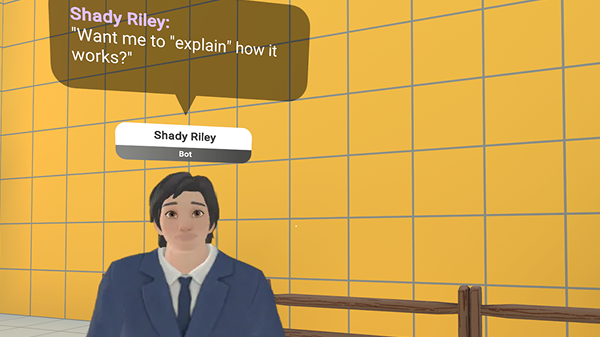

# [Module 1 - Introduction](#module-1---introduction)

Welcome, creators!

This example world demonstrates how you can implement AI Speech NPCs (Non-Player Characters) in Horizon Worlds.

The AI NPCs respond to players with dynamic LLM (Large Language Model) speech output by reacting to game events and player voice input. This example world contains two AI NPCs, Shady Riley and Harmony Bloom, each with their own backstory and personality.

## [Before you start](#before-you-start)

After creating a new copy of this template world, you need to do the following in the Desktop Editor:

1. Navigate to **Systems** > **VariableGroups** > click the plus sign, “Create Variable Group”
2. Inside the variable group, click the plus sign to add a new Player Pesistent Variable called `SaveGame`
3. To link the new player variable to the code, open the `SaveGame.ts` script and find `pvarsBaseName`
   1. Change the value of this to match your VariableGroup name
   2. Make sure that `:` (colon) is at the end
   3. If you did not name the variable `SaveGame`, you need to update the next line `saveGameKey` with the corresponding variable name

## [Example world overview](#example-world-overview)

This world provides examples on how to add an AI Speech NPC. This example world is built on top of the [Sim Tycoon reference world](../../Genre%20samples/Sim%20tycoon%20tutorial/Module%200%20-%20Setup.md). We recommend reviewing the Sim Tycoon world and its associated documentation to better understand the examples in this world.

## [Prerequisites](#prerequisites)

We recommend familiarizing yourself with the “AI Speech NPCs” [documentation](../../../Desktop%20editor/NPCs/NPC%20Conversation/AI%20Speech%20NPCs.md).

## [What you’ll learn](#what-youll-learn)

In this tutorial, you will learn how to:

- [Meet and interact with existing AI Speech NPCs](Module%202%20-%20Meet%20the%20NPCs.md)
- [Understand how NPCs respond to game events](Module%203%20-%20NPC%20Implementation.md)
- [How NPCs interact with players and other NPCs](Module%204%20-%20Introduction.md)
- [Add and configure your own NPCs](Module%205%20-%20Exercise%20-%20Add%20Your%20Own%20AI%20NPC.md)
- [Add game events for your world](Module%206%20-%20Exercise%20-%20Add%20Game%20Events.md)
- [Debug and optimize NPC performance](Module%207%20-%20Debugging%20and%20Best%20Practices.md)

