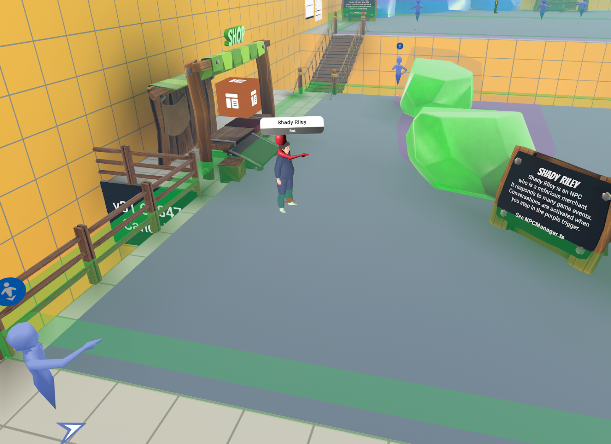
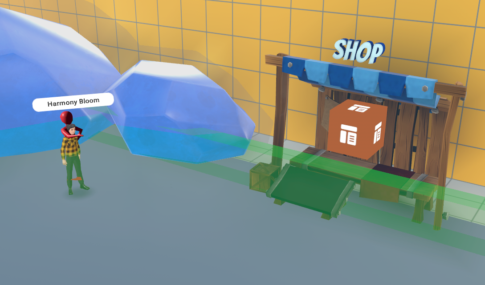
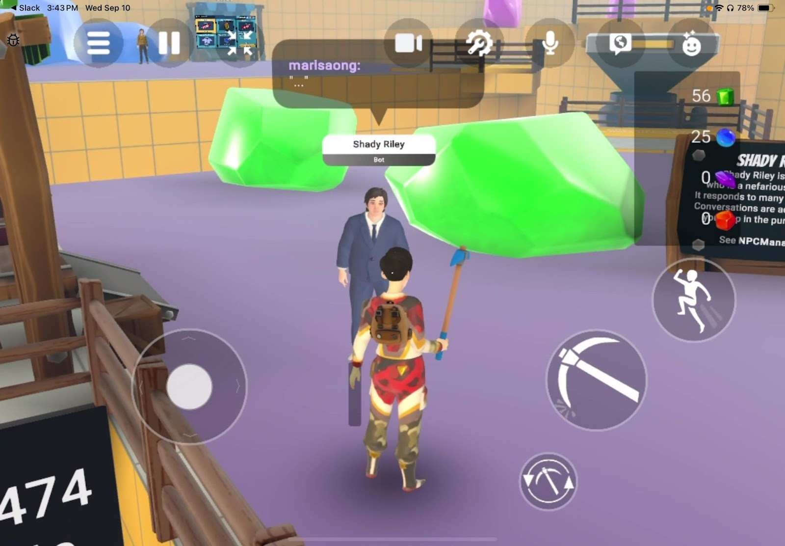

# [Module 2 - Meet the NPCs](#module-2---meet-the-npcs)

This module introduces you to the two AI Speech NPCs in this example world and shows you how to interact with them.

## [AI Speech NPCs](#ai-speech-npcs)

The first thing to notice when you enter this world are the two AI Speech NPCs, Shady Riley and Harmony Bloom.

### [Shady Riley](#shady-riley)

Located on the green platform, Shady Riley is an unscrupulous salesman whose main focus is on making money by any means possible.

### [Harmony Bloom](#harmony-bloom)

Located on the blue platform, Harmony Bloom is an environmental activist who is convinced that mining these nodes hurts them.

## [Interacting with the NPCs](#interacting-with-the-npcs)

Interact with the AI NPCs by stepping on the trigger zones, which are the large purple squares on the green and blue platforms. This will initiate conversations with the AI NPCs. You need to be close enough and face the AI NPCs to chat with them. You can tell the AI NPC is listening to you if your avatar has an interaction bubble.

Be sure both your sound and microphone are turned on. You may need to grant permission for Horizon Worlds to access your microphone.

## [NPC Reactions to Game Events](#npc-reactions-to-game-events)

The two AI NPCs, Shady Riley and Harmony Bloom, respond to a slightly different set of events based on what the player is doing. These are controllable by toggles, discussed in later modules.

| **Game event**                     | **Event description**                       | **Shady Riley** | **Harmony Bloom** |
| ---------------------------------- | ------------------------------------------- | --------------- | ----------------- |
| Pickaxe: PlayerEquipped            | Player equips a pickaxe                     | Yes             | Yes               |
| Pickaxe: PlayerAttached            | Player swaps backpacks                      | Yes             | Yes               |
| Swing: PlayerAxeMissed             | Pickaxe misses                              | No              | No                |
| Swing: PlayerAxeHitOre             | Pickaxe hits mining node                    | No              | No                |
| Pickaxe: PlayerAxeDull             | Pickaxe color doesn’t match mining node     | Yes             | Yes               |
| Inventory: PlayerCollectedResource | Player collects resource (gem)              | Yes             | Yes               |
| Inventory: PlayerInventoryFull     | Player’s backpack is full                   | Yes             | Yes               |
| PlayerTeleport                     | Player teleports after falling into a ditch | Yes             | Yes               |
| PlayerResourceConverter            | Player converts a gem into currency         | Yes             | Yes               |
| Store: PlayerPurchase              | Player purchases an item from the store     | Yes             | Yes               |

## [Try it yourself](#try-it-yourself)

1. **Start a conversation**: Step onto one of the purple trigger zones near either Shady Riley or Harmony Bloom
2. **Talk to the NPC**: Speak into your microphone while facing the NPC
3. **Listen to their response**: The AI NPC will respond based on their personality and backstory
4. **Perform game actions**: Try equipping a pickaxe, mining some resources, or purchasing items from the store to see how the NPCs react

