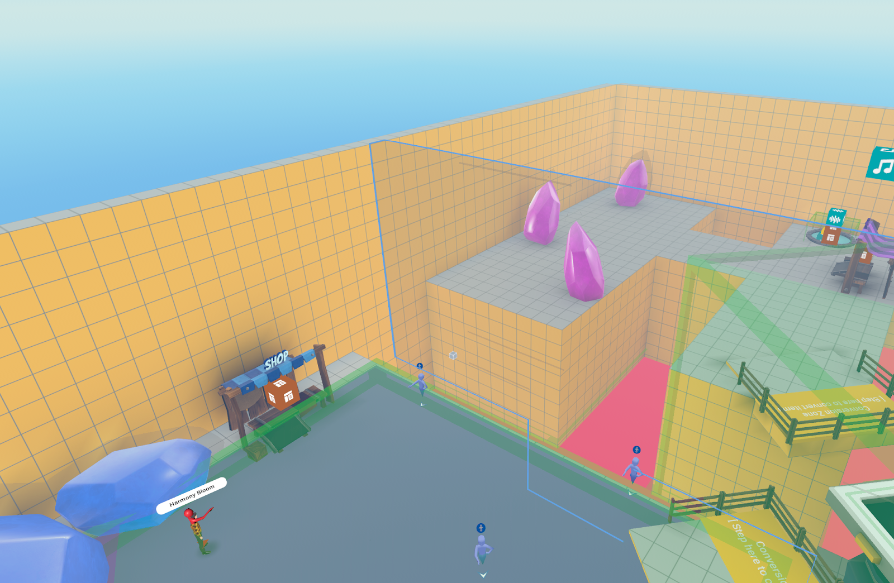
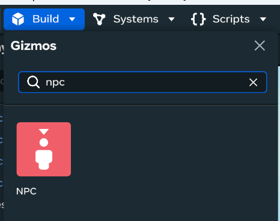
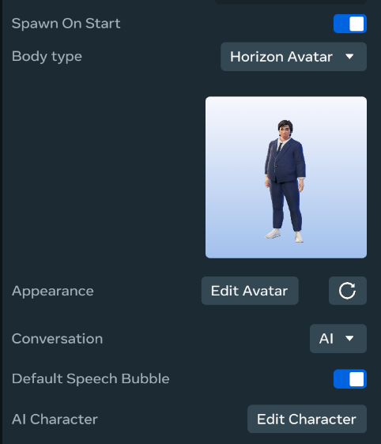
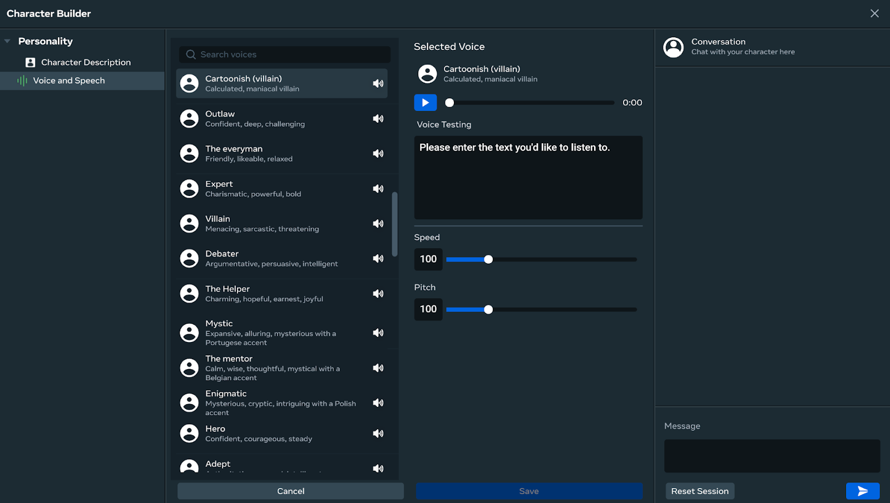
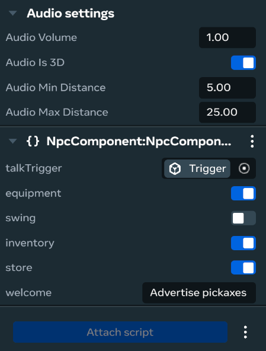

# [Module 5 - Exercise - Add Your Own AI NPC](#module-5---exercise---add-your-own-ai-npc)

This hands-on exercise guides you through creating and configuring your own AI NPC from scratch.

## [Exercise overview](#exercise-overview)

The best way to understand working with the NPCs is to actually work with them and play with the results. This exercise shows you how to add an AI NPC to this example world.

## [Step-by-step instructions](#step-by-step-instructions)

### [Step 1: Prepare the world](#step-1-prepare-the-world)

1. Launch your clone of the example world in the Desktop Editor.
2. Remove the invisible walls in this world which block access to the purple zone. Then add a bridge (same bridge that connects the green and blue zones) or other navigable geometry to connect the blue platform to the purple one. 
3. From the Build menu, place a new NPC gizmo in the purple zone. 
4. Set the Conversation field to “AI” and then press “Edit Character.” 
5. To change the AI NPC’s appearance, click **Edit Avatar**. This will launch a web editor - don’t forget to hit **Done editing** to save your edits before returning to the Desktop Editor. Then you must press the Refresh button to update the in-world appearance of the AI NPC.
6. Write a backstory for the AI NPC.
   1. You can use Generative AI to generate the backstories which can speed up creation. It may take trial and error to achieve the desired results.
7. Write instructions for the AI NPC. These instructions can include phrases such as “Keep answers short, don’t talk much” to influence the AI NPC. Click **Save**.
   1. The Conversations panel can be used to iterate the backstory.
8. There are several presets for voices available so all your NPCs don’t have to sound alike. Click on the **Voice and Speech** section and make your desired changes and click **Save** again. 
9. If you want the AI NPC to directly interact with players, add a trigger volume to your world.
10. Attach the `NpcComponent` script to your new AI NPC.
    1. Select which game events the AI NPC should react to via the toggles.
    2. Set an optional welcome instruction.
    3. You can also set the `talkTrigger` field to the trigger volume you created.
11. Configure the audio settings for the AI NPC depending on its placement and purpose. 
12. Test your world to see how your new AI NPC behaves in response to what you do as a player.

## [Tips for Success](#tips-for-success)

- Experiment with different backstories and instructions to get the desired personality
- Test your NPC with various game events to see how it responds
- Adjust audio settings based on the NPC’s location and role in your world
- Use the NPC Debugger (covered in Module 7) to troubleshoot issues

