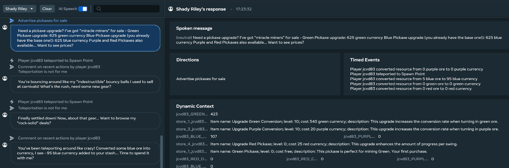

# [Module 7 - Debugging and Best Practices](#module-7---debugging-and-best-practices)

This final module covers debugging techniques and best practices for creating effective AI Speech NPCs.

## [Debugging Your AI NPCs](#debugging-your-ai-npcs)

### [Using the NPC debugger](#using-the-npc-debugger)

Use the NPC Debugger tab in the Desktop Editor to determine which events and world states the Conversation is responding to. Below is a screenshot showing which game events Shady Riley is responding to in the world. You can also use the NPC Debugger to debug user voice inputs.

### [Common debug scenarios](#common-debug-scenarios)

- **NPC not responding**: Check if the conversation is properly registered and the trigger zones are working
- **Unexpected responses**: Review the backstory and instructions for clarity
- **Performance issues**: Monitor how frequently events are being called
- **Audio problems**: Verify microphone permissions and audio settings

## [Best practices](#best-practices)

### [Take time to refine](#take-time-to-refine)

Take the time to refine your AI NPCs to maximize the experience. Small changes can have large effects.

### [Expect variability](#expect-variability)

Do not expect the same conversational responses from the AI NPCs each time. Their responses will vary as their backstories and strings are processed via the conversation API.

### [Configure speaking style](#configure-speaking-style)

Write several sentences in the instructions to configure how your AI NPCs will talk (e.g., length, word choice, topic).

### [Performance optimization](#performance-optimization)

- Monitor the frequency of event calls to prevent performance issues
- Use toggles to control which events NPCs respond to
- Implement timers and throttling for high-frequency events
- Test with multiple players to ensure good performance under load

### [Iterative development](#iterative-development)

As Creators may discover when completing the exercises in this tutorial, adjusting backstories, guardrails, instructions, timers, and interaction logic is an iterative process. Plan to spend time experimenting and refining your NPCs.

## [VR compatibility notes](#vr-compatibility-notes)

Compared to the original Sim Tycoon world, some minor changes were made to allow play in VR:

- Grab anchors were added to the pickaxes
- Some minor modifications were made to [Pickaxe.ts](https://developers.meta.com/horizon-worlds/learn/documentation/tutorial-worlds/feature-samples/ai-conversation-tutorial/module-7-debugging-and-best-practices/Pickaxe.ts)

## [Summary](#summary)

You’ve now learned how to:

1. ✅ Understand AI Speech NPC basics and setup requirements
2. ✅ Interact with existing NPCs and understand their behaviors
3. ✅ Implement NPCs using TypeScript and the Conversation API
4. ✅ Manage player interactions and coordinate multiple NPCs
5. ✅ Create your own AI NPC from scratch
6. ✅ Add custom game events to trigger NPC responses
7. ✅ Debug issues and follow best practices

## [Next steps](#next-steps)

Now that you’ve completed this tutorial, you can:

- Experiment with different NPC personalities and backstories
- Create more complex interaction systems
- Integrate NPCs into your own world designs
- Explore advanced Conversation API features
- Share your creations with the community

