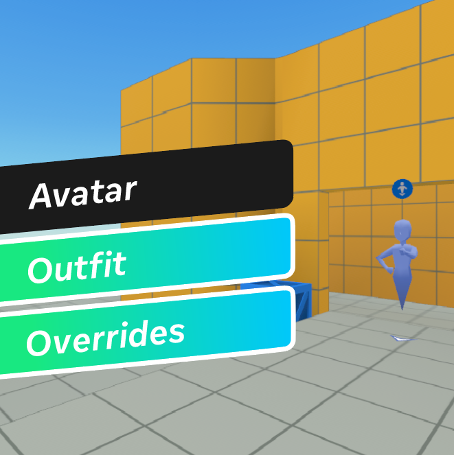
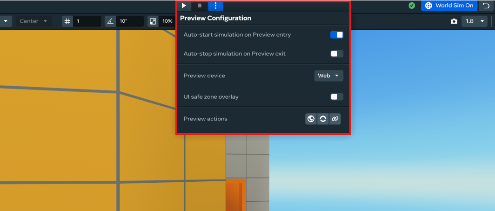
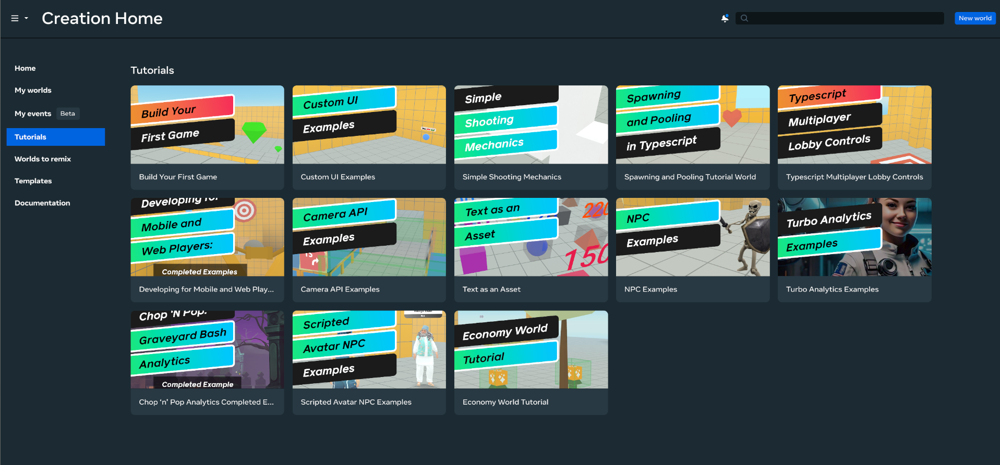

# [Module 1 - Introduction](#module-1---introduction)

> [!Important]
>
> This content is intended as a companion to the tutorial world of the same name, which you can access through the desktop editor. When you open the tutorial world, a copy is created for you to explore, and this page is opened so that you can follow along. For more information, see [Access Tutorial Worlds](../../Getting%20started/Getting%20started%20with%20tutorials/Access%20Tutorial%20Worlds.md).

> [!Note]
>
> You will need to be a member of MHCP and have accepted the terms in the Developer Dashboard in order to create in-world items and currency. Find out more about monetization [here](../../../MHCP%20program/Monetization/Monetization%20opportunities.md).

> [!Note]
>
> For detailed platform documentation on Avatar Overrides, see the [Avatar Item Overrides](https://developers.meta.com/horizon-worlds/learn/documentation/full-bodied-avatars/avatar-item-overrides) page.

## [Welcome to the Avatar Override Tutorial](#welcome-to-the-avatar-override-tutorial)

This tutorial world is a multiplayer dress-up and catwalk experience designed to help creators understand and implement avatar customization features in Horizon Worlds. Players can equip outfits in a dress-up area, then take turns showcasing their avatars on a catwalk, where other players can vote using on-screen elements. The top avatars are displayed in a winners’ circle before the cycle repeats.

## [What You’ll Build](#what-youll-build)

- **Avatar customization system** - Players can equip different clothing items and outfits using creator-controlled digital goods
- **Multiplayer showcase mechanics** - Sequential player presentations on a catwalk stage with camera control
- **Voting system** - Players vote for their favorite outfits with real-time feedback and on-screen UI elements
- **Game flow management** - Automated transitions between lobby, showcase, and results phases
- **Winner celebration** - Podium placement for 1st, 2nd, and 3rd place winners

## [Key Learning Objectives](#key-learning-objectives)

By completing this tutorial, you will understand how to:

- Create and access wearable avatar items for your worlds
- Implement interactive outfit systems using the `setAvatarOverrides` API
- Use Equip, Reset, and Check Triggers with TypeScript to control avatar equips and game logic
- Handle avatar compatibility and conflicts using canApplyOverride APIs
- Build interactive UI components for voting and outfit selection
- Manage player positioning and camera control during showcases
- Develop coordinated multiplayer game states and transitions

## [Tutorial Structure](#tutorial-structure)

1. **Setup** - Configure avatar items and in-world entities
2. **Core Scripts** - Overview of the game system architecture
3. **Game Manager** - Central state management and game flow
4. **Player Manager** - Player positioning and teleportation
5. **UI Systems** - Interactive components for player engagement
6. **Voting System** - Multiplayer voting mechanics and results
7. **Game Utilities** - Helper functions and shared resources
8. **Summary** - Extension ideas and next steps

## [Before You Begin](#before-you-begin)

### [Prerequisites](#prerequisites)

- Ensure you are a member of the Meta Horizon Creator Program (MHCP) and have accepted the monetization Terms of Service
- Basic knowledge of Horizon Worlds scripting and TypeScript
- Understanding of avatar systems in Horizon Worlds
- Review the official [Tutorial Prerequisites](../../Getting%20started/Getting%20started%20with%20tutorials/Tutorial%20Prerequisites.md)

### [Enable World Sim and Auto-start](#enable-world-sim-and-auto-start)

The Custom UI instructions within the tutorial are generated entirely from TypeScript code. In the desktop editor after you have opened the tutorial, click the **World Sim On** button and then click the three-dot menu in the toolbar. Enable the following settings:

- Auto-start simulation on Preview entry
- Auto-stop simulation on Preview exit

## [Learning Pathways](#learning-pathways)

### [Follow Along](#follow-along)

You can follow along with the steps of the tutorial content by using a copy of the world. After you have copied the world, you can compare the steps of the tutorial to the completed world.

**Desktop editor:** To create a copy of this tutorial world from the desktop editor, click **Tutorials** in Creation Home and then select **Avatar Override Tutorial World**.

**VR headset:** To build the world described in this tutorial, make your own copy of the **Avatar Override Tutorial World** from the **Tutorials** tab in the **Create** menu.

### [Explore the Complete World](#explore-the-complete-world)

You can check out the final version of the tutorial world by selecting the completed examples world in the ‘Tutorials’ tab inside Meta Horizon Worlds.

**Related documentation and resources:**

- [Avatar Item Overrides](https://developers.meta.com/horizon-worlds/learn/documentation/full-bodied-avatars/avatar-overrides)
- [Avatar Clothing Creation](https://horizon.meta.com/creator/avatars/create_new_item)

