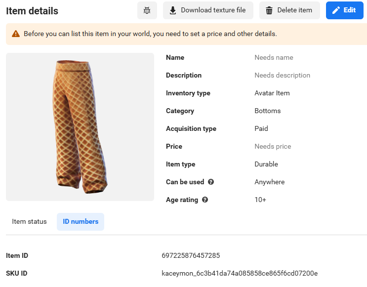

# [Module 2 - Setup](#module-2---setup)

> [!Note]
>
> You will need to be a member of MHCP and have accepted the terms in the Developer Dashboard in order to create in-world items and currency. Find out more about monetization [here](../../../MHCP%20program/Monetization/Monetization%20opportunities.md).

> [!Important]
>
> In-world items are tied to the world in which they are created, and can only be created by owners and editors of the world. This means that in order for the outfits to override as expected, the in-world items for this tutorial will need to be created by you.

> [!Note]
>
> For detailed platform documentation on Avatar Overrides, see the [Avatar Item Overrides](https://developers.meta.com/horizon-worlds/learn/documentation/full-bodied-avatars/avatar-item-overrides) page.

## [Avatar Item Overrides](#avatar-item-overrides)

This module guides you through creating avatar clothing items, accessing them in your world via API, and managing equips via scripting and triggers.

## [Creating In-World Items](#creating-in-world-items)

Avatar clothing items can be created using the Meta [avatar item creation tool](https://horizon.meta.com/creator/avatars/). For detailed instructions, visit the [Avatar Clothing Creation & Selling](https://developers.meta.com/horizon-worlds/learn/documentation/full-bodied-avatars/avatar-clothing-creation-and-selling) page.

Once created, avatar clothing items can be added to your world as interactive entities. For guidance on creating these in-world items, see the Avatar Outfits Tutorial World Setup.

## [Inputting SKUs into the Game](#inputting-skus-into-the-game)

To enable players to equip avatar clothing items, items will need to be created and their SKUs entered into their respective Avatar Test Trigger or Outfit UI.

These elements are used to detect player interaction and apply the corresponding SKU (item ID) to the player’s avatar.

