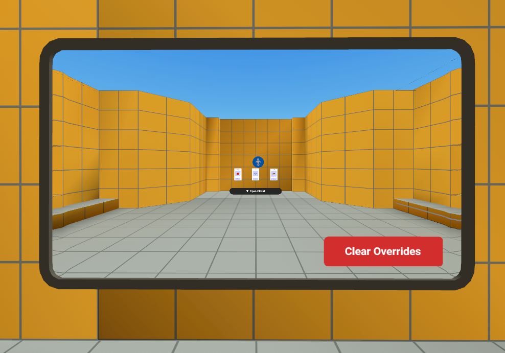
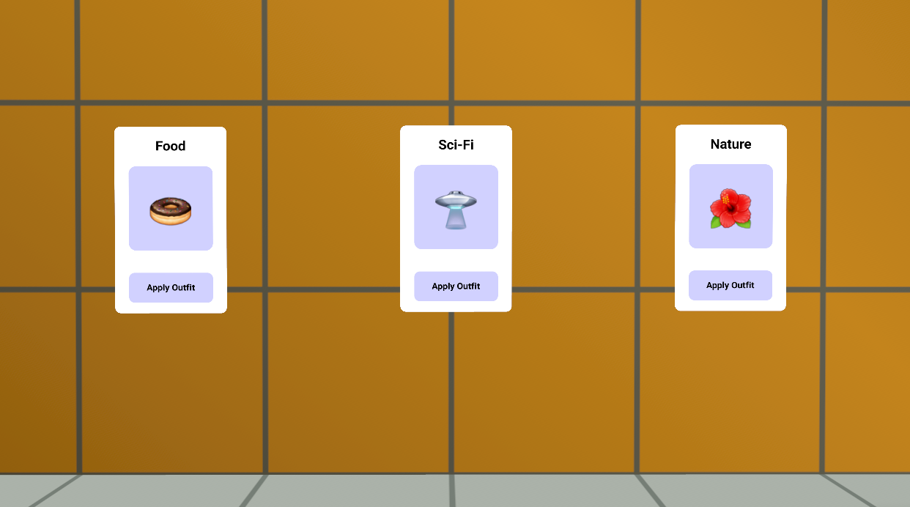
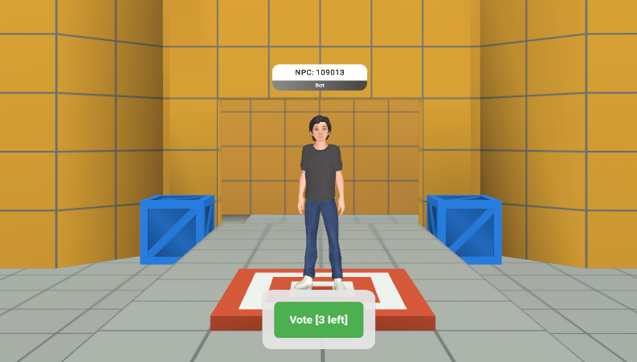

# Module 6 - UI Systems

Note

You will need to be a member of MHCP and have accepted the terms in the Developer Dashboard in order to create in-world items and currency. Find out more about monetization [here](../../../MHCP%20program/Monetization/Monetization%20opportunities.md).

The UI Systems module provides reusable components for player interaction and feedback, including timers, voting, outfit management, and avatar reset. Each UI script is attached to a corresponding UI entity in the Hierarchy panel.

## System Components

### ClearOverridesButton.ts

The `ClearOverridesButton.ts` script is a UI component that allows players to reset their avatar’s outfit to default.

### OutfitUI.ts

The `OutfitUI.ts` script allows players to apply custom outfits to their avatar through a simple UI panel. It manages the button state, loading feedback, and outfit item IDs, updating the button text and color automatically based on user interaction.

When the button is clicked, the component sends network events to request and apply the selected outfit, providing visual feedback during the process.

Note

SKUs within the UI gizmos will need to be replaced with SKUs created by the world owner.

**Modifications:**

* `categoryLabel` – Label for outfit category (default: “Custom Outfit”)
* `previewIcon` – Emoji preview for outfit
* `itemDisplaySize` – Size of the preview area
* `panelWidth` – Panel width
* `panelHeight` – Panel height
* Outfit item IDs – `shirtID`, `pantsID`, `shoesID`, `headwearID`

### TimerHUD.ts

The `TimerHUD.ts` script displays the current game state and a countdown timer on the player’s HUD. It tracks the game state and remaining time, updating the UI text automatically using Bindings.

The component listens for the onTimerInfoUpdated event to update the timer and state, as well as the onGameStateChanged event to reflect changes in game state.

### VoteButton.ts

The `VoteButton.ts` script enables players to cast votes in-game, providing immediate visual feedback and enforcing vote limits per player.

It manages the vote count, maximum allowed votes, and button state, while listening for events such as voteCountUpdate to track voting progress, as well as events to show, hide, or reset the button.

