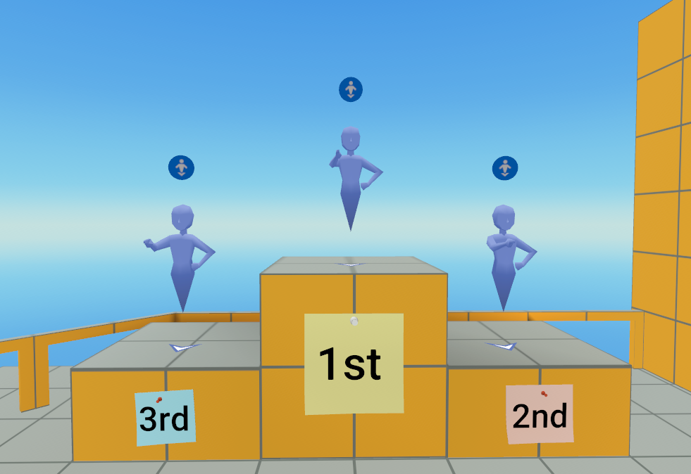

# [Module 7 - Voting System](#module-7---voting-system)

> [!Note]
>
> You will need to be a member of MHCP and have accepted the terms in the Developer Dashboard in order to create in-world items and currency. Find out more about monetization [here](../../../MHCP%20program/Monetization/Monetization%20opportunities.md).

The Voting Manager centralizes player voting during Showcase rounds. It assigns UI vote buttons to players, enforces voting rules, tracks votes, manages button visibility, switches cameras for showcase mode, and produces final results with tie handling.

## [Dependencies](#dependencies)

- **GameUtils (utils)**
  - Events and game state definitions
  - `utils.Events`: used for voting, showcase, and result processing broadcasts
- **PlayerCamera (`PlayerCameraEvents`)**
  - Camera attach/revert events
- **VotingConstants / VotingUtils**
  - Theming and defaults
  - Utilities for debug logging and CPU player checks

## [System Components](#system-components)

- VotingManager reference object hosts `VotingManager.ts`.
- VoteButton entities (12 max) hosting `VoteButton` UI component (one per player).
- Optional Showcase Camera Target entity (used to attach cameras during Showcase).

## [Script Properties](#script-properties)

| Property             | Type              | Default | Description                                                                    |
| -------------------- | ----------------- | ------- | ------------------------------------------------------------------------------ |
| maxVotesPerPlayer    | Number            | 3       | Maximum votes each player can cast per round.                                  |
| enableDebugLogs      | Boolean           | false   | Enables console logging for diagnostics.                                       |
| showcaseCameraTarget | Entity (optional) | -       | Camera target to attach player camera to a fixed position during the Showcase. |
| button1 … button12   | Entity            | -       | References up to 12 vote button entities.                                      |

## [Events](#events)

**Broadcast Events**

| Event Name             | Purpose                                               |
| ---------------------- | ----------------------------------------------------- |
| voteCountUpdate        | Update a player’s vote count display                  |
| registerButtonResponse | Tell button how many votes are allowed                |
| setOwner               | Assigns a button to a specific player                 |
| onHideAndDisableButton | Hides/disables the button when voting ends            |
| onShowAndEnableButton  | Shows/enables the button when voting begins           |
| onVoteButtonStateReset | Resets button state when a new player spawns on stage |
| onVotingResultsReady   | Announces winners to GameManager                      |

**Received Events**

| Event Name              | Purpose                                                      |
| ----------------------- | ------------------------------------------------------------ |
| voteRequest             | When a player presses their vote button                      |
| onShowcaseInitalized    | Indicates showcase players and stage player                  |
| onShowcasePlayerChanges | Indicates current stage player and floor players             |
| onGameStateChanges      | Drives state transitions including entering/exiting Showcase |
| onProcessVotes          | Triggers computation and placement of winners                |

## [Modifications](#modifications)

1. **Change max votes per round:**

   Update maxVotesPerPlayer property in VotingManager.

2. **Add more than 12 players:**

   Add more button entity references and extend propsDefinition plus initialization/assignment arrays accordingly.

3. **Adjust camera timing:**

   Update VotingManager.CAMERA\_DELAY and the small delays around stage transitions for your UX.

4. **Customize button behavior or theme:**

   Edit VoteButton to use constants from VotingConstants to keep styling consistent.

