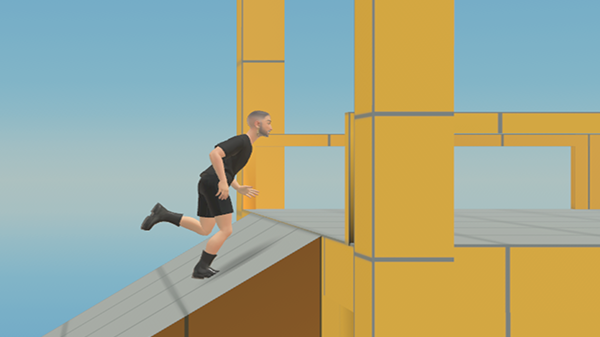

# [Module 1 - Setup](#module-1---setup)

> [!Important]
>
> This content is intended as a companion to the tutorial world of the same name, which you can access through the desktop editor. When you open the tutorial world, a copy is created for you to explore, and this page is opened so that you can follow along. For more information, see [Access Tutorial Worlds](../../Getting%20started/Getting%20started%20with%20tutorials/Access%20Tutorial%20Worlds.md).

In VR, the camera’s point of view is set to first-person from the point of view of your avatar. In web and mobile experiences, however, the camera may be positioned in different points of view to facilitate the best combination of immersive experience, situational awareness, and current interactions. This tutorial covers the different camera positions available through the Camera API for use in web and mobile worlds, including recommended use cases for each one.

**Note**: This world is supported for web and mobile only. Although you may explore it in VR, the camera POVs do not apply.

## [Key Learning Objectives](#key-learning-objectives)

- How to switch the camera

- When to switch the camera

- Changes to interaction models based on the camera

- Other stuff:

  - A working door
  - Text gizmos and how to manage instructions sets

## [Learning Pathways](#learning-pathways)

You can follow this tutorial in different ways:

### [Grab What You Need!](#grab-what-you-need)

You can use assets and scripts from this world in your own. For more information on how to apply this world to yours, see [Use Assets from Tutorials](https://developers.meta.com/horizon-worlds/learn/documentation/tutorial-worlds/getting-started-with-tutorials/use-assets-from-tutorials).

**Note**: In the following modules, script names are listed to indicate where the code for the system is located. These files are available in a local directory for your scripts. Search for the filename of the name of the world.

### [Follow Along](#follow-along)

These modules are intended to be explored in a sequence. Grab a cup of coffee, and get ready to learn about the Camera API!

## [Before You Begin](#before-you-begin)

If you haven’t done so, please review the Getting Started section for tutorials, which includes information on:

- Tutorial prerequisites and assumptions
- How to use tutorial worlds and assets in your own worlds
- Developer tools and testing for your worlds

**Note**: All tutorials are created using TypeScript 2.0.0. You can learn more about how to upgrade your own world to TypeScript 2.0.0.

See [Getting Started with Tutorials](../../Getting%20started/Getting%20started%20with%20tutorials/Tutorial%20Prerequisites.md).

## [Prerequisites](#prerequisites)

To follow along and complete this tutorial, you need the following:

- A Meta Account and a Meta Horizon Profile.
- The Meta Horizon Worlds App installed on your Quest device.
- The desktop editor downloaded and installed on a PC device.

See [Tutorial Prerequisites](../../Getting%20started/Getting%20started%20with%20tutorials/Tutorial%20Prerequisites.md).

- (Optional) An integrated development environment (IDE) can be connected to the desktop editor for building your TypeScript scripts.

  - Visual Studio Code is recommended.

**Note**: If you are new to the desktop editor or to TypeScript, you might want to start with the first tutorial. See [Build your first game](../../Getting%20started/Getting%20started%20with%20tutorials/Tutorial%20Prerequisites.md).

**Note**: This tutorial is built on TypeScript API version 2.0.0.

- Your IDE must be running at least TypeScript Version 4.7.4.
- For API documentation, see [API v2.0.0 documentation](https://horizon.meta.com/resources/scripting-api/index.md/?api_version=2.0.0).

## [Get Started](#get-started)

Before you begin, you must create a new world from this tutorial world. See [Access Tutorial Worlds](../../Getting%20started/Getting%20started%20with%20tutorials/Access%20Tutorial%20Worlds.md).

Open your new world in the desktop editor, where you can explore it in either Build mode or Preview mode to familiarize yourself with the world and its structures before modifying it.

**Note**: This tutorial assumes that you are familiar with the desktop editor, a desktop application for world building in Meta Horizon Worlds. If you are new to the desktop editor, you should check out the “Build your first game” tutorial to learn the basics of building worlds and TypeScript scripts in the desktop editor. See [Build your first game](https://developers.meta.com/horizon-worlds/learn/documentation/tutorial-worlds/build-your-first-game/module-1-build-your-first-game).

### [Set up for web and mobile testing](#set-up-for-web-and-mobile-testing)

As part of the development process, you must test your work on each supported platform, which requires setting up a development environment for them.

**Note**: Mobile can only be tested in a published world.

**Note**: For this tutorial world, the desktop editor is a reasonable testbed for the basics of camera operations. However, mobile has some differences that need to be included as part of your testing. For example, this world includes a camera reset button, which appears in the mobile screen only. Mobile experiences should be tested as well.

For more information, see [How to Test on Web and Mobile](../../../Mobile%20and%20web/Testing%20worlds%20on%20mobile%20and%20web.md).

### [Tutorial modules](#tutorial-modules)

The modules in this tutorial are organized in the following sequence.

| Module Name                                | Description                                                                                                      |
| ------------------------------------------ | ---------------------------------------------------------------------------------------------------------------- |
| Module 2 - PlayerCamera Overview           | Overview of how the player avatar’s camera works in Meta Horizon Worlds. How PlayerCamera objects and code work. |
| Module 3 - PlayerCameraManager             | How the PlayerCameraManager code works and how you can interface with it.                                        |
| Module 4 - Pan Camera                      | Set up camera to follow player at a consistent offset.                                                           |
| Module 5 - Fixed Camera and Spectator Mode | How to set up the PlayerCamera to be located at a fixed point based on a reference object.                       |
| Module 6 - Fixed Camera and Cutscenes      | How you can use the PlayerCamera for cutscenes and other perspectives such as isometric game experiences         |
| Module 7 - Other Systems and Summary       | How to use the secondary systems and summing it all up                                                           |

## [Checkpoint](#checkpoint)

Module 1 completed! In this module, you:

- Verified prerequisites
- Opened the tutorial world in the desktop editor
- Set up web and mobile testing
- Learned the basic structure of the world

In the next module, you explore the camera, its APIs, and its usage in web and mobile.

