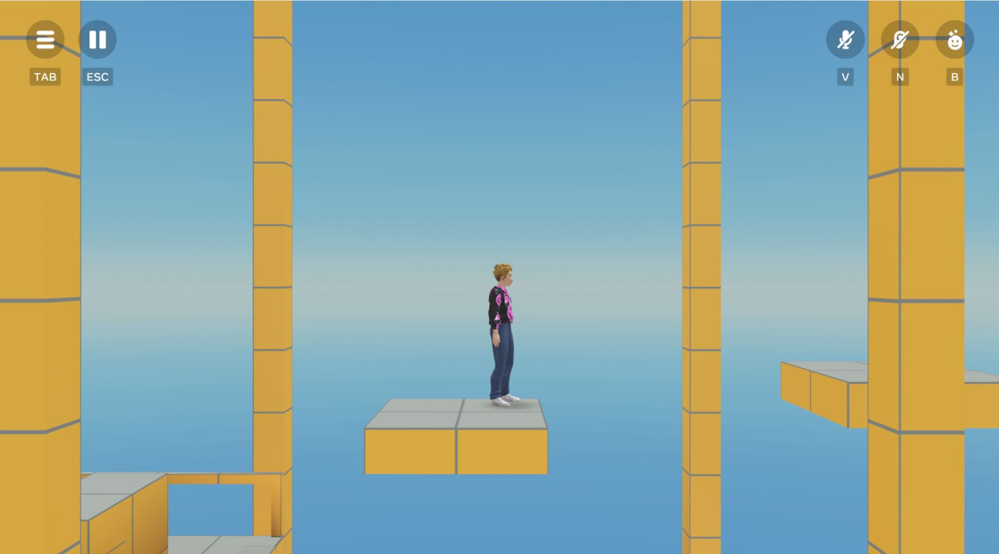
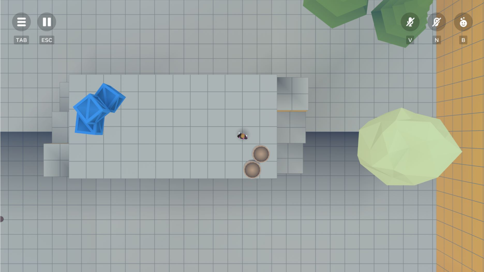

# [Module 4 - Pan Camera](#module-4---pan-camera)

The pan camera setting moves the player’s camera to follow their avatar at a consistent offset. Having the camera follow the avatar gives a lot of creative freedom for experimenting with different types of gameplay, and allows for sidescrolling, top-down and isometric influenced gameplay.

In this tutorial, climbing the steps switches the camera to pan camera mode, and sets the camera’s position to be 10 offset from the player on the X-axis.

Entering the top-down area also switches the camera to pan mode, but notice that we have set the camera’s position to be 20 units offset from the player on the Y-axis, which gives a top-down perspective.

The PanCameraTrigger.ts script is essentially an extension of the CameraTrigger script with some additional properties:

| Parameter           | Description                                                                                                                                                                                                                                                                                                                |
| ------------------- | -------------------------------------------------------------------------------------------------------------------------------------------------------------------------------------------------------------------------------------------------------------------------------------------------------------------------- |
| `cameraOffset`      | The camera’s offset from the player’s avatar in Vec3 format. Note that the camera will always target the player’s avatar at the center of the frame. If not set the default value in this tutorial is `(2, 0, 0)`.                                                                                                         |
| `translationSpeed`  | The speed the camera can move, decoupled from the avatar’s speed. This allows for smoother camera transition when the player starts and ends their movement. If not set, the default value in this tutorial is `4.0`.                                                                                                      |
| `collisionsEnabled` | Whether the camera should collide with objects in the world. If set to `true`, the camera will move closer to the player when there is an obstacle to its position with the offset. If set to `false`, the camera will ignore obstacles in the world, passing through them or behind them to maintain its offset position. |

When a player enters the Trigger Zone, the SetCameraCollisions and SetCameraPan events are emitted, which are received by the `PlayerCamera.ts` script. In `PlayerCamera.ts`:

- A listener for `SetCameraCollisions` triggers a call to the `setCameraCollisions()` function.
- A listener for `SetCameraPan` triggers a call to the `setCameraPan()` function.

For more information on parameters of this event and the above functions, see [Module 2 - PlayerCamera Overview](Module%202%20-%20PlayerCamera%20Overview.md).

## [Checkpoint](#checkpoint)

In this module we explored using the Pan Camera to offset the player’s camera at a specific position from the player, which enables interesting game mode variations on mobile and web such as sidescrolling and top-down.

Next, we explore Fixed Camera modes and use cases.

