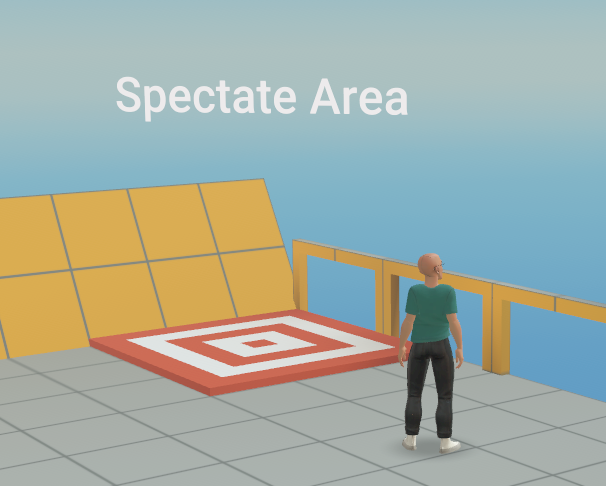
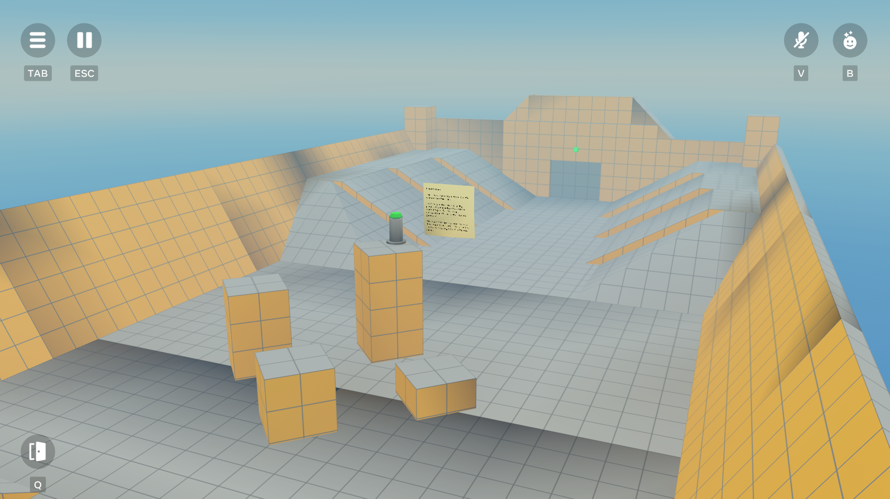

# Module 5 - Fixed Camera and Spectator Mode

In some environments, you may wish to position the player as a spectator to an event. This camera mode allows for visitors to enjoy an unfolding scene, such as an NBA game or musical event. Or, in a dynamic environment, you can enable a FixedCamera perspective to allow them to step out of the action for a moment.

In this tutorial, entering the red target switches the camera to spectator mode:



Upon entering, your view transitions to the following:



After stepping onto the target, the player’s perspective is quickly transformed to the point of view of the stationary reference object positioned above the target, looking out over the above scene.

**Note**: The Q icon is displayed in this camera mode to allow the visitor to escape out of a fixed camera mode.

This transition is triggered when the player enters the Trigger Zone, attached to which is `FixedCameraTrigger.ts`. It’s a pretty simple script:

```
class FixedCameraTrigger extends hz.Component<typeof FixedCameraTrigger> {
  static propsDefinition = {
    cameraPositionEntity: {type: hz.PropTypes.Entity},
  };

  start() {
    this.connectCodeBlockEvent(
      this.entity,
      hz.CodeBlockEvents.OnPlayerEnterTrigger,
      (player: hz.Player) => {
        if (
          this.props.cameraPositionEntity !== undefined &&
          this.props.cameraPositionEntity !== null
        ) {
          this.sendNetworkEvent(
            player,
            PlayerCameraEvents.SetCameraFixedPositionWithEntity,
            {
              entity: this.props.cameraPositionEntity,
              duration: 0.4,
              easing: Easing.EaseInOut,
            },
          );
        } else {
          console.warn(
            'Attempted to use FixedCameraTrigger without a camera position entity. Create an empty object and reference it in the props.',
          );
        }
      },
    );
  }
}
hz.Component.register(FixedCameraTrigger);
```

When a player enters the Trigger Zone, the setCameraFixedPositionWithEntity event is emitted, which is received by the `PlayerCamera.ts` script. This script takes position and rotation information from the submitted entity. In this case, the this.props.cameraPositionEntity property maps to the reference object above the zone.

In `PlayerCamera.ts`:

* A listener for the above event triggers a call to the setCameraFixedPositionWithEntity() function.
* Above function calls to: setCameraFixedPosition(), which:
  + Sets locomotion on the player to 0
  + Calls to displayCameraResetButton(), which activates the Q button on the mobile and web screen.

For more information on parameters of this event and the above functions, see [Module 2 - PlayerCamera Overview](Module%202%20-%20PlayerCamera%20Overview.md).

## Checkpoint

In this module, we covered how to set up a fixed camera for the player. While we generally want to keep players immersed in the action, this perspective can be useful in some contexts.

In the next module, we explore how to create cutscenes using simple camera motions and animation.