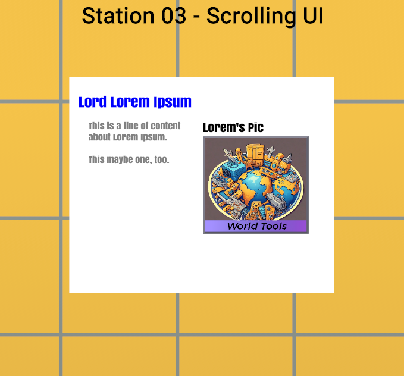

# [Station 3 - Scrollable UI](#station-3---scrollable-ui)

This station demonstrates how to create a custom UI that can be scrolled. It’s pretty simple; instead of using a View object, you deploy a ScrollView object, which supports a couple of additional attributes.



This UI displays an example biography of Lord Lorem Ipsum, including a title, picture, picture caption, and body text.

In this example, the body text is too long for the displayed panel. To display the entire body text, the panel height would have to be so large that the UI would be difficult to review in headset.

In this case, the problem is addressed by rendering the body text of His Lordship in a ScrollView object.

## [Assets](#assets)

- **Station03-CustomUI: CustomUI gizmo**
  - Visible: true
  - Script: the script that defines the custom UI elements must be attached.
- **Station03-ScrollingUI: script**
  - This script defines the customUI object and loads the image referenced in the CustomUI gizmo properties panel.
- **StationAll-CustomUI-Library: script**
  - Some elements of this library file are imported in the script.

## [Script](#script)

### [Station03-ScrollingUI](#station03-scrollingui)

The static components are consistent with Text and Image assets that have been used in previous examples. When building out the structure, you need to pay attention to the `flexDirection` property, which defines how to organize the child objects within a View.

Below is the definition of the ScrollView object:

```typescript
const MyScrollView = ui.ScrollView({
  children: [
    ui.Text({
      text: 'This is a line of content about Lorem Ipsum.\n\nThis maybe one, too.\n\n',
      style: {fontFamily: 'Anton', fontSize: 18, color: 'gray'},
    }),
    ui.Text({
      text: 'Lorem ipsum ... laborum.\n\n',
      style: {fontFamily: 'Anton', fontSize: 18, color: 'gray'},
    }),
    ui.Text({
      text: 'Lorem ipsum ... laborum.\n\n',
      style: {fontFamily: 'Anton', fontSize: 18, color: 'gray'},
    }),
    ui.Text({
      text: 'Lorem ipsum ... laborum.\n\n',
      style: {fontFamily: 'Anton', fontSize: 18, color: 'gray'},
    }),
  ],

  // contentContainerStyle defines properties of the ScrollView object's container.
  contentContainerStyle: {height: 1200, alignItems: 'flex-start'},
  horizontal: false,
  style: {
    height: 300,
    width: 200,
  },
});
```

In the above, the child objects of a `ScrollView()` are defined exactly like a `View()` object. The key differences are in the styling properties.

- The style element defines the height and width of the part of the ScrollView object that is visible in the custom UI. This is the window into the scrolling view.
  - These values must be less than the panelHeight and panelWidth values defined for the class.
- The contentContainerStyle object defines two things:
  - **Height**: The overall height of the scrolling view. Since this value (`1200`) is greater than the window height (`300`), scrollbars are inserted to enable players to scroll to see the entire view.
    - Note that the scrollbars are dependent only on these values; if there is insufficient content to require scrolling, the scrollbars are still displayed. You can experiment by commenting out some of the ui.Text lines in the above definition. You may wish to adjust the overall height value accordingly.
    - The overall height value for the scrolling view (`1200`) can be more than or less than the `panelHeight` value for the class.
  - **alignItems**: This value defines how child objects flow in the axis that is not the predominant one. Since the above ScrollView object flows vertically, this value defines how the object flows horizontally. See the object definition in the API code for details.
- **Orientation**: The orientation of the content pane: horizontal = false means that the pane is oriented vertically. This is the default.

## [Key Learnings](#key-learnings)

### [Meta Horizon Worlds learnings](#meta-horizon-worlds-learnings)

How to deploy a ScrollView object in a custom UI.

### [TypeScript learnings](#typescript-learnings)

You can import an entire API module as a named reference. At the top of the script:

```typescript
import * as ui from 'horizon/ui';
```

Whenever you wish to reference a component from the `/ui` module, you preface the reference with the value: `ui`.

Example: Note the references to the `View()` and `Text()` components from the ui module.

```typescript
initializeUI() {
  return ui.View({
    children: [
      ui.Text({
        text: "Lord Lorem Ipsum" ,
        style: {
          fontFamily: "Anton",
          color: "blue",
          fontSize: 28,
          fontWeight: "bold",
          alignContent: "center"
        }
})
```

