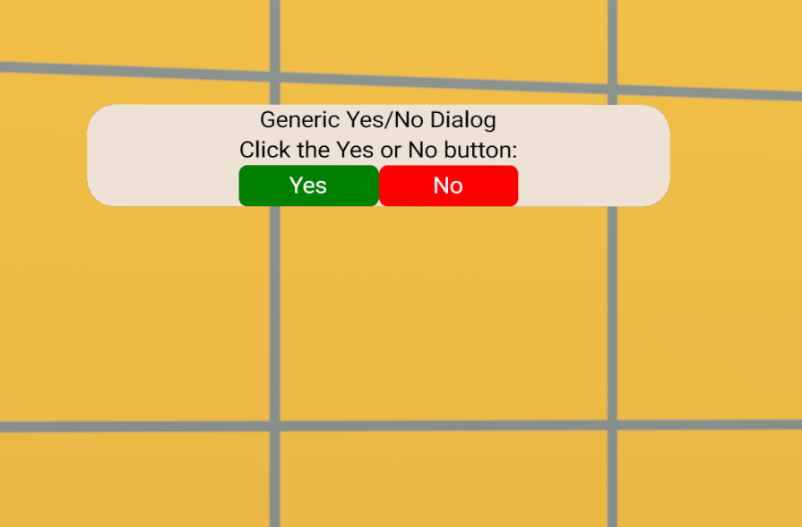

# [Station 4 - Generic Yes/No Dialog](#station-4---generic-yesno-dialog)

This station demonstrates how to set up a generic dialog with Yes/No buttons.

This customUI panel contains a text message and a Yes button and No button, with placeholders for actions to be taken when each button is pressed.

## [Assets](#assets)

- **Station04-CustomUI: CustomUI gizmo**
  - Visible: true
  - Script: the script that defines the custom UI elements must be attached.
- **Station04-GenericYesNoDialog: script**
  - This script defines the customUI object and loads the image referenced in the CustomUI gizmo properties panel.
  - It also defines the method by which the panel is filled over a series of frames.
  - Updates are performed every five frames.
- **StationAll-CustomUI-Library: script**
  - Some elements of this library file are imported in the script.

## [Script](#script)

### [Station04-GenericYesNoDialog](#station04-genericyesnodialog)

This customUI creates the two buttons using two calls to a function (`MyButton()`), passing in properties (`MyButtonProps`).

In the definition for the function, you can see how properties of the button are set to both constant value (ALL CAPS) and to variables, which allow for variation between the two buttons.

This function returns a `UINode()`, which is added to the customUI `View()` definition. This node is an instance of a Pressable object, which is a customUI component that supports the following JavaScript-style events:

- `onClick()`
- `onEnter()`
- `onExit()`
- `onPress()`
- `onRelease()`

There are definitions or placeholders for definitions for each of these events in the Pressable definition. In Visual Studio Code, you can right-click these strings and select **Go to Definition** to learn more.

There’s an intermediate construction of a UINode object using the `MyPrompt()` function, which uses a `Text()` element and two calls to `MyButton()` to create the Yes button and the No button, which have slightly different properties.

Placeholder functions are added for what happens when the buttons are clicked: `doYes()` and `doNo()` write a simple log message to the console.

`MyPrompt()` is called within the `initializeUI()` method as part of initialize setup of the customUI panel.

## [Key Learnings](#key-learnings)

### [Meta Horizon Worlds learnings](#meta-horizon-worlds-learnings)

- The use of a function (`MyButton()`) to return a `UINode()`, which can be added to your customUI panel.
- The Pressable UI component and its JavaScript-style supported events

### [TypeScript coding](#typescript-coding)

- None.

