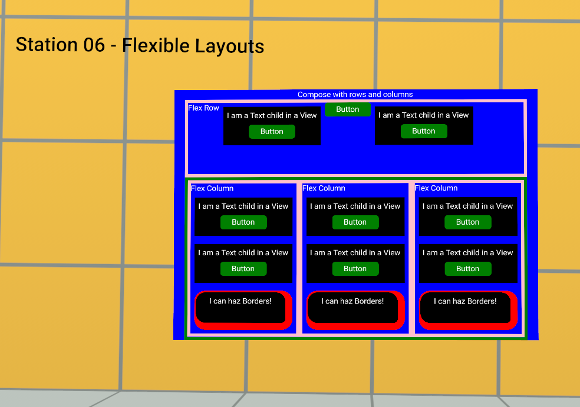

# [Station 6b - Combo View](#station-6b---combo-view)

This station demonstrates how you can combine multiple nested view objects to assemble groups of elements in your user interface.

In the previous example, the `View()` objects were created as constructors, which allows them to be referenced multiple times. Since the entire column was created as a constructor, it can be reused as well, which results in the side-by-side Flex Column objects in the following image.

In this manner, you can build sophisticated user interfaces by assembling core UI widgets as constructor `View()` objects and combining them together to build more sophisticated objects, which can be referenced from a library. Think, for example, of a Confirmation Dialog created as a set of constructor `View()` objects.

## [Assets](#assets)

- **Station06b-CustomUI: CustomUI gizmo**
  - Visible: true
  - Script: the script that defines the custom UI elements must be attached.
- **Station06b-ComboView: script**
  - This script defines the customUI object and loads referenced objects.

## [Script](#script)

### [Station06b-ComboView](#station06b-comboview)

- This script includes more constructor `View()` object declarations: The structure of the UI is as follows:
  - UIComponentViewCombo class
    - `Text()`
    - `viewNestedCombo()`: `flexDirection = "column"`
      - `viewNestedRow()`: `flexDirection = "row"`
        - `Text()` instance
        - `viewSimple()`: `flexDirection` is not specified
          - `Text()` instance
          - `MyButton()` instance
        - `MyButton()` instance
        - `viewSimple()`:
          - `Text()` instance
          - `MyButton()` instance
      - `View()` instance: This view is declared inline and not as a constructor
        - `viewNestedCol()`: `flexDirection = "column"`
          - `Text()` instance
          - `viewSimple()`: `flexDirection` is not specified
            - `Text()` instance
            - `MyButton()` instance
          - `viewSimple()`: `flexDirection` is not specified
            - `Text()` instance
            - `MyButton()` instance
          - `ViewBorder()`: `flexDirection` is not specified
            - `Text()` instance
        - `viewNestedCol()`: `flexDirection = "column"`
          - `Text()` instance
          - `viewSimple()`: `flexDirection` is not specified
            - `Text()` instance
            - `MyButton()` instance
          - `viewSimple()`: `flexDirection` is not specified
            - `Text()` instance
            - `MyButton()` instance
          - `ViewBorder()`: `flexDirection` is not specified
            - `Text()` instance
        - `viewNestedCol()`: `flexDirection = "column"`
          - `Text()` instance
          - `viewSimple()`: `flexDirection` is not specified
            - `Text()` instance
            - `MyButton()` instance
          - `viewSimple()`: `flexDirection` is not specified
            - `Text()` instance
            - `MyButton()` instance
          - `ViewBorder()`: `flexDirection` is not specified
            - `Text()` instance

## [Key Learnings](#key-learnings)

### [Meta Horizon Worlds learnings](#meta-horizon-worlds-learnings)

- Building combinations of constructor `View()` objects to assemble more complex interfaces.

### [TypeScript coding](#typescript-coding)

- None.

