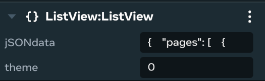

# [Zone 4 - Advanced Lists](#zone-4---advanced-lists)

This zone covers sophisticated list implementations that can handle dynamic data and complex interactions.

## [Station #9: Inventory](#station-9-inventory)

Based on a dynamic list, the inventory takes a set of JSON data, formats it, and then displays it. The demo shows how to fill out a variable list of items of varying sizes as well. This spatial version of the inventory can often be found in hub areas for players to view their inventory.

### [Script Overview](#script-overview)

- **`InventoryCore.ts`**: This is an abstract base class that provides the core logic and UI structure for any inventory-like component. It defines common properties, methods, and a rendering pipeline for displaying items in rows.
- **`Inventory.ts`**: This is the concrete UI component that extends `InventoryCore`. It sets up the specific dimensions (width, height, item size) and theme for the UI panel.
- **`InventoryDemo.ts`**: This is the game logic component that drives the demo. It links in-world triggers to the Inventory UI component.

### [Properties](#properties)

#### [Inventory Properties](#inventory-properties)

- **`theme`**: A number used to select a predefined color theme (blue(`0`), green(`1`), or yellow(`2`)) for the UI panel.

#### [InventoryDemo Properties](#inventorydemo-properties)

- **`trigger1–trigger2`**: Two entity properties that link to in-world triggers.
- **`triggerVisual1–triggerVisual2`**: Two entity properties that link to visual entities that change color based on the state of their corresponding trigger.
- **cuiGizmo**: An entity that links to the entity holding the Inventory UI component.

### [Methods](#methods)

#### [InventoryCore.ts Methods](#inventorycorets-methods)

- **`rebuildUI(player?)`**: A core public method for processing and organizing the loaded data. It groups the items into rows based on the itemsPerRow property from the source data.
- **`InventoryAdd(id, parsedData, player?)`**: A public method to add a new list of items to the inventory from a pre-parsed RootData object.
- **`InventoryDelete(id, player?)`**: A public method to remove a list by its ID.

## [Station #10: Stats List](#station-10-stats-list)

You can create a stats sheet for players using this paginated view. Players can keep track of their stats by viewing this UI. The stats can be for gameplay (such as strength and health) or for accomplishments (such as kill count and number of stars collected).

### [Script Overview](#script-overview-1)

This demo showcases a dynamic paginated list UI, designed for displaying information like player stats. The system is composed of two main scripts:

1. **`ListView.ts`**: This is a UI component responsible for all aspects of rendering and managing the list view. It handles paginated data, allows navigation between pages, and renders different types of list items.
2. **`StatsListDemo.ts`**: This is the game logic component that controls the ListView. It acts as a controller, linking in-world triggers to the ListView component’s public methods.

### [Properties](#properties-1)

#### [ListView Properties](#listview-properties)

- **`jSONdata`**: A string that holds the JSON data for the list. This allows the list’s content to be defined directly in the editor or through a CodeBlock.
- **`theme`**: A number used to select a predefined color theme for the UI panel.

#### [StatsListDemo Properties](#statslistdemo-properties)

- **`trigger1, trigger2, trigger3, trigger4`**: Four entity properties that link to in-world triggers.
- **`cuiGizmo`**: An entity that links to the entity holding the ListView UI component.
- **`jSONdata`**: A string property that provides the default JSON data for the demo, which can be overridden in the editor.

### [Methods](#methods-1)

#### [ListView Methods](#listview-methods)

- **`ListViewLoadJSON(data?, player?)`**: A public method to parse and load new JSON data into the component.
- **`updateDynamicList(player?)`**: A private method that refreshes the UI.
- **`goToPreviousPage(player?)`** and **`goToNextPage(player?)`**: Private methods that handle the pagination logic.
- **`ListViewUpdateValue(itemNum, newValue, player?)`**: A public method that dynamically updates a specific list item’s value.

## [Station #11: Player List](#station-11-player-list)

This UI displays lists of players which can be used to show everyone in the world or keep track of team lineups.

### [Script Overview](#script-overview-2)

1. **`cuiItemList.ts`**: A utility library defining the data structures and rendering functions for various list item types.
2. **`PlayerListCore.ts`**: An abstract base class that provides the core logic for managing a list of players. It handles adding, deleting, and updating the UI’s data source.
3. **`PlayerList.ts`**: A concrete UI component that extends `PlayerListCore`. It defines the specific dimensions and layout for the player list panel.
4. **`PlayerListDemo.ts`**: A game logic component that controls the UI. It listens for players entering and exiting triggers and dynamically adds or removes them from two separate PlayerList UI components.

### [Properties](#properties-2)

#### [PlayerList Properties](#playerlist-properties)

- **`theme`**: A number used to select a predefined color theme for the UI panel.

#### [PlayerListDemo Properties](#playerlistdemo-properties)

- **`trigger1 and trigger2`**: Two entity properties that link to in-world triggers.
- **`triggerVisual1 and triggerVisual2`**: Two entity properties that link to visual entities that change color to provide feedback on which team is selected.
- **`list1`** and **`list2`**: Two entity properties that link to the entities containing the PlayerList UI components.
- **`title1`** and **`title2`**: Two string properties that set the titles for the two player lists.

### [Methods](#methods-2)

#### [PlayerListCore Methods](#playerlistcore-methods)

- **`rebuildUI()`**: A public method that processes the internal data and updates the reactive binding.
- **`PlayerListAdd(id, name, itemHeight)`**: A public method to add a new player to the internal data array.
- **`PlayerListDelete(id)`**: A public method to remove a player from the internal data array.

