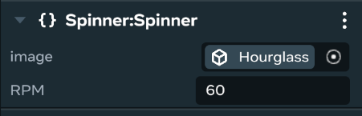
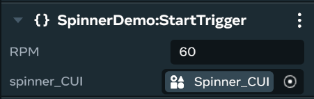
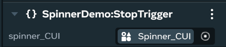
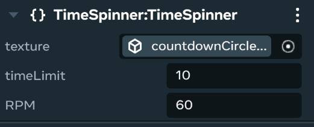
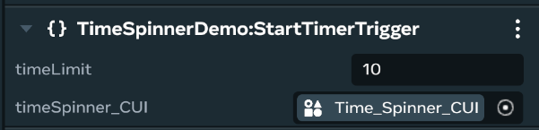
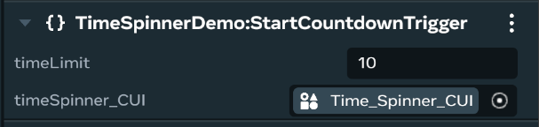
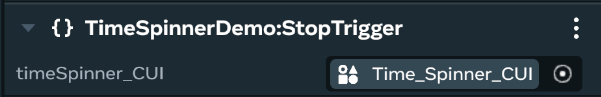
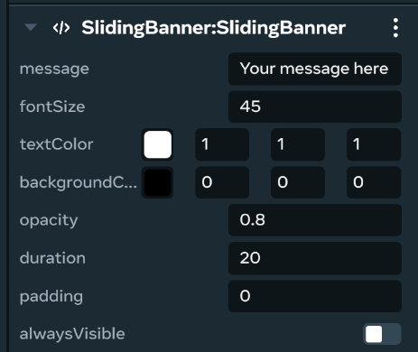
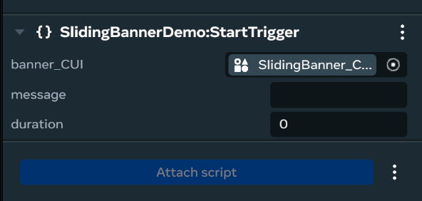
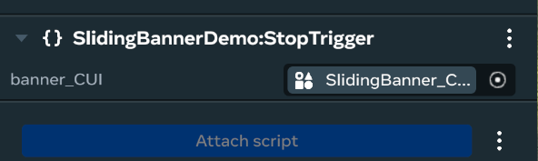

# [Zone 5 - Animation](#zone-5---animation)

This zone showcases animated Custom UI elements that provide dynamic visual feedback and enhance the user experience.

## [Station #12: Hourglass Spinner](#station-12-hourglass-spinner)

This example of animation is a simple spinning image of an hourglass. Start and stop the spinning with a network event. You can change the image from an hourglass to any image asset as well as change the speed of the spin from the properties panel or through function calls.

### [Primary Script(s)](#primary-scripts)

- **`Spinner.ts`:** This TypeScript code defines an hourglass Spinner component and related trigger components.

### [Properties](#properties)

- **`image`**: the image to be rotated 360 degrees
- **`RPM`**: the speed per minute to rotate the image (1 rotation per second)

### [Network Events](#network-events)

The following network events are defined to communicate across the network:

- **`StartSpinner`**: An event that triggers the spinner to begin rotating. It carries an object with the spinner’s entity ID and the RPM to rotate the image.
- **`StopSpinner`**: An event to stop the spinner’s animation. It carries the spinner’s entity ID.
- **`SetDisplay`**: An event to control the visibility of the spinner without affecting its animation state.

### [Demo Components](#demo-components)

These helper components are designed to be placed in the world to trigger the spinner’s behavior when a player enters a designated area.

- StartTrigger

- Uses connectCodeBlock event `onPlayerEnterTrigger` to listen for a player entering its trigger volume. When this happens, it sends a StartSpinner network event, passing the configured spinner\_CUI’s entity ID and RPM.
- `spinner_CUI` must be linked to the configured Custom UI gizmo.
- You can override the spinner’s RPM here by setting an RPM value or leave as 0 to use the RPM in the properties of the spinner’s Custom Ui gizmo.
- StopTrigger

- Similar to StartTrigger, it sends a StopTrigger network event when a player enters its trigger volume.
- ShowTrigger
  - Sends a SetDisplay network event with `isVisible: true`, making the spinner visible.
- HideTrigger
  - Sends a SetDisplay network event with `isVisible: false`, making the spinner invisible.

## [Station #13: Spinner With Timer](#station-13-spinner-with-timer)

This animated Custom UI combines a timer with a spinner. A common use for this is displaying the time for short gameplay functions that do not require player input such as the time for a plant to sprout or an ability to finish its cooldown.

### [Primary Script(s)](#primary-scripts-1)

- **`TimeSpinner.ts`**: This TypeScript code defines a spinner with a time component and related trigger components.

### [Properties](#properties-1)

The component’s configurable properties are defined in static propsDefinition:

- **`texture`**: the image to be rotated 360 degrees
- **`timeLimit`**: duration of the timer or countdown in seconds
- **`RPM`**: the speed to rotate the texture in revolutions per minute

### [Network Events](#network-events-1)

The following network events are defined to communicate with the TimeSpinner component across the network:

- **`StartTimer`**: An event that triggers the timeSpinner to begin. It carries an object with the timeSpinner’s entity ID and the timeLimit for the timeSpinner.
- **`StartCountdown`**: An event that triggers the timeSpinner to begin. It carries an object with the spinner’s entity ID and the timeLimit for the timeSpinner.
- **`StopSpinner`**: An event to stop the timeSpinner. It carries the timeSpinner’s entity ID.
- **`SetDisplay`**: An event to control the visibility of the timeSpinner without affecting its animation state.
- **`TimeStopped`**: An event sent when a StopTimer is received by the timeSpinner.
- **`TimeFinished`**: An event sent when the timeSpinner’s timer or countdown reaches timeLimit.

### [Demo Components](#demo-components-1)

These helper components are designed to be placed in the world to trigger the timeSpinner behavior when a player enters a designated area.

- StartTimerTrigger

- Uses connectCodeBlock event `onPlayerEnterTrigger` to listen for a player entering its trigger volume. When this happens, it sends a StartTimer network event, passing the configured timeSpinner\_CUI’s entity ID, and timeLimit.
- timeSpinner\_CUI must be linked to the configured Custom UI gizmo.
- You can override the timeSpinner’s timeLimit here by setting a timeLimit value, or leave as 0 to use the timeLimit in the properties of the timeSpinner’s Custom UI gizmo.
- StartCountdownTrigger

- Uses connectCodeBlock event `onPlayerEnterTrigger` to listen for a player entering its trigger volume. When this happens, it sends a StartCountdown network event, passing the configured `timeSpinner_CUI`’s entity ID and timeLimit.
- `timeSpinner_CUI` must be linked to the configured Custom UI gizmo.
- You can override the timeSpinner’s timeLimit here by setting a timeLimit value, or leave as 0 to use the timeLimit in the properties of the timeSpinner’s Custom UI gizmo.
- StopTrigger

- Similar to StartTrigger, it sends a StopTrigger network event when a player enters its trigger volume. This is used for both timer mode and countdown mode

## [Station #14: Sliding Banner](#station-14-sliding-banner)

A sliding banner can be used to convey messages to all players in your world. When used spatially, the sliding banner can display information similar to animated billboards seen in train stations. When used as an overlay, the sliding banner can display announcements that all players will see.

Because the text scrolls horizontally along the banner, the message can be longer than the actual width of the banner.

### [Primary Script(s)](#primary-scripts-2)

- **`SlidingBanner.ts`**: This TypeScript code defines a sliding banner component and related trigger components.

### [Properties](#properties-2)

The component’s configurable properties are defined in static propsDefinition:

- **`message`**: the string to display
- **`fontSize`**: size of the characters (45 is recommended as the minimum size to be easily readable on mobile devices)
- **`textColor`**: RGB values \[range: 0.0–1.0]
- **`backgroundColor`**: RGB values \[range: 0.0–1.0]
- **`opacity`**: range of opacity from transparent to opaque \[range: 0 = clear, 1 = opacity]
- **`duration`**: how long in seconds to scroll from the right side of the panel completely to the left side and no longer be visible
- **`padding`**: add a value (in pixels) to the calculated width of the message
- **`alwaysVisible`**: turn on if you want the banner’s background to be visible at startup and after the sliding banner completes scrolling

### [Network Events](#network-events-2)

The following network events are defined to communicate with the sliding banner component across the network:

- **`StartBanner`**: An event that triggers the banner to begin sliding. It carries an object with the banner’s ID, the message to display, and the animation duration in seconds.
- **`StopBanner`**: An event to stop the banner’s animation and hide it. It carries the banner’s ID.
- **`SetDisplay`**: An event to control the visibility of the banner without affecting its animation state.

### [Demo Components](#demo-components-2)

These helper components are designed to be placed in the world to trigger the banner’s behavior when a player enters a designated area.

- StartTrigger

- Uses connectCodeBlock event `onPlayerEnterTrigger` to listen for a player entering its trigger volume. When this happens, it sends a StartBanner network event, passing the configured `banner_CUI`’s entity ID, a message, and a duration.
- banner\_CUI must be linked to the configured Custom UI gizmo.
- You can override the sliding banner’s message or duration by setting a new message or duration. Leave this blank to use the message or duration in the properties of the sliding banner’s Custom UI gizmo.
- StopTrigger

- Similar to StartTrigger, it sends a StopBanner network event when a player enters its trigger volume.

