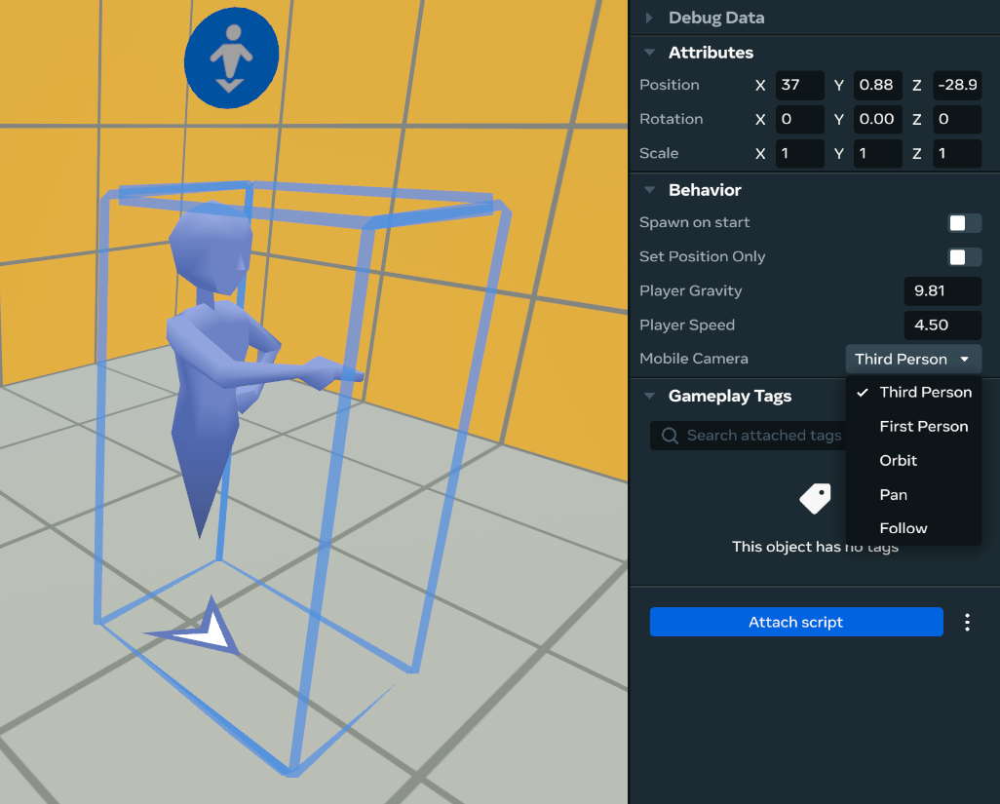
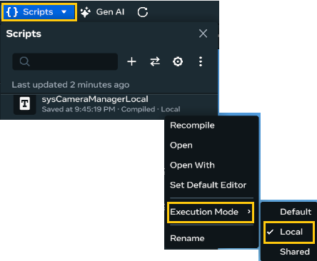
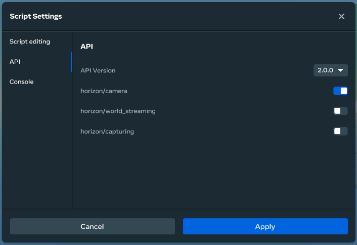
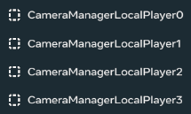

# [Module 4 - Camera Manager](#module-4---camera-manager)

Controlling the camera is useful in a game for focusing the player’s attention on the important areas of the screen. Using our Camera Manager, you can leverage the camera-related features of Meta Horizon Worlds, including:

- Switching between first-person and third-person cameras at any time.
- Setting the camera to a fixed position.
- Changing the camera field of view.
- Enabling and disabling camera collisions.

## [SpawnPoint camera control](#spawnpoint-camera-control)

Here’s a quick and codeless solution to set the camera to first-person or third-person mode by using the Mobile Camera field in the SpawnPoint gizmos.

**Note**: This feature is not used in the tutorial world, but it’s an easy alternative if you don’t need much control over the camera.



Using this property, you can set the camera mode to first-person or third-person for all web or mobile players who enter through this Spawn Point; VR players are unaffected. For example, you might want a default first-person camera for your world, or you can choose to use a third-person camera in a lobby and then teleport players to another Spawn Point in the game area, where a first-person camera is applied.

Now, let’s get started with the Camera Manager.

## [Camera events](#camera-events)

We use events to communicate when we want to enable one of these camera features. Open the sysEvents script, and review the Camera API events that we have defined:

```typescript
  // Camera API events
  OnSetCameraModeThirdPerson: new hz.NetworkEvent("OnSetCameraModeThirdPerson"),
  OnSetCameraModeFirstPerson: new hz.NetworkEvent("OnSetCameraModeFirstPerson"),
  OnSetCameraModeFixed: new hz.NetworkEvent<{position: hz.Vec3, rotation: hz.Quaternion}>("OnSetCameraModeFixed"),
  OnSetCameraModeAttached: new hz.NetworkEvent<{target: hz.Entity | hz.Player, positionOffset: hz.Vec3, translationSpeed: number, rotationSpeed: number}>("OnSetCameraModeAttached"),
  OnSetCameraModeFollow: new hz.NetworkEvent<{target: hz.Entity | hz.Player}>("OnSetCameraModeFollow"),
  OnSetCameraModePan: new hz.NetworkEvent<{panSpeed: number, positionOffset?: hz.Vec3}>("OnSetCameraModePan"),
  OnSetCameraModeOrbit: new hz.NetworkEvent<{target: hz.Entity | hz.Player, distance: number, orbitSpeed: number}>("OnSetCameraModeOrbit"),
  OnSetCameraRoll: new hz.NetworkEvent<{rollAngle: number}>("OnSetCameraRoll"),
  OnSetCameraFOV: new hz.NetworkEvent<{newFOV: number}>("OnSetCameraFOV"),
  OnResetCameraFOV: new hz.NetworkEvent("OnResetCameraFOV"),
  OnSetCameraPerspectiveSwitchingEnabled: new hz.NetworkEvent<{enabled: boolean}>("OnSetCameraPerspectiveSwitching"),
  OnSetCameraCollisionEnabled: new hz.NetworkEvent<{enabled: boolean}>("OnSetCameraCollisionEnabled"),
```

## [Set script to Local mode](#set-script-to-local-mode)

The Camera API must be executed in **Local Execution Mode**, as it functions on the local client only. Let’s double check that our script is configured correctly.

1. Hover over the sysCameraManagerLocal script in the Scripts menu, and select the ellipsis (3 dots).
2. From the context menu, select **Execution Mode > Local**:



## [Transfer ownership to player](#transfer-ownership-to-player)

Ownership of the sysCameraManagerLocal script must be transferred to the player before the Camera APIs can be called.

- Here, we check to see that the script is owned by the player.
- In the next section, we build the Player Manager, which is where ownership is transferred.

Find the next TODO in the script:

```typescript
// TODO: Check if this is owned by the player or the server
```

Replace the above with the following check:

```typescript
this.owningPlayer = this.entity.owner.get();
this.ownedByServer = this.owningPlayer === this.world.getServerPlayer();

if (this.ownedByServer) return;
```

When the above is inserted at the start of the script, we ensure that the Camera APIs calls later in the script are performed only in a local client.

## [Enable Camera API module](#enable-camera-api-module)

The Camera API must be enabled for use in your world.

1. Open the **Scripts panel**.
2. Click the **Gear icon** to open the Script Settings.
3. Click on **API** on the left side of the Settings.
4. Enable **horizon/camera**.
5. Click **Apply** to save the changes:



## [Modify sysCameraManagerLocal](#modify-syscameramanagerlocal)

#### [Imports:](#imports)

Next, let’s import the events and the local camera at the top of the sysCameraManagerLocal file:

```typescript
import { sysEvents } from 'sysEvents';
import LocalCamera, { CameraTransitionOptions, Easing } from 'horizon/camera';
```

**Initialize camera**:

Let’s begin using the Camera API!

We must ensure that the camera is initialized in a consistent manner each time that the local player enters the world. Particularly when you are switching between Preview mode and Edit mode in desktop or VR, the camera may change. So, to ensure that the camera works as expected on entry, you can apply a set of configuration properties to the camera. Locate the following TODO in the script:

```typescript
// TODO: Reset camera to default settings
```

Replace the above with the following code, which sets the following defaults:

- Set the camera to third-person
- Reset the camera roll
- Reset the camera field of view

```typescript
LocalCamera.setCameraModeThirdPerson();
LocalCamera.setCameraRollWithOptions(0);
LocalCamera.resetCameraFOV();
```

**Tip**: You can apply the above code and make modifications as needed in your worlds.

For now, let’s keep these settings as-is during the tutorial, as we still must change the camera in different places of the game later.

#### [Create event listeners:](#create-event-listeners)

To use the camera events we defined, we must listen for them. Each event is associated with a specific Camera API, so you can just call that API after receiving each event.

Find the next TODO in the script:

```typescript
// TODO: Listen for camera events
```

Replace the above with the following code:

```typescript
this.connectNetworkEvent(
  this.owningPlayer,
  sysEvents.OnSetCameraModeThirdPerson,
  () => {
    LocalCamera.setCameraModeThirdPerson(this.transitionOptions);
  },
);

this.connectNetworkEvent(
  this.owningPlayer,
  sysEvents.OnSetCameraModeFirstPerson,
  () => {
    LocalCamera.setCameraModeFirstPerson(this.transitionOptions);
  },
);

this.connectNetworkEvent(
  this.owningPlayer,
  sysEvents.OnSetCameraModeFixed,
  data => {
    LocalCamera.setCameraModeFixed({
      position: data.position,
      rotation: data.rotation,
      ...this.transitionOptions,
    });
  },
);

this.connectNetworkEvent(
  this.owningPlayer,
  sysEvents.OnSetCameraModeAttached,
  data => {
    LocalCamera.setCameraModeAttach(data.target, {
      positionOffset: data.positionOffset,
      translationSpeed: data.translationSpeed,
      rotationSpeed: data.rotationSpeed,
      ...this.transitionOptions,
    });
  },
);

this.connectNetworkEvent(this.owningPlayer, sysEvents.OnSetCameraRoll, data => {
  LocalCamera.setCameraRollWithOptions(data.rollAngle, this.transitionOptions);
});

this.connectNetworkEvent(this.owningPlayer, sysEvents.OnSetCameraFOV, data => {
  LocalCamera.overrideCameraFOV(data.newFOV, this.transitionOptions);
});

this.connectNetworkEvent(this.owningPlayer, sysEvents.OnResetCameraFOV, () => {
  LocalCamera.resetCameraFOV(this.transitionOptions);
});

this.connectNetworkEvent(
  this.owningPlayer,
  sysEvents.OnSetCameraPerspectiveSwitchingEnabled,
  data => {
    LocalCamera.perspectiveSwitchingEnabled.set(data.enabled);
  },
);

this.connectNetworkEvent(
  this.owningPlayer,
  sysEvents.OnSetCameraCollisionEnabled,
  data => {
    LocalCamera.collisionEnabled.set(data.enabled);
  },
);
```

In this local script, we’re listening for all the events related to the camera on the owningPlayer, and calling the associated camera API with the necessary parameters. Each API will have different parameters, so each event will receive different parameters. For example, the API to enable the camera perspective switching has an “enabled” parameter that is forwarded to the LocalCamera to apply this change.

Notice that we’re adding the listeners on the owningPlayer, instead of this entity, which is simpler to use. We don’t have to keep track of a reference to the camera manager entities, and we can just send events to the players to change the camera that they own.

An example on how we can use this system to change the camera for player to first-person:

```typescript
this.sendNetworkEvent(player, sysEvents.OnSetCameraModeFirstPerson, null);
```

#### [transitionOptions:](#transitionoptions)

Notice that these APIs have a transitionOptions parameter, where you can modify the duration and the easing of the camera transition.

We have defined some default options that are used in all the events, but you can experiment with those and check how it affects the camera behavior. These options may also vary between types of games.

## [Checkpoint](#checkpoint)

You’re done making the sysCameraManagerLocal script! It should now look like the following:

```typescript
import * as hz from 'horizon/core';
import { sysEvents } from 'sysEvents';
import LocalCamera, { CameraTransitionOptions, Easing } from 'horizon/camera';


/**
 * Camera Manager Component (Local)
 *
 * Handles camera-related events for the local player in Horizon Worlds.
 * Listens for network events from sysCameraChangeTrigger and applies
 * camera settings to the local player's view.
 */
class sysCameraManagerLocal extends hz.Component<typeof sysCameraManagerLocal> {
  static propsDefinition = {};


  private ownedByServer: boolean = true;
  private owningPlayer!: hz.Player;


  private transitionOptions: CameraTransitionOptions = {
    duration: 0.5,
    easing: Easing.EaseInOut,
  };


  start() {
    this.owningPlayer = this.entity.owner.get();
    this.ownedByServer = this.owningPlayer === this.world.getServerPlayer();


    if (this.ownedByServer) return;


    this.resetCameraToDefaults();
    this.setupStandardCameraModeListeners();
    this.setupSpecialCameraEffectListeners();
  }


  private resetCameraToDefaults(): void {
    LocalCamera.setCameraModeThirdPerson();
    LocalCamera.setCameraRollWithOptions(0);
    LocalCamera.resetCameraFOV();
  }


  /**
   * Set up listeners for standard camera mode changes
   */
  private setupStandardCameraModeListeners(): void {
    this.connectNetworkEvent(this.owningPlayer, sysEvents.OnSetCameraModeThirdPerson, () => {
      LocalCamera.setCameraModeThirdPerson(this.transitionOptions);
    });


    this.connectNetworkEvent(this.owningPlayer, sysEvents.OnSetCameraModeFirstPerson, () => {
      LocalCamera.setCameraModeFirstPerson(this.transitionOptions);
    });


    this.connectNetworkEvent(this.owningPlayer, sysEvents.OnSetCameraModeFixed, (data) => {
      LocalCamera.setCameraModeFixed({
        position: data.position,
        rotation: data.rotation,
        ...this.transitionOptions
      });
    });


    this.connectNetworkEvent(this.owningPlayer, sysEvents.OnSetCameraModeAttached, (data) => {
      LocalCamera.setCameraModeAttach(
        data.target,
        {
          positionOffset: data.positionOffset,
          translationSpeed: data.translationSpeed,
          rotationSpeed: data.rotationSpeed,
          ...this.transitionOptions
        }
      );
    });


    this.connectNetworkEvent(this.owningPlayer, sysEvents.OnSetCameraModeFollow, () => {
      LocalCamera.setCameraModeFollow(this.transitionOptions);
    });


    this.connectNetworkEvent(this.owningPlayer, sysEvents.OnSetCameraModePan, (data) => {
      const panCameraOptions = {
        positionOffset: data.positionOffset,
        ...this.transitionOptions,
      };


      LocalCamera.setCameraModePan(panCameraOptions);
    });


    this.connectNetworkEvent(this.owningPlayer, sysEvents.OnSetCameraModeOrbit, () => {
      LocalCamera.setCameraModeOrbit(this.transitionOptions);
    });
  }


  /**
   * Set up listeners for special camera effects
   */
  private setupSpecialCameraEffectListeners(): void {
    this.connectNetworkEvent(this.owningPlayer, sysEvents.OnSetCameraRoll, (data) => {
      LocalCamera.setCameraRollWithOptions(data.rollAngle, this.transitionOptions);
    });


    this.connectNetworkEvent(this.owningPlayer, sysEvents.OnSetCameraFOV, (data) => {
      LocalCamera.overrideCameraFOV(data.newFOV, this.transitionOptions);
    });


    this.connectNetworkEvent(this.owningPlayer, sysEvents.OnResetCameraFOV, () => {
      LocalCamera.resetCameraFOV(this.transitionOptions);
    });


    this.connectNetworkEvent(this.owningPlayer, sysEvents.OnSetCameraPerspectiveSwitchingEnabled, (data) => {
      LocalCamera.perspectiveSwitchingEnabled.set(data.enabled);
    });


    this.connectNetworkEvent(this.owningPlayer, sysEvents.OnSetCameraCollisionEnabled, (data) => {
      LocalCamera.collisionEnabled.set(data.enabled);
    });
  }
}


hz.Component.register(sysCameraManagerLocal);
```

The Camera Managers are ready to be used by the Player Manager, which transfers the ownership of each manager to a player when it enters the world.

Since we need one Camera Manager per player, you should verify that you have the same number of Camera Managers as the maximum number of players permitted in your world (one Camera per one Player):



#### [Test:](#test)

We can’t test this system yet, as we need to assign a camera manager to each player to use it. We will test the Camera Manager as part of the Player Manager in the next module.

## [Additional Documentation and APIs](#additional-documentation-and-apis)

#### [Docs:](#docs)

- [Using the Camera API for Web and Mobile](../../../Mobile%20and%20web/TypeScript%20APIs%20for%20mobile/Camera.md)
- [How to set the player’s camera](../../../Mobile%20and%20web/TypeScript%20APIs%20for%20mobile/Camera.md)
- [Local Script for Mobile and Web](../../../Scripting/Local%20scripting/Getting%20Started%20with%20Local%20Scripting.md)

#### [API references:](#api-references)

- [Camera](https://horizon.meta.com/resources/scripting-api/camera.md/?api_version=2.0.0)
- [Camera class](https://horizon.meta.com/resources/scripting-api/camera.camera.md/?api_version=2.0.0)

