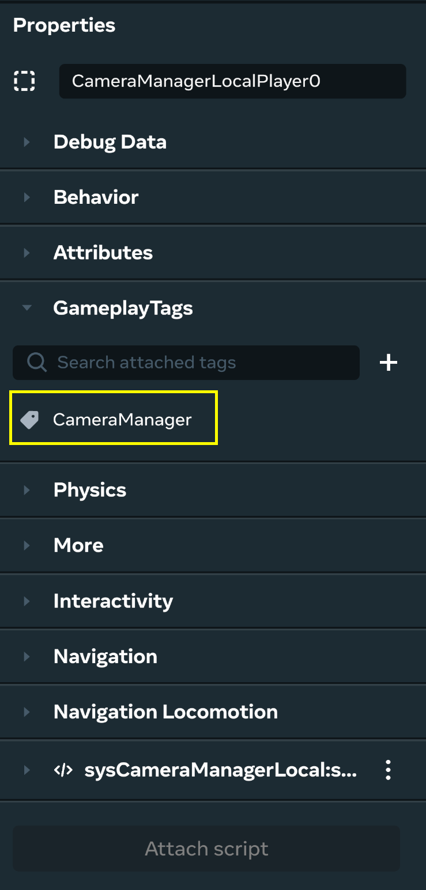

# [Module 5 - Player Manager](#module-5---player-manager)

Now, to put the Camera Manager to use. Open the sysPlayerManager script.

## [Acquire list of Camera Managers](#acquire-list-of-camera-managers)

To acquire a list of the camera managers in the world, we can use tags. You can use GameplayTags as a simple way of searching for entities.

#### [Assign tags:](#assign-tags)

For each of your Camera Manager entities in the world, please verify that you have added the CameraManager gameplay tag on its Properties panel:



Find the following TODO in the sysPlayerManager script:

```typescript
// TODO: Get all camera managers
```

Replace the above with the following line:

```typescript
this.cameraManagers = this.world.getEntitiesWithTags(["CameraManager"]);
```

this.cameraManagers now contains the list of all entities that have the CameraManager tag.

After we have this list, we must transfer the ownership of one of them to a player when the player enters the world, since the Camera API runs in the local client only.

Locate the next TODO in the script:

```typescript
// TODO: Assign a Camera Manager to the player
```

Replace the above with this code:

```typescript
if (playerIndex < this.cameraManagers.length) {
  this.cameraManagers[playerIndex].owner.set(player);
} else {
  console.error("Not enough Camera Managers in the world");
}
```

This code checks if there are available Camera Managers in the world and assigns one of them to the player, based on its player index. If there are no available Camera Managers, an error is written to the console.

When the player leaves the world, we must transfer the Camera Manager for the player back to the server. Find this TODO:

```typescript
// TODO: Release the Camera Manager from the player
```

Replace the above with the following:

```typescript
if (playerIndex < this.cameraManagers.length) {
  this.cameraManagers[playerIndex].owner.set(this.world.getServerPlayer());
}
```

Your sysPlayerManager script should look like the following now (in a later module, we complete the remaining TODO items):

```typescript
import * as hz from 'horizon/core';

class sysPlayerManager extends hz.Component<typeof sysPlayerManager> {
  static propsDefinition = {};

  private cameraManagers: hz.Entity[] = [];
  private focusedInteractionManagers: hz.Entity[] = [];

  preStart() {
    // Get all camera managers
    this.cameraManagers = this.world.getEntitiesWithTags(["CameraManager"]);
    // TODO: Get all Focused Interaction Managers
  }

  start() {
    // When a player enters the world assign them a Camera Manager and a Focused Interaction Manager
    this.connectCodeBlockEvent(
      this.entity,
      hz.CodeBlockEvents.OnPlayerEnterWorld,
      (player: hz.Player) => {
        this.RegisterPlayer(player);
      },
    );

    // When a player exits the world release their Camera Manager and Focused Interaction Manager
    this.connectCodeBlockEvent(
      this.entity,
      hz.CodeBlockEvents.OnPlayerExitWorld,
      (player: hz.Player) => {
        this.DeregisterPlayer(player);
      },
    );
  }

  private RegisterPlayer(player: hz.Player) {
    let playerIndex = player.index.get();

    // Assign a Camera Manager to the player
    if (playerIndex < this.cameraManagers.length) {
      this.cameraManagers[playerIndex].owner.set(player);
    } else {
      console.error("Not enough Camera Managers in the world");
    }

    // TODO: Assign a Focused Interaction Manager to the player
  }

  private DeregisterPlayer(player: hz.Player) {
    let playerIndex = player.index.get();

    // Release the Camera Manager from the player
    if (playerIndex < this.cameraManagers.length) {
      this.cameraManagers[playerIndex].owner.set(this.world.getServerPlayer());
    }

    // TODO: Release the Focused Interaction Manager from the player
  }
}
hz.Component.register(sysPlayerManager);
```

## [Checkpoint](#checkpoint)

Each player that joins the world is assigned its own Camera Manager, which we can use to control its camera.

#### [Test:](#test)

To check if you’ve done everything correctly, jump into Preview Mode, teleport to the Features Lab, and try out the camera related features there, which exercise these systems:

- First Person Camera
- Third Person Camera
- Fixed Camera
- Attached Camera
- Camera POV
- Camera Roll
- Camera Collision
- Camera Perspective Switching

#### [Systems complete:](#systems-complete)

That completes building out our game systems! In the past few modules, you did the following:

- Created a HUD system
- Created a Puzzle Manager
- Created a Camera Manager
- Updated the Player Manager

These components lay the foundation for the next modules, where we start building out the puzzle rooms and create a good experience for web and mobile players.

## [Additional Documentation and APIs](#additional-documentation-and-apis)

#### [Docs:](#docs)

- [Using the Camera API for Web and Mobile](../../../Mobile%20and%20web/TypeScript%20APIs%20for%20mobile/Camera.md)
- [How to set the player’s camera](../../../Mobile%20and%20web/TypeScript%20APIs%20for%20mobile/Camera.md)
- [Local Script for Mobile and Web](../../../Scripting/Local%20scripting/Getting%20Started%20with%20Local%20Scripting.md)

#### [API references:](#api-references)

- [Camera](https://horizon.meta.com/resources/scripting-api/camera.md/?api_version=2.0.0)
- [Camera class](https://horizon.meta.com/resources/scripting-api/camera.camera.md/?api_version=2.0.0)

