# [Module 6 - Room A: The Magic Wand](#module-6---room-a-the-magic-wand)

Now, we begin building out the puzzle rooms of our game. In this first room, the puzzle is simple: navigate a maze to find and collect a magic wand, find the exit door, and zap it with the wand to open the door to the next room.

The above pathway requires use of all of the systems that we have built, as well as some new coding to manage game activities. In this module, you learn:

- Camera API: Changing camera modes such as First-Person Camera, Third-Person Camera, or Camera Collisons settings.
- Specify Grabbable Objects that are interactive in web and mobile devices.
- Shooting: Projectile Launchers and making them interactive with other objects.

## [Camera API](#camera-api)

The Camera API supports several camera modes that you can switch between at runtime to enhance your players’ experience. In this room, we utilize two modes:

- First Person Camera
- Disabling Camera Collisions

### [Switch to First Person Camera](#switch-to-first-person-camera)

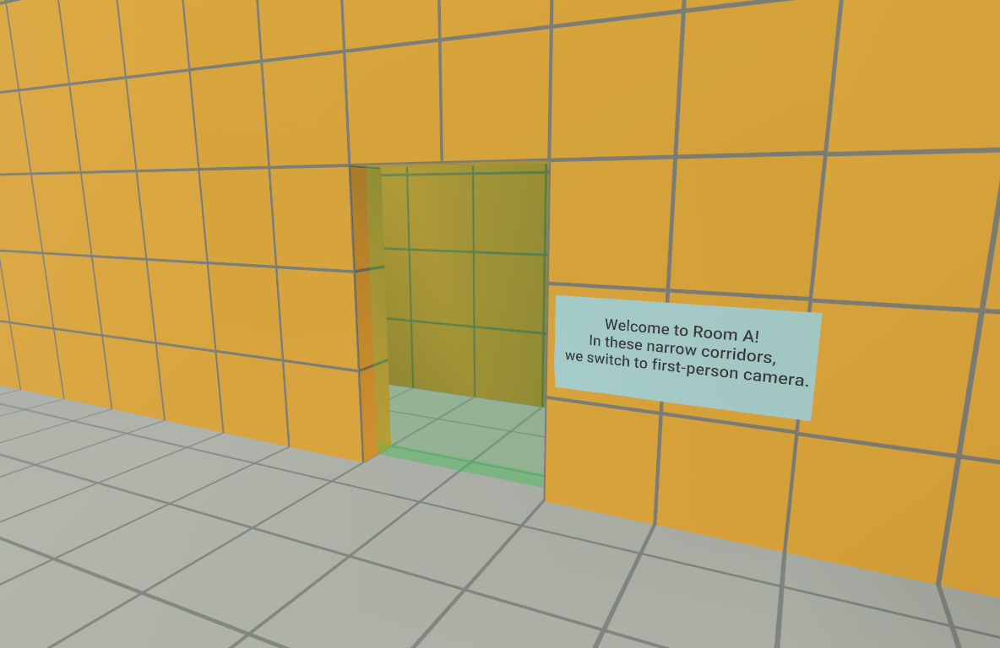

This room features a number of tight corridor spaces, where third-person camera perspective (as shown above) won’t work. In tighter spaces, the camera should be first-person, so that the player can follow the direction of movement and avoid occlusions caused by sharp corners.

#### [Trigger Object](#trigger-object)

In this room, there’s a Trigger Zone entity, RoomA\_TriggerCameraFirstPerson, which covers the volume where we want the camera to be set to First Person. This volume covers the narrow corridors of the room. Whenever the player is inside the trigger volume, the camera should be set to First Person mode. When the player exits the trigger, the Camera mode is changed back to Third Person mode.

#### [sysCameraChangeTrigger Script](#syscamerachangetrigger-script)

Let’s open the sysCameraChangeTrigger script. This script has two portions, actions to be taken when the player enters the trigger (OnPlayerEnterTrigger) and when the player exits the trigger (onPlayerExitTrigger).

1. Search for the section of code where we are to input the sendNetworkEvent for First Person Camera Mode when Player Enters Trigger, and find the following TODO:

```typescript
// TODO: Add in sendNetworkEvent for First Person Camera Mode when Player Enters Trigger
```

1. Add in the following code:

```typescript
this.sendNetworkEvent(player, sysEvents.OnSetCameraModeFirstPerson, null);
```

This above sends a network event with the event: onSetCameraModeFirstPerson. If you recall, the listener is defined in sysCameraManagerLocal. When this event is fired, sysCameraManagerLocal receives the event and sets Local Camera mode to First Person.

1. In the section of code where Player Exits Trigger, we want to set the camera to Third Person mode when the player exits the trigger. Find the following TODO:

```typescript
// TODO: Add in sendNetworkEvent for Third Person Camera Mode when Player Exits Trigger
```

1. Replace the above with the following code:

```typescript
this.sendNetworkEvent(player, sysEvents.OnSetCameraModeThirdPerson, null);
```

Now we must attach this script to the trigger object.

1. Select the RoomA\_TriggerCameraFirstPerson Trigger Zone.
2. In its Properties, locate the Script section. From the Attached Script drop-down, select sysCameraChangeTrigger.
3. The parameter appears in the panel. For the cameraMode value, enter: FirstPerson.
   1. cameraModeText can be left blank for now.

The panel should look like the following:

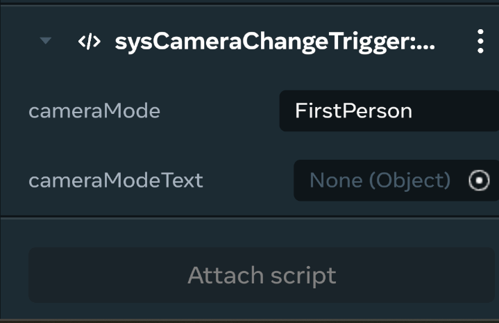

### [Disable camera collisions](#disable-camera-collisions)

In the next area of the room, we must disable camera collision where you find multiple columns that can interfere.

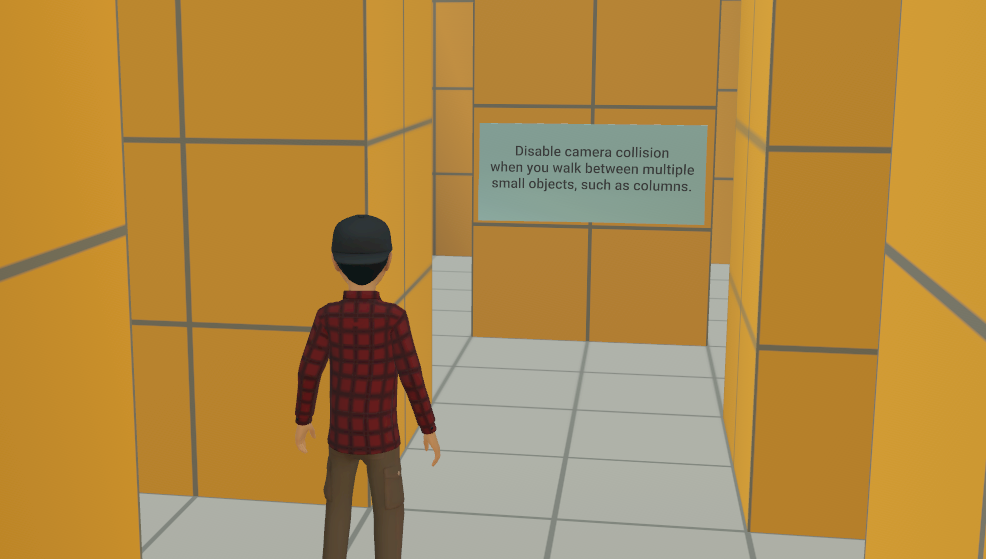

##### [Trigger Object](#trigger-object-1)

In the room, locate the Trigger Zone entity TriggerCameraCollision. This entity covers the area where we want camera collision to be disabled: (the entire area with the columns). Below, the Trigger Zone has been selected in the Hierarchy panel of the desktop editor:

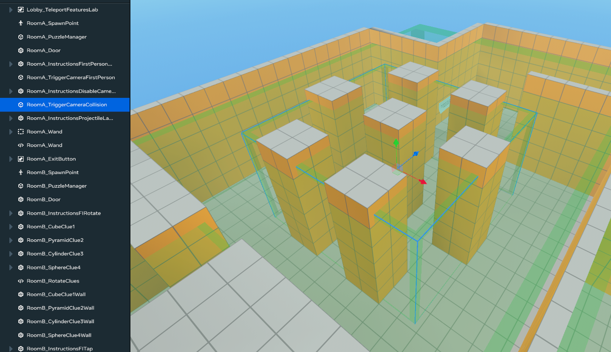

##### [sysCameraChangeTrigger Script](#syscamerachangetrigger-script-1)

Now, we edit the sysCameraChangeTrigger script when the input is Collision:

1. Search for the section of code where we are to input the sendNetworkEvent for Collision Mode when Player Enters Trigger. Find the following TODO:

```typescript
// TODO: Add in sendNetworkEvent to disable collision mode when Player Enters Trigger
```

1. Replace the above with the following code:

```typescript
this.sendNetworkEvent(player, sysEvents.OnSetCameraCollisionEnabled, {
  enabled: false,
});
```

The above sends a network event with the event: onSetCameraCollision. Keep in mind that the listener is defined in sysCameraManagerLocal. When this event is fired, sysCameraManagerLocal performs the update to disable camera collision.

1. When the player exits the trigger, we want to re-enable camera collision. Find the following TODO:

```typescript
// TODO: Add in sendNetworkEvent to enable collision mode when Player Exits Trigger
```

1. Replace the above with the following code:

```typescript
this.sendNetworkEvent(player, sysEvents.OnSetCameraCollisionEnabled, {
  enabled: true,
});
```

1. Now we must attach this script to the Trigger Zone entity. Select the TriggerCameraCollision trigger zone.
2. In its Properties, locate the Script section. From the Attached Script drop-down, select sysCameraChangeTrigger.
3. For the CameraMode property, enter: Collision.
   1. cameraModeText can be left blank for now.

The panel should look like the following now:

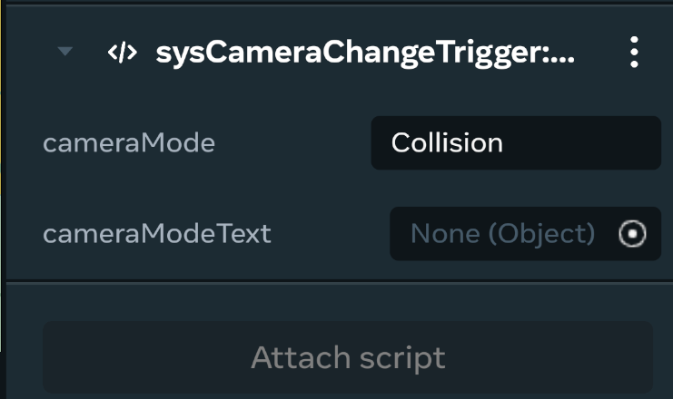

## [Set up a grabbable object that shoots projectiles](#set-up-a-grabbable-object-that-shoots-projectiles)

In the area shown below, we have group of entities:

- A magic wand entity
- A projectile launcher

We want to make this grouped entity grabbable, as well as able to shoot and interact with other objects. To complete the puzzle, the player must grab the wand, fire projectiles and hit the exit door to open it.

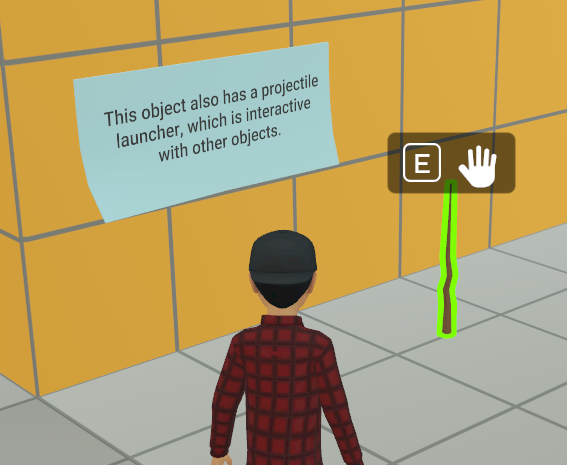

#### [The Magic Wand projectile entity](#the-magic-wand-projectile-entity)

The wand projectile object (RoomA\_Wand) is a parent group of 2 items.

1. The wand object that constitutes the shape
2. A projectile launcher (RoomA\_ProjectileLauncher) that actually does the projectile animation and interaction

The wand and the projectile launcher must be grouped together so that they interact with the world as a set.

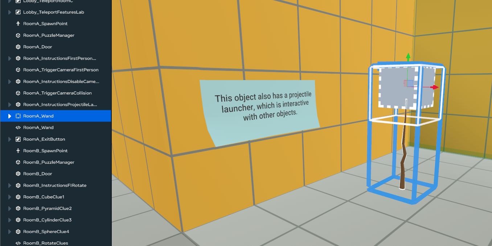

#### [Set object as grabbable:](#set-object-as-grabbable)

1. Select the RoomA\_Wand entity.
2. In the Properties tab, locate the Behavior section.
3. Properties:
4. Set Motion property: Interactive.
5. Set Interaction property: Grabbable.

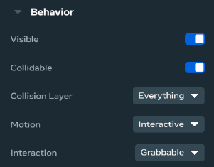

**Checkpoint**: After the above is completed, preview the scene. You should see that the wand now has an E and a hand symbol over it, indicating that you can press E to grab the entity on mobile or desktop.

#### [Customize avatar interactions:](#customize-avatar-interactions)

We can also customize the Avatar’s interaction with this entity. For example:

1. Set Avatar Pose: Torch. This sets the grab animation to be similar to a person holding a torch.
2. Set Who Can Grab?: Anyone. This allows anybody to grab this entity.
3. Set Who Can Take From Holder?: Only You. This disables the ability to grab the entity out of somebody else’s hand.
4. Set Primary Action Icon: Fire. This creates the action button on mobile where players can select to trigger a fire action.
5. Set Secondary Action Icon: Aim. This creates the action button on mobile where players can select to trigger the aim action.

The Properties panel should look something like the following:

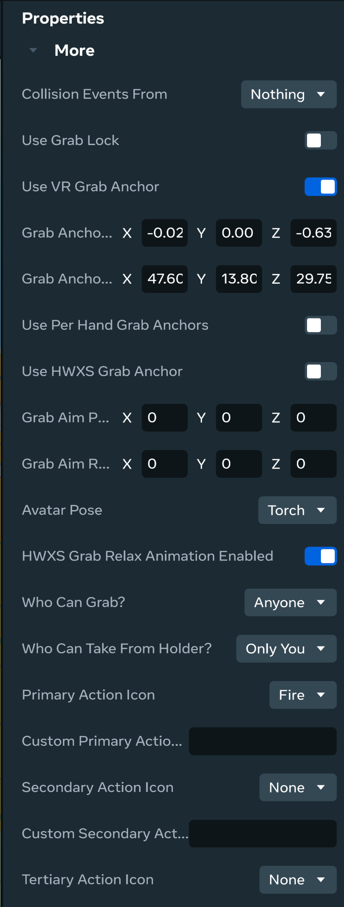

**Tip**: If you wish to customize the way the Avatar holds the wand, you can switch to the VR headset to set the Grab Anchors on the entity. This defines the locations on the entity where it can be grabbed.

## [Customize Projectile Launcher](#customize-projectile-launcher)

You may wish to customize the properties of the projectile launcher, such as the speed of the projectile, the gravity acting on the projectile motion, the scale (size) of the projectile objects, the trail length and the color.

You can modify these properties by selecting the projectile entity (RoomA\_ProjectileLauncher) and modify the appropriate values in the Properties panel:

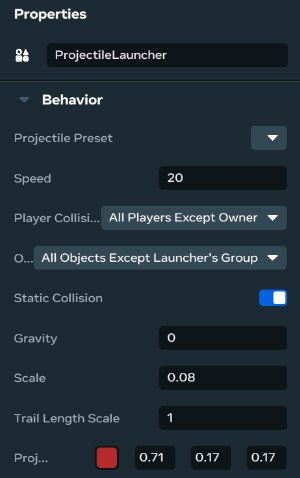

#### [Projectile Launcher Scripting](#projectile-launcher-scripting)

Now, we must script the ability for the wand to shoot projectiles and open the exit door.

First, we configure the following props definitions in the propsDefinition section of the RoomA\_Wand script as shown below.

1. Open the RoomA\_Wand script.
2. Search for the propsDefinition code section:

```typescript
static propsDefinition = {
  // TODO: Add in props definitions
};
```

1. Add in the following props:

```typescript
// This points to the projectile launcher entity
projectileLauncher: {type: hz.PropTypes.Entity},


// This holds the hint text that we want to display when player grabs wand
hintText: {type: hz.PropTypes.String},

// Number of seconds to display hint
hintDuration: {type: hz.PropTypes.Number, default: 2},

// The exit door object that we want to move when hit with projectile
objectToMove: {type: hz.PropTypes.Entity},

// Puzzle Manager object holding the Puzzle Manager script to solve puzzle
puzzleManager: {type: hz.PropTypes.Entity},
```

The propsDefinition should look like the following (comments have been removed):

```typescript
static propsDefinition = {

    projectileLauncher: {type: hz.PropTypes.Entity},
    hintText: {type: hz.PropTypes.String},
    hintDuration: {type: hz.PropTypes.Number, default: 2},
    objectToMove: {type: hz.PropTypes.Entity},
    puzzleManager: {type: hz.PropTypes.Entity},
};
```

1. Next, we want to check if the props have been defined, as we need them for the wand to work as intended. To do so, add the following code under this TODO comment:

```typescript
// TODO: Check if the props have been defined
const launcher = this.props.projectileLauncher?.as(hz.ProjectileLauncherGizmo);
const door = this.props.objectToMove;
if(launcher === undefined \|\| launcher === null) return;
```

1. Next, we set the owner of the projectile launcher to be the player, which enables us to set the aim direction on web and mobile and to shoot projectiles in the same direction that the camera (also owned by the player) is facing. To do so, add the following code under this TODO comment:

```typescript
// TODO: Set ownership of the launcher to the player. This will also allow us to set the aim direction on web and mobile,
// shooting projectile in the direction the camera is facing
launcher.owner.set(player);
```

1. Next, we want to display a hint through the player’s HUD when the player grabs the wand. The code below sends the event to sysHintHUDManager to display the hint:

```typescript
// TODO: Send event to HintHUDManager to display wand hint
this.sendNetworkBroadcastEvent(sysEvents.OnDisplayHintHUD, {
  players: [player],
  text: this.props.hintText,
  duration: this.props.hintDuration,
});
```

1. Now, we add animation and a small delay before launching the projectile. Insert the following code within the connectCodeBlockEvent section:

```typescript
// TODO: Play animation and launch projectile on index trigger down
this.connectCodeBlockEvent(
  this.entity,
  hz.CodeBlockEvents.OnIndexTriggerDown,
  (player: hz.Player) => {
    player.playAvatarGripPoseAnimationByName(
      hz.AvatarGripPoseAnimationNames.Fire,
    );
    // Small delay to allow the animation to play before launching the projectile
    this.async.setTimeout(() => launcher.launchProjectile(), 30);
  },
);
```

1. We want to resolve the puzzle by sending a network event (OnFinishPuzzle) to the Puzzle Manager:

```typescript
// TODO: Solve puzzle when door is hit
this.connectCodeBlockEvent(
  launcher,
  hz.CodeBlockEvents.OnProjectileHitEntity,
  (obj, position, normal, isStaticHit) => {
    if (obj === door && this.props.puzzleManager) {
      this.sendNetworkEvent(
        this.props.puzzleManager,
        sysEvents.OnFinishPuzzle,
        {},
      );
    }
  },
);
```

After all the code changes, the RoomA\_Wand script should look like the following:

```typescript
import * as hz from 'horizon/core';
import { sysEvents } from 'sysEvents';


class RoomA_Wand extends hz.Component<typeof RoomA_Wand> {
  static propsDefinition = {
    projectileLauncher: {type: hz.PropTypes.Entity},
    hintText: {type: hz.PropTypes.String},
    hintDuration: {type: hz.PropTypes.Number, default: 2},
    puzzleManager: {type: hz.PropTypes.Entity},
    objectToMove: {type: hz.PropTypes.Entity},
  };


  start() {
    const launcher = this.props.projectileLauncher?.as(hz.ProjectileLauncherGizmo);
    const door = this.props.objectToMove;
    if(launcher === undefined \|\| launcher === null) return;


    this.connectCodeBlockEvent(this.entity, hz.CodeBlockEvents.OnGrabStart, (isRightHand: true, player: hz.Player) => {
      // Set ownership of the launcher to the player. This will also allow us to set the aim direction on web and mobile,
      // shooting projectile in the direction the camera is facing
      launcher.owner.set(player);


      // Sends event to HintHUDManager to display wand hint
      this.sendNetworkBroadcastEvent(sysEvents.OnDisplayHintHUD, {players: [player], text: this.props.hintText, duration: this.props.hintDuration});


      // Play animation and launch projectile on index trigger down
      this.connectCodeBlockEvent(this.entity, hz.CodeBlockEvents.OnIndexTriggerDown, (player: hz.Player) => {
        player.playAvatarGripPoseAnimationByName(hz.AvatarGripPoseAnimationNames.Fire);
        // Small delay to allow the animation to play before launching the projectile
        this.async.setTimeout(() => launcher.launchProjectile(), 30);
      });


      //Solve puzzle when door is hit
      this.connectCodeBlockEvent(launcher, hz.CodeBlockEvents.OnProjectileHitEntity, (obj, position, normal, isStaticHit) => {
        console.log(obj.name.get())
        if(obj === door && this.props.puzzleManager) {
          this.sendNetworkEvent(this.props.puzzleManager, sysEvents.OnFinishPuzzle, {});
        }
      });
    });
  }
}
hz.Component.register(RoomA_Wand);
```

The code is complete! Now, we attach this script to the wand.

1. Select the RoomA\_Wand entity.
2. In its Properties, locate the Script section.
3. From the Attached Script drop-down, select RoomA\_Wand.
4. New properties appear in the panel, as taken from the propsDefinition in the script. Specify the following values:
   1. projectileLauncher: RoomA\_ProjectileLauncher
   2. hintText: Fire and use magic to exit this room! (or any other hint text you want)
   3. hintDuration: 5 (or any other duration in seconds you want the hint to show)
   4. objectToMove: RoomA\_Door
   5. puzzleManager: RoomA\_PuzzleManager

The properties should look like the following:

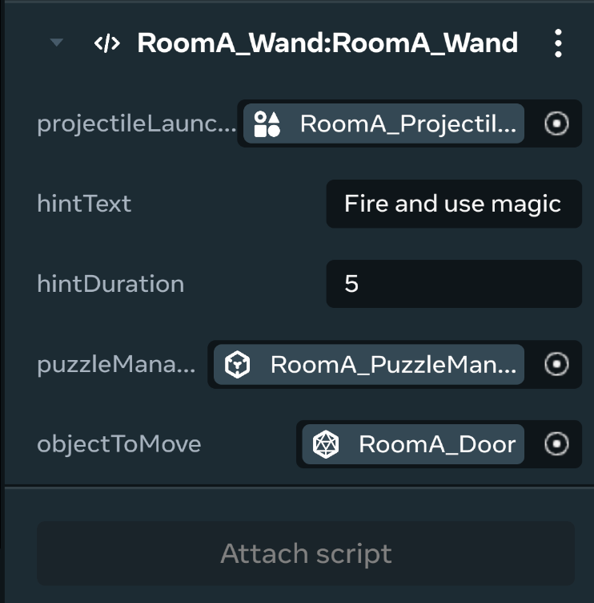

## [Checkpoint](#checkpoint)

Room A module completed! In this module, you:

- Learned how to use the Camera API.
- Learned how to make an object grabbable.
- Learned how to use projectile launchers and make it interactive with the world.

#### [Test:](#test)

To test, you can try the puzzle in Room A to see if you can collect the wand and use it to open the exit door!

**Tip**: Pay attention to the changes in the camera as you move through the puzzle room.

- Camera should be in Third Person mode in the wider areas.
- In the column area, the camera should switch to First Person mode.

## [Additional Documentation and APIs](#additional-documentation-and-apis)

#### [Additional documentation:](#additional-documentation)

- [How to set the player’s camera](../../../Mobile%20and%20web/TypeScript%20APIs%20for%20mobile/Camera.md)
- [Intro to Grabbable Entities](../../../Mobile%20and%20web/Grabbable%20entities/Introduction%20To%20Grabbable%20Entities%20On%20Mobile%20And%20Web.md)

#### [API docs:](#api-docs)

- [Camera](https://horizon.meta.com/resources/scripting-api/camera.md/?api_version=2.0.0)
- [ProjectileLauncherGizmo](https://horizon.meta.com/resources/scripting-api/core.projectilelaunchergizmo.md/?api_version=2.0.0)

