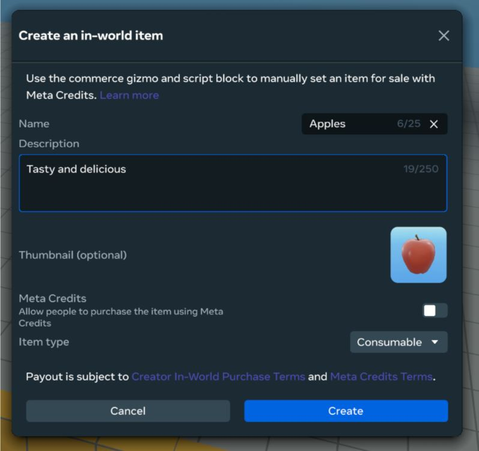
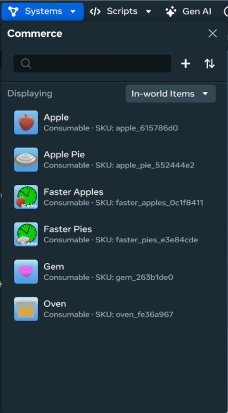
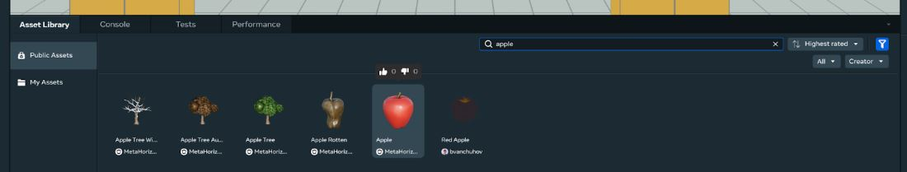
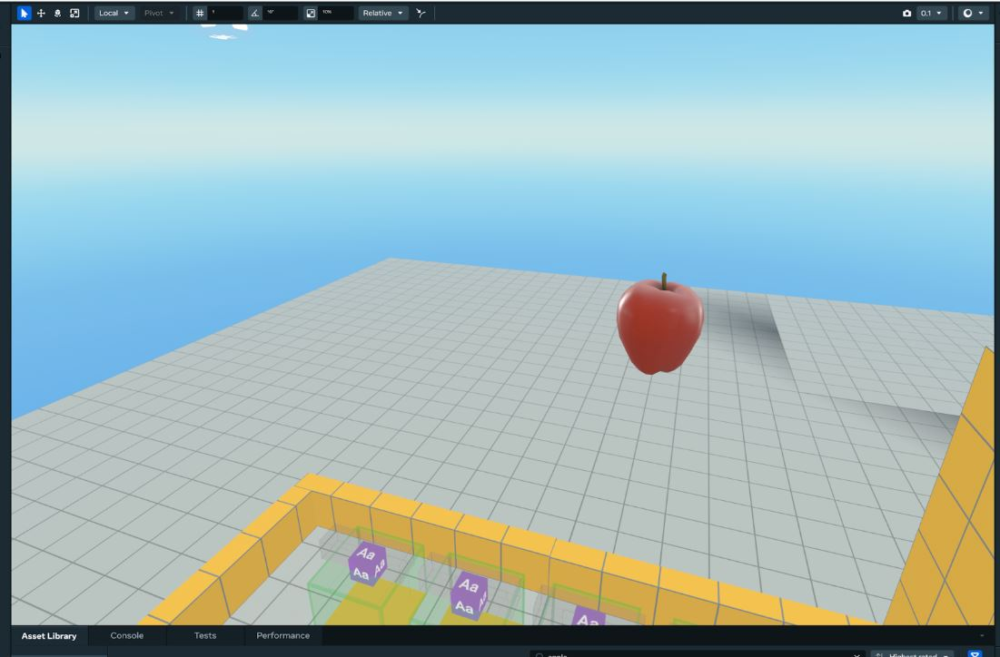
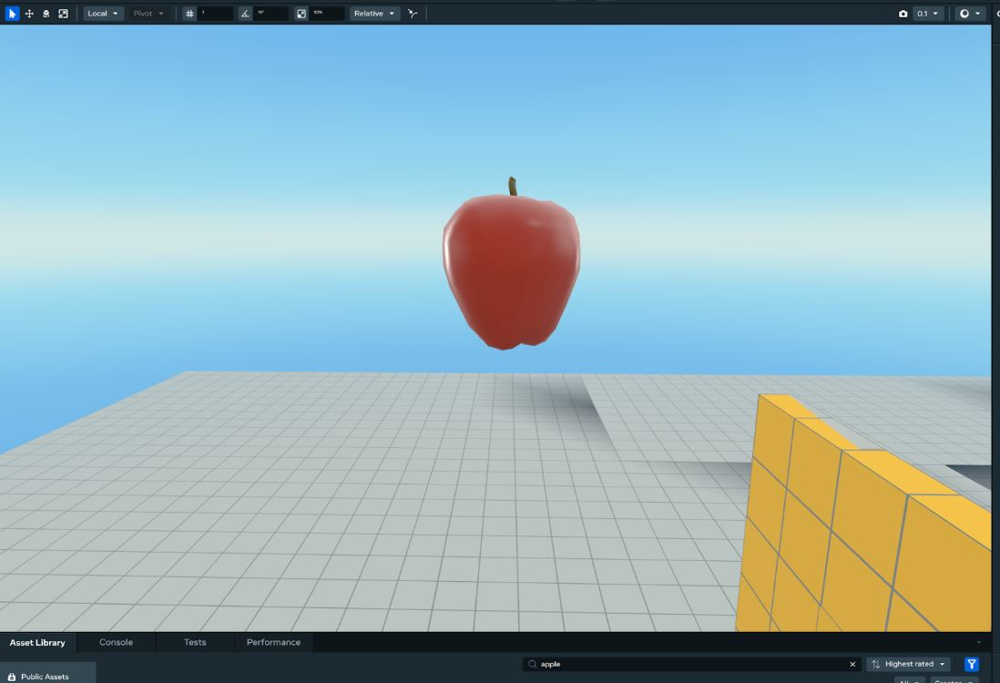

# Module 2 - Setup

Requirements

 You will need to be a member of MHCP and have accepted the monetization Terms Of Service in the Developer Dashboard in order to create in-world items and currency. Find out more about monetization [here](../../../MHCP%20program/Monetization/Monetization%20opportunities.md).

## Creating in-world items

In-world items are tied to the world in which they are created, and can only be created by owners and editors of the world. This means that in order for the shop to work as expected the in-world items for this tutorial will need to be created by you.

Follow the [In-World Purchase Guide: Creating An Item](../../../MHCP%20program/Monetization/In-world%20purchase%20guide.md#creating-an-item) to create the following in-world items:

* Apple
* Apple Pie
* Faster Apples
* Faster Pies
* Gem
* Oven

## Consumable vs. durable: What’s the difference?

A consumable in-world item is something that can be granted to a player, and is able to be spent or removed from their world inventory. It is also possible to grant players more than one of the consumable items, making them perfect for soft currencies, and reflective of the way that in-world items are typically used in an economy.

Conversely, a durable item is granted to a player once and is not able to be removed from their inventory. This is obviously a little less appropriate for our situation.

When creating your items, make sure to set each item type to “consumable”, and set Meta credits to “off”.

Once you have created the items, the **Commerce** panel should list them as follows (though your items will have different SKUs).

## Creating item thumbnails

To make a thumbnail of an item:

- Search for the item in the Asset Library

- Drag the item into the world

- Use the viewport camera to position the item in the center of the frame. You can change the camera speed to make positioning the camera easier.

- Take a screenshot of the item and save this image locally.
- Upload the image when creating your in-world items.