# [Module 4 - Adding The Shop](#module-4---adding-the-shop)

> [!Note]
>
> You will need to be a member of MHCP and have accepted the terms in the Developer Dashboard in order to create in-world items and currency. Find out more about monetization [here](../../../MHCP%20program/Monetization/Monetization%20opportunities.md).

## [Adding the shop to the world](#adding-the-shop-to-the-world)

Let’s add a shop to the world using the world shop gizmo.

1. From the desktop editor, open the **Build Menu** and select **Gizmos**

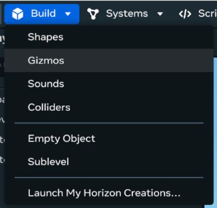

1. Search or scroll to find the world shop gizmo

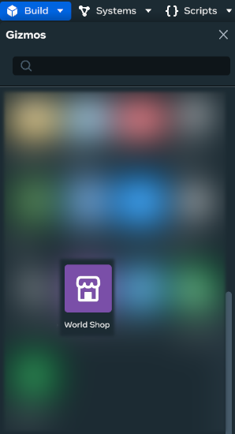

1. Drag the world shop gizmo into the world, and place it under the “Cook Shop” heading.

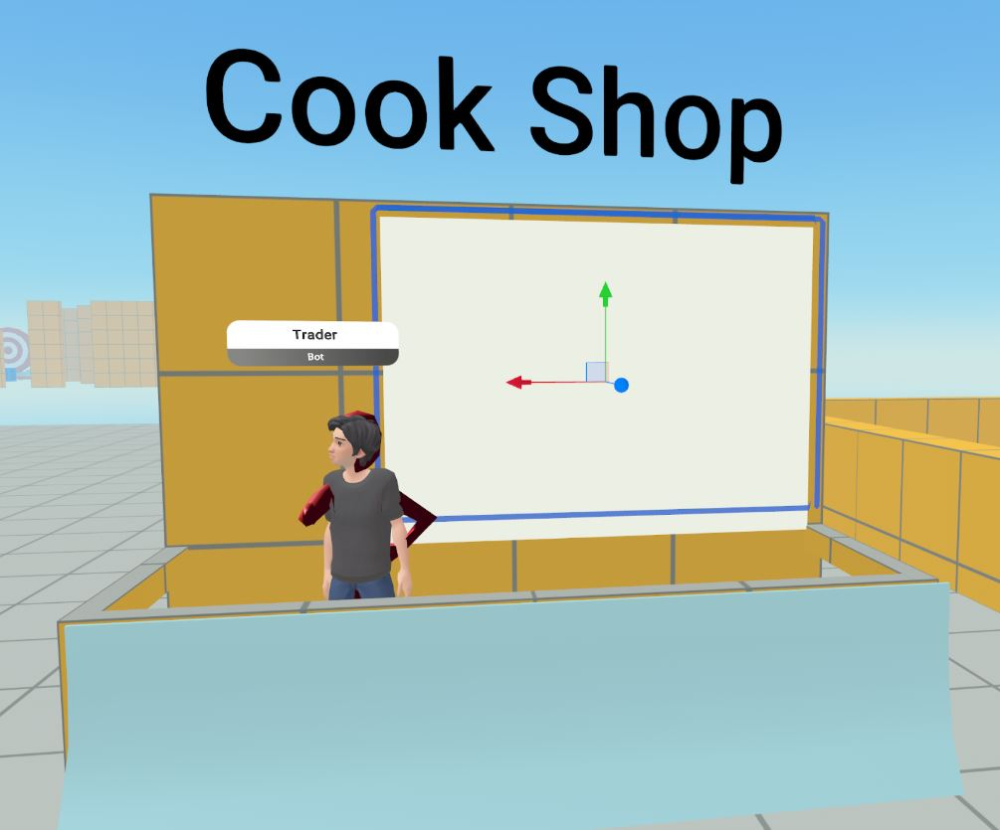

1. You may find that the gizmo arrives in the world facing the wrong way. Switch to the rotate tool (“E” on the keyboard) and rotate it 180° on the Y-axis (the green arc).

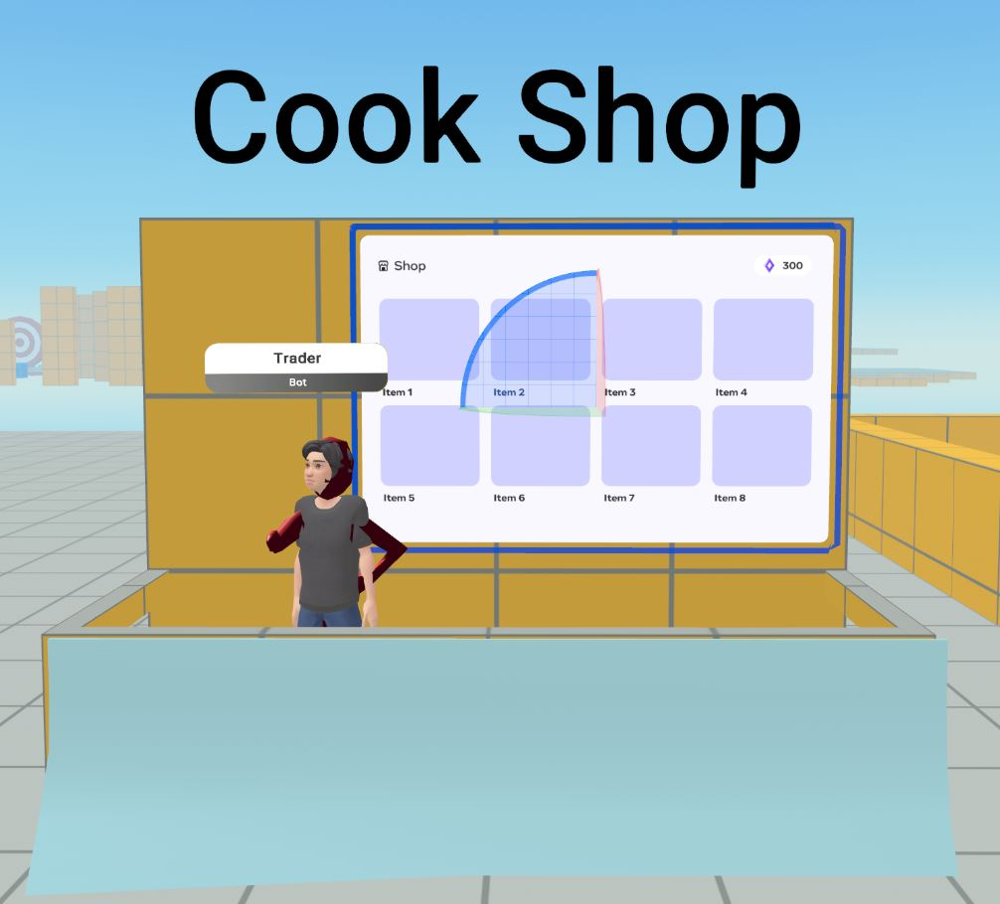

## [Selling pies for gems](#selling-pies-for-gems)

Configure the world shop Gizmo to allow the player to swap 1x pie for 10x gems:

1. Select the world shop gizmo you added to the world

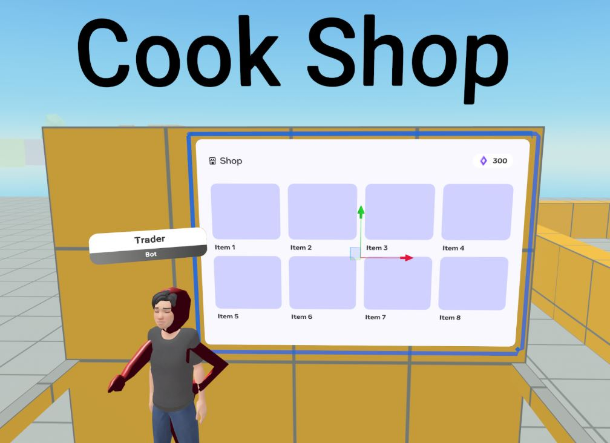

1. In the **Properties** panel, click the**Select item** drop-down menu

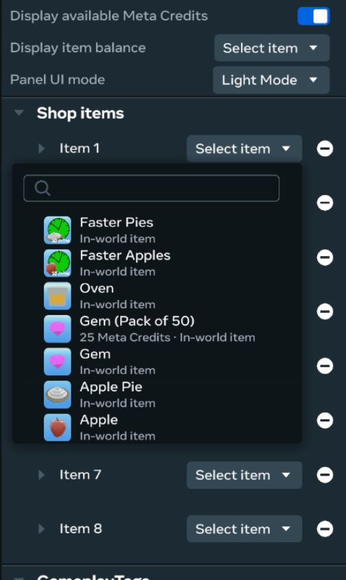

1. Select **Gem**, and ensure the first **Quantity** text entry is set to “1”

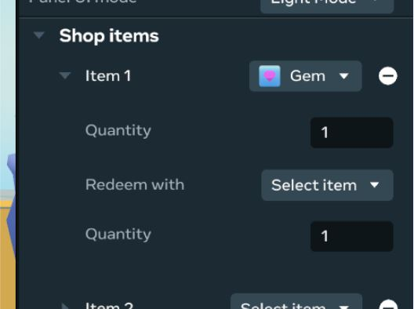

1. Click the **Select item** drop-down and choose **Apple Pie**

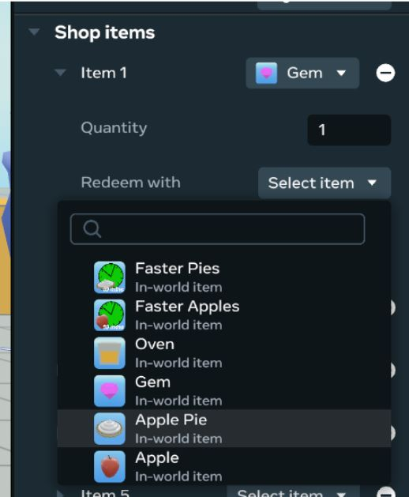

1. Change the second **Quantity** text entry to “10” (10x Apple Pies = 1x Gem)

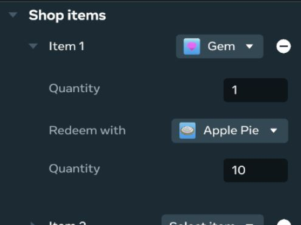

The gem should now be visible in the shop UI, which also lists the purchase price and currency of the item.

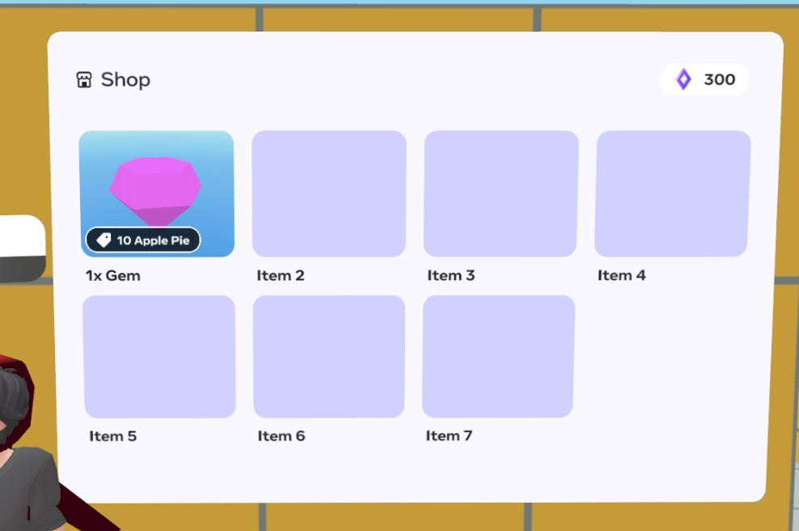

## [Adding utility power-ups: Faster pies and faster apples](#adding-utility-power-ups-faster-pies-and-faster-apples)

Purchaseable utility items are great options to sell in the shop. They increase the player’s earning potential, but still require them to perform the core game loop of collecting apples and baking pies in order to maximize their benefit.

The benefit of utility items like faster pies is that it keeps the perceived value of pies high (as it still requires time investment from the player to bake the pie) while ensuring the player feels rewarded for purchasing the power-up (because they can increase their pie output).

Conversely, if we made pies purchaseable they would become devalued, as players with enough money could just pay to get them, rather than dedicating time in-game.

Let’s add “Faster Pies” and “Faster Apples” to the game. Repeat the steps for adding Gems to the shop, but now add the following items:

1. Item 2: 1x Faster Pies should be redeemed with 20x Gems
2. Item 3: 1x Faster Apples should be redeemed with 30x Gems

Your world shop properties should now be as follows:

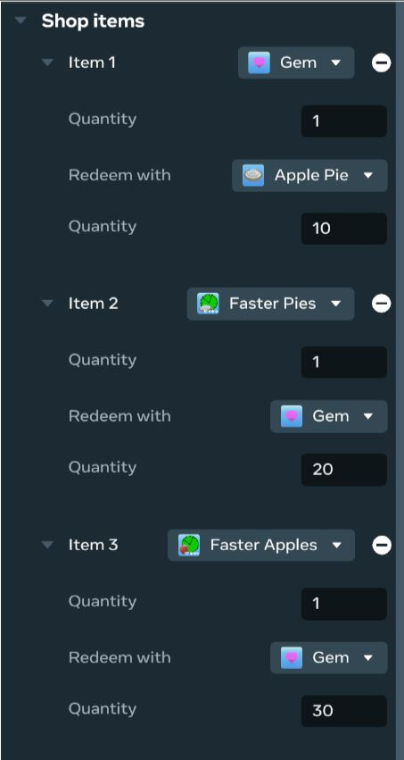

## [Configuring the appearance of the shop](#configuring-the-appearance-of-the-shop)

As there are only three items for sale in the shop, you can configure the shop to only show the first three items in the shop UI. This will reduce clutter and make it easier for the player to understand what they can purchase.

With the shop selected, change the following properties in the **Properties** panel:

1. **Displayed title**: Cook Shop
2. **# Shop Items**: 3
3. **Display item balance**: Apple Pie

