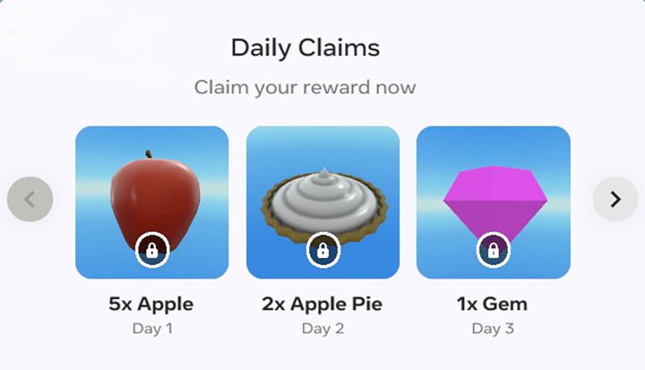
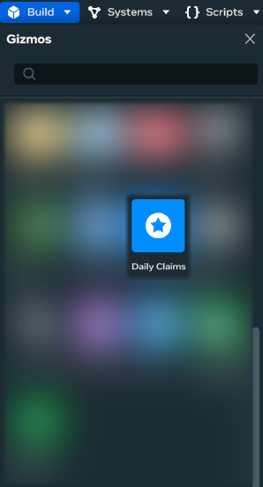
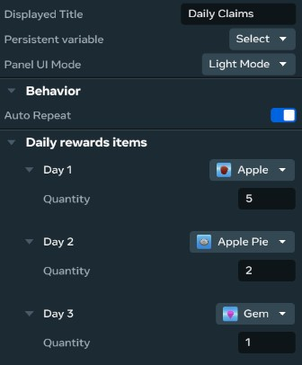

# [Module 5 - Adding Daily Claims](#module-5---adding-daily-claims)

> [!Note]
>
> You will need to be a member of MHCP and have accepted the terms in the Developer Dashboard in order to create in-world items and currency. Find out more about monetization [here](../../../MHCP%20program/Monetization/Monetization%20opportunities.md).

## [Integrating the Daily Claims gizmo](#integrating-the-daily-claims-gizmo)

Add the Daily Claims gizmo to encourage daily player engagement. Players can claim one free consumable item per day to use in the shop or gameplay.

## [Adding the Daily Claims gizmo](#adding-the-daily-claims-gizmo)

1. In the desktop editor, enter Build mode and select **Build > Gizmos** from the menu bar.
2. Search for “Daily Claims” in the search field.
3. Drag the Daily Claims gizmo into the scene. Place it near your shop for visibility.
4. Select the gizmo and open the **Properties** panel.

## [Visual and interaction](#visual-and-interaction)

### [Configuring rewards](#configuring-rewards)

1. **Number of days**: Set how many consecutive days players can claim rewards (e.g., 3 days).
2. **Reward items**: Choose consumable items that complement your shop and economy. For this tutorial, use items like Apples, Apple Pies, or Gems.
3. **Auto-repeat**: Enable to restart the reward cycle after completion.

Example Daily Claims configuration for the Cook Shop economy:

- Day 1: 5x Apples (helps players get started with baking)
- Day 2: 2x Apple Pies (can be traded for gems in the shop)
- Day 3: 1x Gem (can be used to purchase utility power-ups like Faster Pies)

> [!Note]
>
> Any changes to the reward configuration will reset all players’ progress on their next login.

# [Using claimed items](#using-claimed-items)

Players can use claimed items in gameplay, at ovens, or in the shop. This creates a rewarding loop that encourages daily returns.

# [Best practices](#best-practices)

- Only consumable items are supported for daily claims.
- Ensure reward days are consecutive (no gaps).
- Use unique persistent variables for multiple Daily Claims gizmos.
- Place the Daily Claims gizmo near your shop for maximum visibility and engagement.

