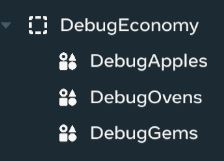
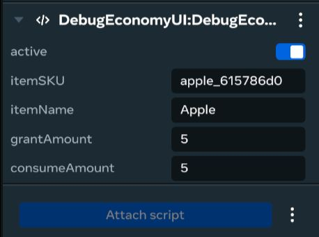

# [Module 6 - Finishing Up](#module-6---finishing-up)

Requirements

You will need to be a member of MHCP and have accepted the monetization Terms Of Service in the Developer Dashboard in order to create in-world items and currency. Find out more about monetization [here](../../../MHCP%20program/Monetization/Monetization%20opportunities.md).

Now that you have set up items, you can configure the debug tool to facilitate testing in your world.

This world includes a tool that you can use to debug and test your in-world items. The DebugEconomyUI enables you to grant yourself in-world items during gameplay in order to test the functionality of the world. You can configure the currency and number of items that the tool can grant you.

In the tutorial world there are three tools in the hierarchy for the three main currencies in the world (gems, apples, and pies), though you can duplicate and configure more as needed.

In this section you will configure the DebugEconomyUI to grant you the items you need to test the shop and gameplay.

> [!Warning]
>
> If enabled, the DebugEconomyUI will grant you the items you need to test the shop and gameplay, even if the world is published. This is to facilitate your testing of your world. It is strongly recommended that you disable the DebugEconomyUI before publishing your world as discoverable in order to avoid giving players the ability to grant as much currency as they want.

## [Configuring the debug tools](#configuring-the-debug-tools)

1. In the **Systems > Commerce** menu, copy the SKU for the apple.
2. In the **Hierarchy** panel, expand the DebugEconomy empty object.

1. Select `DebugApples`
2. In the Properties panel, ensure that the DebugEconomyUI script has the following:
   1. Set `Active` to `true`
   2. Paste the SKU into the `itemSKU` property

1. The other Debug Tools (DebugOvens and DebugGems) can be configured in a similar way.
2. (Optional) Set `Active` to `true` for the debug tool with the currency you want to debug, and set `Active` to `false` for the others.

## [Testing your game](#testing-your-game)

To test the gameplay and shop:

1. Set DebugApples `Active` to `true`, and set DebugGems and DebugOvens `Active` to `false`.
2. Preview the world in the desktop editor.
3. Observe you already have 1 oven available.
4. Collect 5x apples.
5. Navigate to the oven you already own.
6. Interact with the oven to bake an apple pie.
7. Press ‘H’ on the keyboard to open the DebugApples panel.
8. Click “+5 Apples” and wait a few seconds. You should see that your HUD updates to show you now have 5 more apples.
9. Bake 10 pies by granting yourself apples and using the oven.
10. Interact with the shop and trade 10 pies for a Gem.

## [Tutorial Complete](#tutorial-complete)

Congratulations on reaching the end of this tutorial. In these steps you explored how to implement a shop in your world, and you also explored the benefits and limitations of adding an in-world economy to your world.

To continue your learning, you might also want to extend the world. Here’s some ideas to get you started:

- Add another crop to the world (like a pumpkin) and extend the oven to be able to produce different types of pie.
- Add another crop to the world, like wheat, and create a different process to turn that crop into a sellable good (like a mill to grind the wheat into flour).
- Add the ability to permanently upgrade the ovens to produce faster pies.
- Add an auto-harvest feature which automatically collects the apples from specific spawners.

