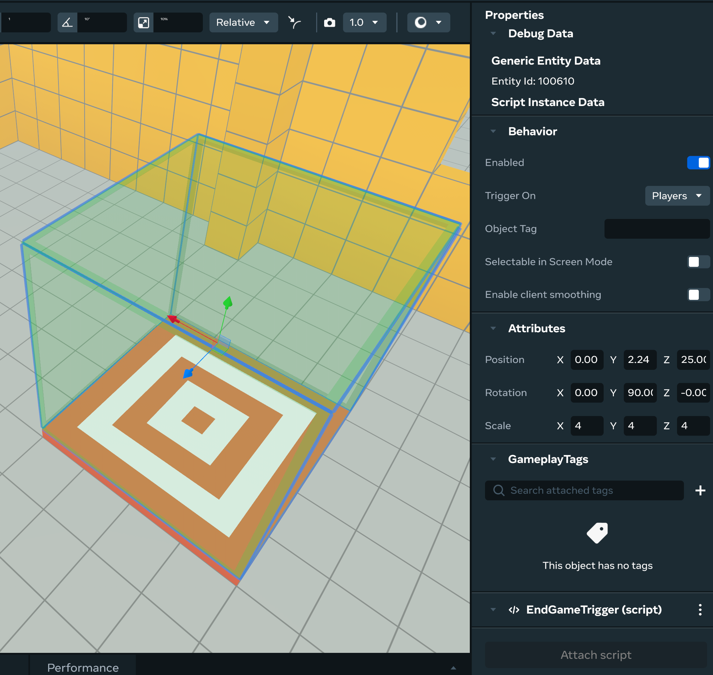
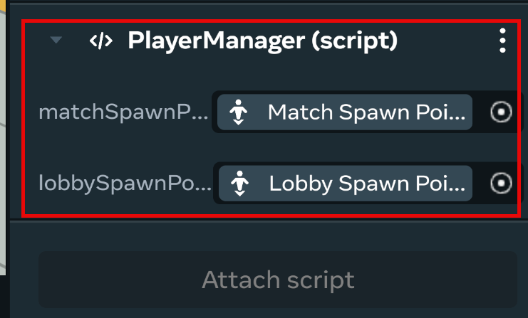

# [Module 6 - Completing the Match and Returning Players](#module-6---completing-the-match-and-returning-players)

The provided match environment has a very simple game setup. First person to run to the target wins. After the game ends, all players in the match should teleport back to the lobby.

Let’s wrap up our multiplayer module by building the functionality to handle the end of the match.

## [Game Over!](#game-over)

The provided course has an **End Game Trigger Gizmo** with an attached script named **EndGameTrigger**. Inside of this script we need to let our game know when someone has won the game.



In the **EndGameTrigger** script, replace:

```typescript
// TODO: broadcast the "gameOver" event
```

With:

```typescript
this.sendLocalBroadcastEvent(Events.gameOver, {});
```

From here, our remaining steps are very similar to Module 5.

The **GameManager** script will receive the “ **gameOver** ” broadcast, and when it does we want it to set the game state to “ **Ending** ”.

To do that, replace:

```typescript
// TODO: update the game state to "Ending"
```

With:

```typescript
this.setGameState(GameState.Ending);
```

Before we move players back to the lobby, remember it’s best to alert users that they are about to teleport.

When the game state changes to **Ending**, our **GameManager** will show another Popup UI message to all players in the **handleGameOver** event handler. This time, instead of 3 messages for 1 second each, our game will show 1 message for 3 seconds. See **handleGameOver()** in the **GameManager** script:

```typescript
this.world.ui.showPopupForEveryone(
  `Game Over! \n Teleporting back to Lobby`,
  3,
);
```

After 3 seconds, the **handleGameOver** method will update the game state once again, this time to the **Finished** state.

## [Teleporting Players back to the Lobby](#teleporting-players-back-to-the-lobby)

The **PlayerManager** script is already listening to state change events and will receive this event. When the **Finished** state is received, display a message and move all players back to the lobby.

Players that are returned to the lobby are delivered to the **Lobby Spawn Point**, which is already in the world and is where the game began.

We need our PlayerManager to know about the Lobby Spawn Point object. We’ll do that with a script property just like we did early with the other spawn point.

In the desktop editor, in the main window, select the **Player Manager\*\*\*\*Object**. In the **Script properties**, update the new prop field with the “ **Lobby Spawn Point** ” object.

In the **PlayerManager** script, replace:

```typescript
// TODO: create a prop for the Lobby Spawn Point
```

With:

```typescript
lobbySpawnPoint: { type: hz.PropTypes.Entity },
```

And then, using the desktop editor UI, connect the Lobby Spawn Point game object with the new prop on Player Manager.



In the **PlayerManager** script, replace:

```typescript
// TODO: respawn the player at the Lobby Spawn Point location
```

With:

```typescript
this.props.lobbySpawnPoint?.as(hz.SpawnPointGizmo)?.teleportPlayer(player);
```

And then update our data sets. Replace:

```typescript
// TODO: update match MatchPlayers
```

With:

```typescript
this.matchPlayers.moveToLobby(player);
```

## [Resetting Game State](#resetting-game-state)

The last thing for us to do is to put the game back in the Ready game state, so that another match can be started.

Our Player Manager knows when all players have moved back to the lobby, so this is the perfect place to broadcast a new game state update.

In the **PlayerManager** script, replace:

```typescript
// TODO: reset the world back to the original game state
```

With:

```typescript
this.sendLocalBroadcastEvent(Events.setGameState, {newState: GameState.Ready});
```

Our GameManager script will receive this broadcast event and update the game state to the Ready state.

## [Testing](#testing)

Enter the world in **Visit** mode, you should now be able to play the game over and over again.

## [Checkpoint](#checkpoint)

Congratulations, your multiplayer game is complete!

## [Extending This World](#extending-this-world)

This foundation can easily be extended to support some alternative and extra features.

- Only teleport players standing on the Start platform to the match, instead of all lobby players
- Don’t start a match unless there are a certain number of players in the lobby
- Have new players to the world automatically join a match in progress instead of waiting
- Cancel the Start Game countdown if a player jumps off the Start platform
- Message the name of the winning player to all match players
- Automatically declare a winner if other players leave and there is only one left

These are just a few ideas. Hopefully, this tutorial makes it easier for you to build your next multiplayer game in Meta Horizon Worlds using Typescript.

