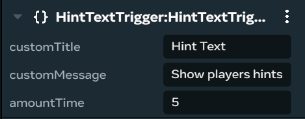
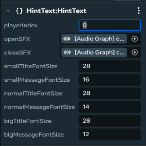
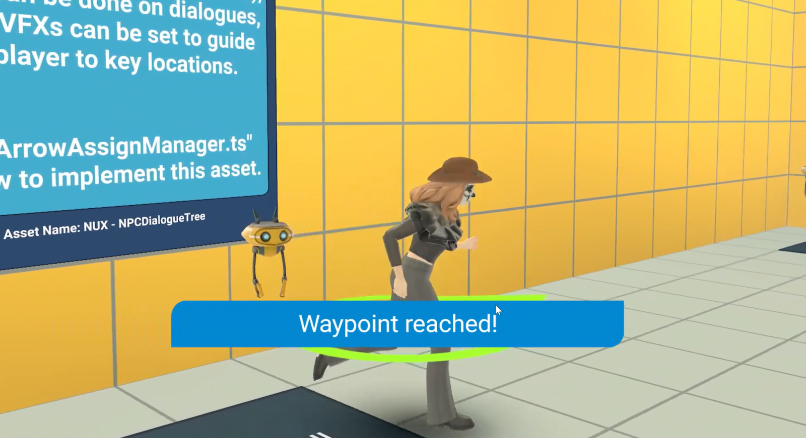

# [Module 3 - Hint Text](#module-3---hint-text)

In this module, we will cover how hint text works and how to use it to help onboard new users to your world.

Hint text can be used to display notification messages to players in your game world. You can use hint text to provide reminders or nudge players toward goals and objectives with different notification layouts based on message length and whether a title is included.

In the New User Experience Tutorial (NUX) world, hint text is used to display notifications to players when they enter a trigger area. The hint text system is designed to be flexible and scalable for different player counts. It also supports multiple notification layouts and dynamic font sizing. The system works on both mobile and desktop platforms.

The hint text system works with the following scripts included in the tutorial world:

- `HintText.ts` — Handles the UI for displaying notifications with dynamic font sizing and multiple layouts
- `HintTextTrigger.ts` — Displays notification text when players enter a trigger area

The Hint Text system supports the following features:

- Dynamic font sizing based on message length
- Multiple UI layouts for different notification types
- Countdown timer for time-sensitive messages
- Customizable background colors
- Mobile and desktop adjustments
- Support for up to three players (expandable by duplicating components)

## [Implement Hint Text components](#implement-hint-text-components)

In the New User Experience (NUX) tutorial world, Hint Text appears when players enter trigger zones and automatically adapts its layout and font size based on message length. The system provides multiple notification layouts for optimal readability across different scenarios.

The Hint Text system uses a trigger-based approach where `HintTextTrigger.ts` detects player entry and sends notification events to `HintText.ts` for UI display.

### [Setup the Hint Text system](#setup-the-hint-text-system)

To implement a complete hint text system, use the following process:

1. **Create the hint text trigger zone**: Navigate to **Build** > **Gizmos**, select the **Trigger Zone** gizmo and position it where you want to display notifications to players. This trigger will detect when players enter the area and activate the hint text display.

   

2. **Configure the trigger script**: Attach the `HintTextTrigger.ts` script to your trigger zone. Configure the trigger properties in the inspector:

   - **customTitle**: Title of the notification (can be empty for message-only notifications)
   - **customMessage**: Main message content to display to players (default: “Welcome to the world!”)
   - **amountTime**: Duration in seconds the notification should remain visible (default: 5 seconds)

   **Note**: The script automatically sends a network broadcast event when players enter the trigger area.

3. **Create the hint text UI handler**: Create an empty object in your scene to house the hint text display system. Navigate to **Build** > **Gizmos** and add a **Custom UI** gizmo to this object.

4. **Setup the UI script**: Attach the `HintText.ts` script to your Custom UI gizmo. Configure the essential properties:

   - **playerIndex**: Set to 0, 1, or 2 to assign this hint text component to a specific player (supports up to 3 players by default)
   - **openSFX/closeSFX**: Optional audio entities to play when notifications appear/disappear
   - **Font Size Properties**: Configure dynamic font sizing for different message lengths:
     - **smallTitleFontSize/smallMessageFontSize**: Used for messages under 50 characters (default: 28/16)
     - **normalTitleFontSize/normalMessageFontSize**: Used for messages 50-100 characters (default: 28/14)
     - **bigTitleFontSize/bigMessageFontSize**: Used for messages over 100 characters (default: 28/12)

   

5. **Configure advanced features** (Optional):
   - **Countdown Support**: Send messages with format “Countdown: X” to activate countdown timer functionality
   - **Background Colors**: Use the `bgColor` parameter in network events to customize notification background colors
   - **Multiple Player Support**: Duplicate the hint text UI objects and set different playerIndex values (0, 1, 2) for each player
   - **Device Adaptation**: The system automatically adjusts UI layout for mobile vs desktop players

### [Understanding the notification layouts](#understanding-the-notification-layouts)

The `HintText.ts` script automatically selects the optimal notification layout based on message length:

- **Messages < 50 characters**: Uses small layout with larger fonts for high readability
- **Messages 50-100 characters**: Uses normal layout with medium fonts
- **Messages > 100 characters**: Uses big layout with smaller fonts to fit content

### [Advanced implementation notes](#advanced-implementation-notes)

**Event System**: The system uses `UIEvents.notification` network events to communicate between trigger and display components. You can manually send these events from other scripts using:

```typescript
this.sendNetworkBroadcastEvent(UIEvents.notification, {
  player: [playerArray],
  title: 'Your Title',
  message: 'Your Message',
  time: 5,
  bgColor: '#0288d1',
});
```

**Player Assignment**: The component automatically assigns itself to players based on the `playerIndex` property when they enter the world. Ensure you have separate hint text components for each player if supporting multiplayer.

### [Testing your hint text implementation](#testing-your-hint-text-implementation)

Once your hint text system is implemented, test it by:

1. **Trigger Testing**: Walk into the trigger zones and verify notifications appear with correct content
2. **Layout Testing**: Test with different message lengths to ensure appropriate layouts are selected
3. **Timing Testing**: Verify notifications display for the configured duration and dismiss properly
4. **Multiplayer Testing**: If supporting multiple players, test that each player sees their assigned notifications
5. **Audio Testing**: Confirm opening and closing sound effects play correctly (if configured)



With a complete hint text system in place, you can provide contextual guidance and reminders that adapt to different message lengths and player scenarios, improving the onboarding experience for new users in your world.

