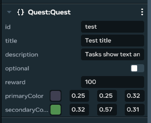
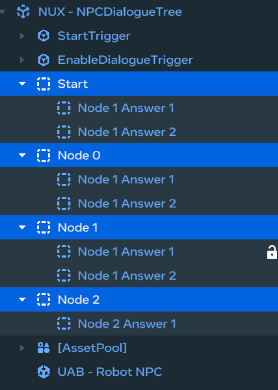
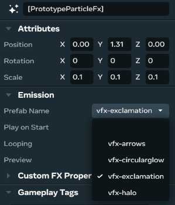
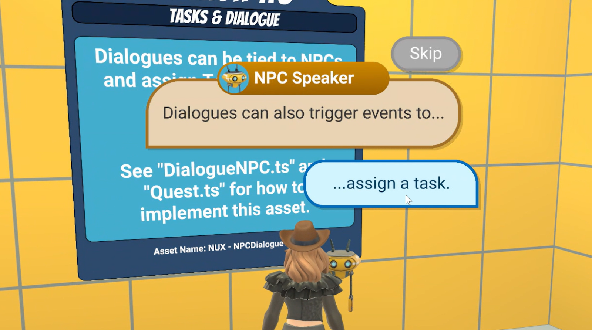

# Module 4 - Quest and Dialogue

In this module we will cover how to build a complete quest experience that combines quest management, dialogue systems, and visual waypoint indicators to create engaging player journeys in your world.

The Quest Experience encompasses the full player journey from quest discovery through completion. It combines quest tracking, NPC dialogue interactions, visual waypoint indicators, and reward systems to create seamless objective-driven gameplay. This integrated approach ensures players understand their goals, know where to go, and feel rewarded for their progress.

The complete quest system integrates multiple components working together: NPCs provide context through dialogue, visual waypoints guide players to locations, quest managers track progress, and UI systems provide feedback. This creates a cohesive experience where players are never confused about their objectives or next steps.

You may want to add this complete quest system to your world to provide players with engaging storylines, clear navigation, structured progression, and satisfying completion experiences that keep them engaged throughout their journey.

In the tutorial world the quest experience works with the following included scripts:

**Core Quest Management:**

* `QuestManager.ts` - Manages overall quest tracking and player progress
* `Quest.ts` - Represents individual quest entities and their properties
* `QuestTrigger.ts` - Triggers quest start or completion events

**User Interface Systems:**

* `UIQuestComplete.ts` - Displays quest completion messages and rewards
* `UICurrentQuests.ts` - Shows active quests on the player’s screen
* `UIQuestStartDialogue.ts` - Displays quest prompts and dialogue options

**Visual Navigation:**

* `QuestWaypointController.ts` - Manages visual waypoint indicators for quest locations
* `TestSendEventQuest.ts` - Demo script for waypoint activation

**NPC Dialogue System:**

* `DialogueNode.ts` - Represents individual dialogue nodes in the conversation tree
* `DialogueNodeOption.ts` - Handles player response options within dialogue nodes
* `DialogueNPC.ts` - Manages overall dialogue system for NPCs and integration with other systems
* `DialogueTreeCustomUI.ts` - Displays dialogue trees and manages the user interface

**Integration Components:**

* `CameraManagerLocal.ts` - Handles camera changes during quest events

## Build a complete quest experience

Creating a complete quest experience involves multiple integrated systems working together to guide players from quest discovery through completion. This section provides a comprehensive approach to building engaging quest journeys.

The quest experience follows this player journey: **Discovery** (finding NPCs/quests) → **Dialogue** (learning objectives) → **Navigation** (finding quest locations) → **Completion** (achieving objectives) → **Reward** (feedback and progression).

### Phase 1: Core quest infrastructure

Begin by establishing the foundational quest management system:

- **Create the quest container hierarchy**: Navigate to your world hierarchy and create a empty object for the **QuestsContainer** entity. This will serve as the parent for all quest entities and the central hub for quest management.

  
- **Setup quest management**: In the **Properties** panel for your QuestsContainer, attach the `QuestManager.ts` script. Configure the quest blocking behavior and timing for new quest indicators. This script manages all quest tracking, player progress, and integration with other systems.
- **Define individual quests**: Create quest entities as children of the QuestsContainer. For each quest, attach the `Quest.ts` script and configure properties including:

  * **Quest ID**: Unique identifier for the quest
  * **Title and Description**: Player-facing quest information
  * **Quest Type**: Tutorial or side quest classification
  * **Completion Criteria**: What players need to accomplish

### Phase 2: NPC dialogue integration

Connect your quests to interactive NPCs that provide context and story:

- **Create quest-giving NPCs**: Navigate to the **Asset Library** and locate the **NPC** asset (such as the **UAB - Robot NPC** used in the tutorial). Drag the NPC asset into your world and position it where you want players to discover quests.
  * **Character Name**: Display name for the NPC
  * **Start Dialogue Trigger**: Position where players interact to begin conversations
  * **Enable Dialogue Trigger**: Set up triggers for dialogue activation
  * **Quest Integration**: Connect to quest manager for automatic quest starting
- **Setup dialogue tree structure**: Create dialogue nodes as child entities of your NPC. For each dialogue interaction, you’ll need:
  * **Root dialogue node**: Create a dialogue node named “start” (or the system will use the first child). Attach the `DialogueNode.ts` script and set the **NPCText** property for the initial dialogue content.
  * **Player response options**: For each dialogue node requiring player responses, create **DialogueNodeOption** child entities and attach the `DialogueNodeOption.ts` script. Configure:
    + **AnswerText**: The text players will see for their response choice
    + **NextNode**: The dialogue node to jump to if this option is selected (leave empty if dialogue ends)
    + **EndsDialogue**: Set to true if this option should end the conversation
  * **Multiple choice support**: You can create up to 3 response options per dialogue node by duplicating NodeOption objects

  
- **Configure dialogue UI system**: Set up the visual presentation by attaching the `DialogueTreeCustomUI.ts` script to handle dialogue display. This script automatically:
  * Manages text display for character names and dialogue content
  * Shows up to 3 player response options
  * Spawns automatically within the **DialogueNPC** component
  * Adapts dialogue colors based on quest type (tutorial vs. side quest)
- **Integrate with quest system**: Configure the `DialogueNPC.ts` script to work with other systems by setting:
  * **TriggerToEnableOnEnd**: Optional trigger to activate when dialogue completes
  * **TriggerToEnableOnEnd2**: Additional trigger for complex quest chains
  * **Quest Manager Integration**: Automatic connection to quest starting events
  * **Arrow System Integration**: Coordination with waypoint arrow assignments

### Phase 3: Visual waypoint guidance

Implement waypoint indicators to guide players to quest locations:

- **Setup quest waypoints**: Navigate to the **Asset Library** and locate quest waypoint assets. Place **Asset Pool Gizmos** at quest locations and attach the `QuestWaypointController.ts` script. Configure waypoints to:
  * **Trigger Zones**: Define completion areas for quest objectives
  * **Visual Effects**: Customize particle effects for indoor/outdoor environments
  * **Player Ownership**: Ensure per-player waypoint visibility
  * **Event Integration**: Connect to quest system for automatic activation

  
- **Configure waypoint behavior**: Set up waypoint parameters including:
  * **isOutsideWaypoint**: Enable scaling for outdoor locations
  * **waypointVFX**: Customize visual appearance (exclamation points, arrows, halos)
  * **Event Listeners**: Configure responses to `WaypointEvents.activeQuestWaypoint`

### Phase 4: Quest progression and completion

Implement triggers and UI systems for quest advancement:

- **Create progression triggers**: Use **Build > Gizmos > Trigger Zone** to place quest triggers throughout your world. Attach the `QuestTrigger.ts` script and configure:
  * **Quest ID**: Link to specific quest objectives
  * **Operation Type**: Set to ‘start’ or ‘complete’ based on function
  * **Integration Points**: Connect with dialogue completion and waypoint systems
- **Setup UI feedback systems**: Configure quest user interface components:
  * **Active Quests Display**: Attach `UICurrentQuests.ts` to show ongoing objectives
  * **Completion Feedback**: Use `UIQuestComplete.ts` for reward messages
  * **Quest Prompts**: Implement `UIQuestStartDialogue.ts` for quest acceptance UI

### Phase 5: Testing and integration

Verify the complete quest experience works seamlessly:

- **Test the quest flow**: Walk through the complete player journey:
  * **Discovery**: Approach NPCs and trigger dialogue
  * **Acceptance**: Navigate quest prompts and accept objectives
  * **Navigation**: Follow waypoints to quest locations
  * **Completion**: Achieve objectives and observe completion feedback
  * **Progression**: Verify quest state updates and system integration

  
- **Validate integration points**: Ensure all systems work together:
  * Dialogue completion triggers quest starts
  * Quest activation spawns waypoints
  * Quest completion removes waypoints and shows rewards
  * UI systems provide clear feedback at each stage

Once your quest experience is implemented, players will have a complete guided journey from quest discovery through completion. The integrated systems ensure players always know their objectives, understand how to reach them, and feel rewarded for their progress.

With a complete quest experience in place, you can create engaging player journeys that combine storytelling, clear navigation, and satisfying progression to keep players engaged throughout their time in your world.