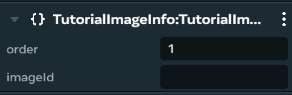
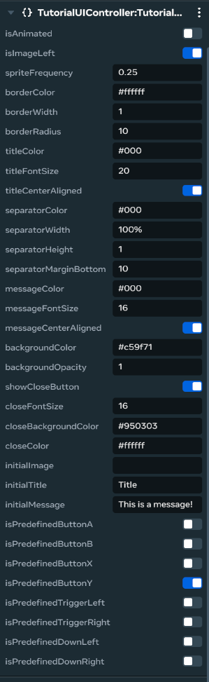
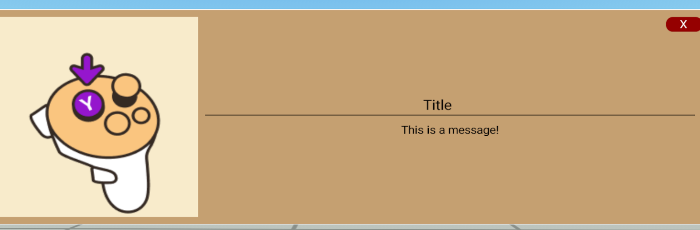

# [Module 7 - Controller Images](#module-7---controller-images)

In this module we will cover how the Controller Images system works and how to use it to visually teach VR controller inputs using animated motion sequences and static diagrams.

The Controller Images system gives creators the tools to visually teach VR controller inputs using animated motion sequences or static diagrams with highlighted buttons. Designed for onboarding and tutorials, it helps players understand required interactions through clear, customizable controller visuals that support both static instructional panels and dynamic image sequences to show controller movement in action.

This system provides essential visual guidance for VR interactions, ensuring players understand how to use their controllers effectively without confusion or trial-and-error learning.

You may want to add this to your world to teach new VR users how to interact with controllers, demonstrate specific input combinations, or provide visual references for complex gestures and button sequences.

The Controller Images system works with the following scripts included in the tutorial world:

- `ControllerUI.ts` - Creates customizable UI panels with animated or static controller diagrams and supports predefined VR control images
- `SpriteInfo.ts` - Represents individual image sprites with IDs and display order for creating custom animated sequences

## [Implement the controller images components](#implement-the-controller-images-components)

In the New User Experience (NUX) tutorial world, the controller images system creates customizable UI panels that display VR controller instructions through static diagrams or animated sequences. The system includes predefined controller images for common VR inputs and supports custom animation sequences for complex gestures.

The controller images system uses a UI component approach where `ControllerUI.ts` manages the visual presentation and layout, while `SpriteInfo.ts` provides the data structure for custom animated sequences.

### [Understanding the controller UI architecture](#understanding-the-controller-ui-architecture)

The `ControllerUI.ts` script provides a highly configurable panel system with these key features:

- **Predefined VR Controls**: Built-in animated sequences for common VR controller buttons (A, B, X, Y, triggers, directional buttons)
- **Custom Animation Support**: Framework for creating custom controller instruction sequences using image sprites
- **Flexible Layout**: Configurable positioning, colors, fonts, and visual styling
- **Interactive Elements**: Optional close buttons and dynamic content updates

### [Setup the basic controller UI panel](#setup-the-basic-controller-ui-panel)

The `ControllerUI.ts` script creates the foundational UI panel for displaying controller instructions.

1. **Create the controller UI entity**: Navigate to your world and create a UI entity where you want controller tutorials to appear. Attach the `ControllerUI.ts` script to this entity.

   

2. **Configure panel appearance**: Set up the visual properties in the script inspector:
   - **Panel Layout**: Configure `panelWidth` (default: 1000) and `panelHeight` (default: 300) for appropriate sizing
   - **Background Styling**: Set `backgroundColor` (default: ‘#c59f71’), `backgroundOpacity` (0-1), and border properties (`borderColor`, `borderWidth`, `borderRadius`)
   - **Content Layout**: Choose image position using `isImageLeft` (true for left side, false for right side)

3. **Setup content properties**: Configure the text and message display:
   - **Title Configuration**: Set `initialTitle`, `titleColor` (default: ‘#000’), `titleFontSize` (default: 20), and `titleCenterAligned`
   - **Message Configuration**: Set `initialMessage`, `messageColor`, `messageFontSize` (default: 16), and `messageCenterAligned`
   - **Separator Styling**: Configure `separatorColor`, `separatorWidth`, `separatorHeight`, and `separatorMarginBottom`

4. **Configure interactive elements**: Set up optional close button:
   - **Close Button**: Toggle `showCloseButton` (default: true), set `closeBackgroundColor` (default: ‘#950303’), `closeColor` (default: ‘#ffffff’), and `closeFontSize`

### [Implement predefined VR controller images](#implement-predefined-vr-controller-images)

The system includes built-in animated sequences for common VR controller inputs with predefined image assets.

1. **Select predefined controller input**: Choose one of the available predefined controller animations by setting the corresponding property to `true` (ensure only one is active):

   - **isPredefinedButtonA**: Left controller A button animation (3 frames)
   - **isPredefinedButtonB**: Left controller B button animation (3 frames)
   - **isPredefinedButtonX**: Right controller X button animation (3 frames)
   - **isPredefinedButtonY**: Right controller Y button animation (3 frames)
   - **isPredefinedTriggerLeft**: Left controller trigger/back button animation (3 frames)
   - **isPredefinedTriggerRight**: Right controller trigger/back button animation (3 frames)
   - **isPredefinedDownLeft**: Left controller directional down button animation (3 frames)
   - **isPredefinedDownRight**: Right controller directional down button animation (3 frames)

   

2. **Configure animation timing**: Set the `spriteFrequency` property (default: 0.25 seconds) to control how fast the animation cycles through frames. The `isAnimated` property is automatically handled for predefined sequences.

### [Create custom animated controller sequences](#create-custom-animated-controller-sequences)

For custom controller instructions, use the `SpriteInfo.ts` component system to create your own animated sequences.

1. **Setup custom animation structure**: Enable custom animations by setting `isAnimated: true` in the ControllerUI script properties.
2. **Create sprite info entities**: For each frame in your custom animation sequence:
   - Create an empty child object under your ControllerUI entity
   - Attach the `SpriteInfo.ts` script to each child object
   - Configure the sprite properties:
     - **order**: Set the sequence order (1, 2, 3, etc.) to control frame progression
     - **imageId**: Set the asset ID string for the image to display in this frame
3. **Test custom animation**: The system automatically:
   - Loads all child entities with `SpriteInfo` components
   - Sorts frames by the `order` property
   - Creates a smooth animation loop at the specified `spriteFrequency`
   - Cycles continuously through all frames in sequence

### [Advanced controller UI features](#advanced-controller-ui-features)

1. **Dynamic content updates**: Use the `trigger()` method to update content dynamically:

   ```typescript
   // Update title and message from other scripts
   controllerUI.trigger('New Title', 'New instruction message');
   ```

2. **Custom styling options**: The system supports advanced styling:
   - **Color formats**: Use RGBA values (`"rgba(255,0,0,0.5)"`), hex codes (`"#ff0000"`), or named colors (`"red"`)
   - **Responsive layout**: Content automatically adjusts based on message length and panel size
   - **Image background**: Configure `imageBackgroundColorBinding` for image area styling

3. **Animation control methods**: Advanced animation management:
   - **Start animation**: Call `animate(cooldown)` to begin custom animation sequences
   - **Stop animation**: Call `stopAnimation()` to pause and reset to first frame
   - **Load custom images**: Call `loadChildImages()` to refresh sprite sequences

### [Implementation best practices](#implementation-best-practices)

**For Basic VR Teaching**: Use predefined controller images with clear titles and simple messages to teach standard VR interactions.

**For Complex Gestures**: Create custom animated sequences using `SpriteInfo` components to show multi-step controller movements.

**For Tutorial Integration**: Combine with trigger systems to show contextual controller instructions at appropriate tutorial moments.

### [Testing your controller images implementation](#testing-your-controller-images-implementation)

Once your controller images system is implemented, thoroughly test:

1. **Static Display Testing**: Verify panels appear with correct layout, colors, and text formatting
2. **Predefined Animation Testing**: Test each predefined controller animation for smooth playback and appropriate timing
3. **Custom Animation Testing**: Verify custom sprite sequences load in correct order and animate smoothly
4. **Interactive Testing**: Test close button functionality and dynamic content updates
5. **Integration Testing**: Confirm controller tutorials integrate properly with other tutorial systems
6. **Visual Clarity Testing**: Ensure controller instructions are clear and helpful for new VR users



With a comprehensive controller images system in place, you can provide clear visual instruction for VR controller usage through both predefined animations for common inputs and custom sequences for complex gestures, significantly improving the onboarding experience for new users in your world.

