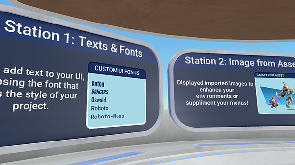
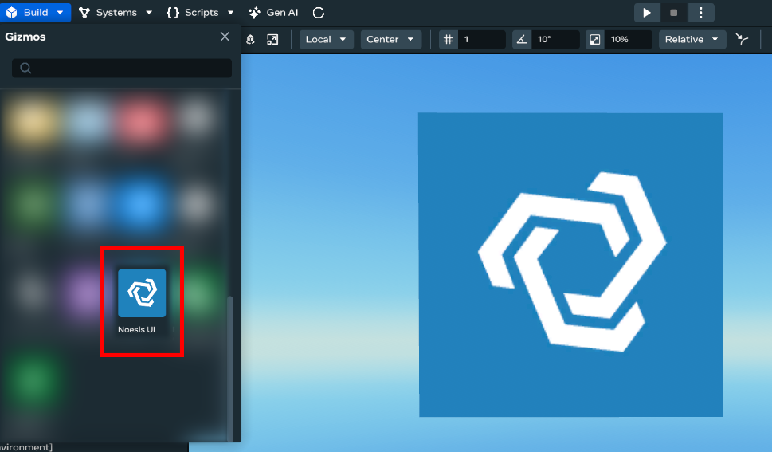

# Module 1 - Setup

Welcome! This module introduces the NoesisGUI and prepares you to work with the sample stations included in this tutorial. You’ll learn how to set up your workspace, import the provided project, and get ready to explore each station.

Note

 Changes to **.noesis** and XAML files require reuploading to the Desktop Editor. Before making edits, ensure the [approved fonts](../../../Desktop%20editor/NoesisUI/Noesis%20UI%20Fonts%20Usage.md) have been downloaded in preparation.

## What You’ll Learn

By the end of this tutorial, you’ll be able to:

* Install NoesisGUI and open the provided tutorial project
* Upload and use Noesis assets in Horizon Worlds
* How to navigate the sample stations and understand their structure
* Find official resources and troubleshooting help

## NoesisGUI

NoesisGUI is a high-performance UI framework for games and interactive applications. In this training, you’ll use pre-built sample projects and stations to learn UI concepts, scripting integration, and best practices for Horizon Worlds.

**Key Features**

* **High Performance:** Built for real-time applications, NoesisGUI is lightweight and optimized for both desktop and mobile platforms.
* **XAML-Based:** Design your UI using XAML, a declarative markup language that separates design from logic and makes complex interfaces easier to manage.
* **Modern UI Capabilities:** Supports animations, data binding, vector graphics, and advanced layout controls.
* **Designer-Developer Workflow:** Enables artists and developers to work in parallel, using familiar tools like Visual Studio and VSCode with live XAML preview.

## Prerequisites

Before you begin, make sure to:

- Download the [Tutorial Project File](https://scontent-dfw5-2.oculuscdn.com/v/t64.5771-25/491821952_1259793042859186_6085846278908550693_n.zip?_nc_cat=104&ccb=1-7&_nc_sid=e280be&_nc_ohc=TQeuPLpl9z0Q7kNvwENNvIM&_nc_oc=Adl84r7lIAtuhdSkSlHmbsbUzktALgAF_5Ez61kohpoHDuKNh3W8oSrUWHqcT3wteXGKUGUTyx-UHEMD6_tbxZ_W&_nc_zt=3&_nc_ht=scontent-dfw5-2.oculuscdn.com&oh=00_AfonW1z7hzKGU8VtFqz4yrtN_3iawW-kAwWASgQTp6kTFg&oe=69843884)
- Install [NoesisGUI Studio](https://www.noesisengine.com/studio/)
- Unzip the NoesisGUI Studio folder
- Run the application named **App.StudioTool.exe**
- Select Add Existing, to import the Tutorial project
- Navigate to the Tutorial Project folder and select the **.noesis** file
- Download and add supported fonts from the [NoesisGUI Fonts Usage Guide](../../../Desktop%20editor/NoesisUI/Noesis%20UI%20Fonts%20Usage.md) to your project

## Step-by-Step: Uploading Noesis Projects to Horizon Station

In this tutorial, making additional updates and reuploading the NoiesisGUI project file is optional.

If you would like to expand upon the tutorial, follow these steps:

- Ensure the project has been saved and all assets (XAML, images, scripts) are included.
- Upload to Horizon Asset Library
  * Open Horizon Worlds and go to the Asset Library
  * Click “Add new”
  * Locate the folder that includes your project
  * Select the **.noesis** project file.
- Add the Noesis Gizmo to Your World
  * In the Horizon Worlds editor, open your world
  * From the Asset Library, drag and drop the uploaded Noesis gizmo into your scene
  * Position and attach TypeScript components as needed

## Next Steps

Once you’ve completed the setup:

* Move on to the next module to explore the stations in detail
* Follow the documentation for each station to understand its UI features and scripting integration
* Use the provided XAML and TypeScript examples to experiment and learn
* Explore official resources:
  + [NoesisTechnologies YouTube Channel](https://www.youtube.com/@NoesisTechnologies)
  + [Noesis Tutorials GitHub](https://github.com/Noesis/Tutorials)
  + [NoesisGUI XAML Tools](https://marketplace.visualstudio.com/items?itemName=NoesisTechnologies.noesisgui-tools).